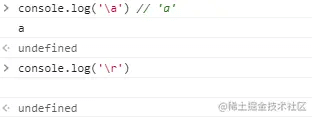

## 前言

字符是我们编写程序的基础的基础。

我们前端是最常见的字符，符号，数字，英文，中文， 我们通常都是使用直接量来表示，偶尔会在正则表达等场景用到 UTF-16 码点的格式，**问题来了，那你知道 JS 有几种字符表示方式吗？**

答案：**至少 6 种**，以字符 a 为例子：

```js
;`a` // 'a'
;('a') // 'a'
;('a') // 'a'
;('\141') // 'a'
;('\x61') // 'a'
;('\u0061') // 'a'
;('\u{0061}') // 'a'
```

前三种都很理解， 后面这又是`\`, `\x`, `\u`, `\u{}`， 这都是什么玩意？

别急，我们一一道来。

|      格式       |     示例     |  码点范围  |                        注意                         |
| :-------------: | :----------: | :--------: | :-------------------------------------------------: |
|     \8 进制     |   `'\141'`   |   0-255    |              模板字符串中不可直接使用               |
| \x 两位 16 进制 |   `'\x61'`   |   0-255    |                      必须两位                       |
| \u 四位 16 进制 |  `'\u0061'`  |  0-65535   |                      必须四位                       |
|   `\u{16 进制}`   | `'\u{0061}'` | 0-0x10FFFF | 码点大于 0xFFFF,length 为 2，下标访问值是高低位的值 |

## 编码基础知识

完全理解字符表示，还是需要一些**简单的编码知识**，我们一起来看看吧。

### ASCII 码

ASCII 码一共定义了 128 个字符，例字母 a 是 97 (0110 0001)。这 128 个字符只使用了 8 位二进制数中的后面 7 位，最前面的一位统一规定为 0。

ASCII 码止共定义了 128 个字符，其中 33 个字符无法显示。0010 0000 ~ 0111 1110 (32-126)是可以显示的 ，基本都能使用键盘打出来， 具体参见对照表： [ASCII 编码对照表](http://c.biancheng.net/c/ascii//)。

ASCII 额外扩展的版本 EASCII，这里就可以使用一个完整子节的 8 个 bit 位表示共 256 个字符，其中就又包括了一些衍生的拉丁字母。 可以参见 [extended-ascii-table](https://www.lookuptables.com/text/extended-ascii-table)。

### Unicode 和 码点

Unicode 是字符集， 为了兼容 ASCII，Unicode 规定前 0-127 个字符是和 ASCII 是一样的，**不一样的是 128-255 这一部分**。

我们一起看看 ASCII 128-255 部分:


再看看 Unicode 的 128-255 部分：


其给某个字符规定对应的数值，我们经常称其为码点。我们可以通过字符串的实例方法 `charCodeAt` 和 `codePointAt` 获取，前者只能准确获取码点值小于 `0xFFFF(65535)` 的码点。

```js
'𠀠'.codePointAt(0) // 131104 0x20020 正确
'𠀠'.charCodeAt(0) // 55360 0xd840 错误
'a'.charCodeAt(0) // 97 0x0061 正确
```

对应的我们可以使用 String 的静态方法 fromCharCode,fromCodePoint 用码点获取对应的字符。

```js
String.fromCodePoint(131104) // "𠀠" 正确
String.fromCharCode(131104) // " " 错误
String.fromCharCode(97) // "a" 正确
```

### UTF-8, UTF-16

我们平时接触比多的就是 UTF-8 和 UTF-16，均是 Unicode 字符编写的一种实现。
我们 JS 编码的字符串是 UTF-16 格式来存储的和表示的。

UTF-16 对于码点小于 0xFFFF 的用 2 个字节（**1 个编码单元**）表示，大于 0xFFFF 的编码用四个字节（**2 个编码单元**）表示。 **具体的体现可以表现在字符的长度上**。

```js
'𠀠'.length // 2 码点 131104（0x20020）> 65535 (0xFFFF)
'a'.length // 1
'人'.length // 1
```

**这里强调 `0xFFFF` 是分界线**，很重要。

### 进制转换

我们可以使用数字实例 toString()10 进制转为相对应的进制。

```js
;(97).toString(16) // 61
;(97).toString(2) // 1100001
```

下面进入正题, 一起来看字符的表示：

## `\` + 字符

`\` 是一个特殊的存在，转义字符，大多数情况下，不产生什么作用。 只对一些特殊的字符起作用。

从下可以看出 `\a` 这个 `\` 没有任何作用，对 `\r` 就不一样了。



更多转义字符知识，参见 [转义字符-维基](https://zh.wikipedia.org/wiki/%E8%BD%AC%E4%B9%89%E5%AD%97%E7%AC%A6)。

## `\` + `八进制`

**其能表示的码点范围值为 0-255**。

这里提个问题， 这里显示的 ASCII 的字符，还是 Unicode 的字符。

1. 比如字符 a 为 97， 可以使用 charCodeAt 获取，

```js
'a'.charCodeAt(0) // 97
```

2. 转为 8 进制为 `97..toString(8) = 141`
3. \141

```js
console.log('\141') // a
```

我们看一些特殊码点的字符，因为码点为 31 和 127 的字符，不能被显示或者表示。

```js
// 37 = 31..toString(8)
'\37' // '\x1F'

// 177 = 127..toString(8)
'\177' // '\x7F'
```

至于为什么 `\177` 变为了 `\x7F`， 是不是有点疑惑，其实也很简单。
当程序检查其值，不在可显示范围的时候，直接反向计算其原值，并转为 16 进制值，并使用`\x 两位十六进制`格式表示。

```js
// 177 = 127..toString(8)
'\177' // '\x7F'
127.toString(16) // 7f
```

关于表示码点上限(255)：

```js
'\377' // "ÿ" --- 码点 255
'\400' // ' 0' --- 码点 256 // 大于 255 可以理解为 '\40' + '0'
```

回答开始的提问:

我们这里显示的肯定是 Unicode 字符啊，前面提过了， JS 字符编码采用的是 UTF-16 啊。 可以用码点在 128-255 的一个字符试试， 那就码点 254 的字符吧:

扩展 ASCII 254：

Unicode 254: 'þ'

```js
//376 = 254..toString(8)
'\376' // 'þ'
```

所以大家要明白，我们这各种字符表示方法，表示的都是 Unicode 字符。

关于 `\x 两位十六进制` 格式，我们开讲。

## `\x` + `两位十六进制`

我们可以用 0x 表示 16 进制的数字，所以\x 大家也很好理解，是 16 进制。

```js
0x61 // 97 0x 表示 16 进制格式数字
'a'.charCodeAt(0) // 获取码点 97
;(97).toString(16) // 转为 16 进制 61
;('\x61') // 'a'
```

两位十六进制码点, 0x00 ~ 0xFF（0~255） , 和 \八进制码一样，不可显示的码点字符，直接显示其编码

```js
// 1f = 31..toString(16)
'\x1F' // '\x1F'

// 20 = 32..toString(16)
'\x20' // ' '

// 7e = 126..toString(16)
'\x7e' // '~'

// 7f = 127..toString(16)
'\x7f' // '\x7F'

// 80 = 128..toString(16)
'\x80' // '\x80'
```

到这里你可能问，你这里，那么这不能显示，那不能显示，有没有一个表啊。有的， 参见 [Unicode 码表](http://titus.uni-frankfurt.de/unicode/unitestx.htm), 这里记录了 0x0000 到 0xFFFF 的码点的字符，一般情况准够用。

**0-255 码点范围内， 0x00 到 0x1F`(0-31)`, 0x80 到 0x9F`(128-159)`是无法显示的或者看不见的**。


```js
'\x9F' // '\x9F' // 编码输出
'\xA1' // "¡" // 正常
```

这个结果，在不通浏览器，可能输出还不一样。 尽量采用最新版本的 chrome 去验证。

## `\u` + `四位十六进制`

这里固定是 4 位，少一位都不行。

```js
'\u0061' // "a"
'\u061' // 报错
```

还是 4 位，如果多了, 截取前 4 位，后面的直接追加。看个例子，非常好理解。

```js
'\u0061' // 'a'
'\u00610' // 'a0'
```

这里也就反应了问题，码点大于 0xFFFF，大于 4 位 16 进制的字符怎么表示？？？

ES6 考虑了这个问题，于是推出了 `\u{ + 十六进制 + }`， 看下个章节。

我们之前说过，UTF-16 是 Unicode 的一种实现，Unicode 的代理区 `0xD800-0xDFFF` ， 其不代表任何字符。同理，我们采用`\u` + `四位十六进制`方式，如果码点在这个区间，返回 � 或者原字符（浏览器不同，可能返回不同）, 当然其他的码点也可能还没设定值或者是不可打印的。

```js
'\uD800' // '\uD800'
'\uDFFF' // '\uD800'
```

实际上 UTF-16 也就是利用了代理区，把码点大于 0xFFFF 字符分为高低两部分, 索引值 0 获得的值实际上是高位部分，索引值 1 获得的是低位部分。

```js
var text = '𠀠'
text[0] // '\uD840'
text[1] // '\uDC20'
```

更多 utf-16 编码的知识，我们后续跟上。

## `\u{` + `十六进制` + `}`

ES6 新增的能力。 这个多了一个 `{}` 包裹。

这个应该是可以一统江湖，可以表示码点低于 0xFFFF 的字符，也可表示码点大于 0xFFFF 的字符。

```js
'\u{20020}' // '𠀠'
'\u{0061}' // 'a'
'\u{061}' // 'a'
'\u{61}' // 'a'
'\u{9}' // "\t"
```

而且其还没有强制四位的限制，简直爽的没法没边。

缺点嘛，那就是兼容性了，就让时间去磨平吧。

## ES6 的模板字符串

ES6 的模板字符串，可以说是爽歪歪，我们就也算其一种新的字符表示方式吧。

我们也是可以使用\u， \u{}, \x 格式的

```js
// 61 = "a".charCodeAt(0).toString(16)
;`我\u{61}` // 我 a
`我\x61` // 我 a
`我\u0061` // 我 a
`我\a` // 我 a
```

到这里，你们没觉得少了了点什么吗？ 没错 \8 进制，是不被允许的

```js
// 141 = "a".charCodeAt(0).toString(8)
;`我\141`
```

如果，你非得用，那就 `${''}` 包裹一下：

```js
;`我${'\141'}` // '我 a'
```

## 实际的应用

### 匹配中文的正则

我们总不能去罗列，多义采取的是[\u4e00-\u9fa5]这种格式去匹配：

```js
var regZH = /[\u4e00-\u9fa5]/g
regZH.test('a') // false
regZH.test('人') // true
regZH.test('𠀠') // false 尴尬了不
```

**这里注意了，只能识别常见中文**。, 毕竟码点的范围就那么大点。

### 去掉空白字符

看看 MDN 上 [String.prototype.trim](https://developer.mozilla.org/zh-CN/docs/Web/JavaScript/Reference/Global_Objects/String/Trim)

```js
if (!String.prototype.trim) {
  String.prototype.trim = function () {
    return this.replace(/^[\s\uFEFF\xA0]+|[\s\uFEFF\xA0]+\$/g, '')
  }
}
```

我们一起来看一下著名的 core-js 对 trim 的空白字符的理解 [whitespaces.js](https://github.com/zloirock/core-js/blob/21ef59549f62ce082f8f7c3b478a721241f5e959/packages/core-js/internals/whitespaces.js)

```js
module.exports = '\u0009\u000A\u000B\u000C\u000D\u0020\u00A0\u1680\u2000\u2001\u2002' + '\u2003\u2004\u2005\u2006\u2007\u2008\u2009\u200A\u202F\u205F\u3000\u2028\u2029\uFEFF'
```

我们还是输出一下吧：

```js
'\u0009\u000A\u000B\u000C\u000D\u0020\u00A0\u1680\u2000\u2001\u2002' + '\u2003\u2004\u2005\u2006\u2007\u2008\u2009\u200A\u202F\u205F\u3000\u2028\u2029\uFEFF'
// '\t\n\v\f\r                 　 '
```

### CSS content 属性 和 CSS 字体图标

现代浏览器，已经支持中文，但是建议还是使用 `\16 进制`编码格式 。
这里使用的是 `\16 进制`， 不需要 `u` 也不需要 `{}`, 支持码点大于 `0xFFFF` 的字符

```css
div.me::before {
  content: '\6211'; /* 我 */
  padding-right: 10px;
}

div.me::before {
  content: '\20020:'; /* 𠀠 */
  padding-right: 10px;
}
```

### CSS 颜色色值

字体颜色，背景颜色，边框颜色等等，其有一种表示方式就是 6 位 16 进制，当然也有简写形式。

```css
.title {
  color: #fff;
}
```

### 字符个数统计

这个是利用了 UTF-16 编码特性。 因为\uD800-\DFFF 是代理区，具体 UTF-16 编码的东西，单独来讲解。 也可以看见文章 为什么一定是 �, 里面有完整的解释。

```js
const spRegexp = /[\uD800-\uDBFF][\udc00-\udfff]/g
function chCounts(str) {
  return str.replace(spRegexp, '_').length
}
```

```js
chCounts('𠀠') // 1
'𠀠'.length // 2
```

ES6 中的方式就多一些了：

```js
Array.from("𠀠").length //1
[..."𠀠"].length // 1
```

### 文件类型识别

具体可以参见阿宝哥的 [JavaScript 如何检测文件的类型?](https://juejin.cn/post/6971935704938971173)

```js
const isPNG = check([0x89, 0x50, 0x4e, 0x47, 0x0d, 0x0a, 0x1a, 0x0a]) // PNG 图片对应的魔数
const realFileElement = document.querySelector('#realFileType')

async function handleChange(event) {
  const file = event.target.files[0]
  const buffers = await readBuffer(file, 0, 8)
  const uint8Array = new Uint8Array(buffers)
  realFileElement.innerText = `${file.name}文件的类型是：${isPNG(uint8Array) ? 'image/png' : file.type}`
}
```

### 其他

- emoji 图标
- 编码转换，比如 utf-8 转 base64
- 等等
