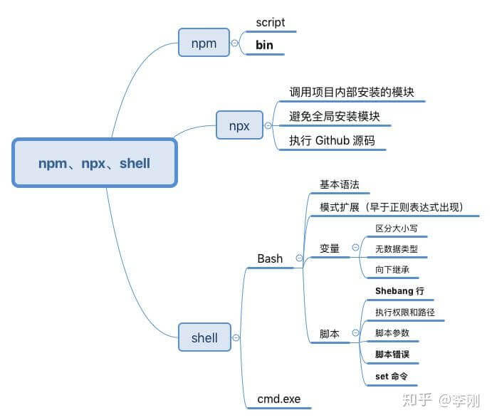
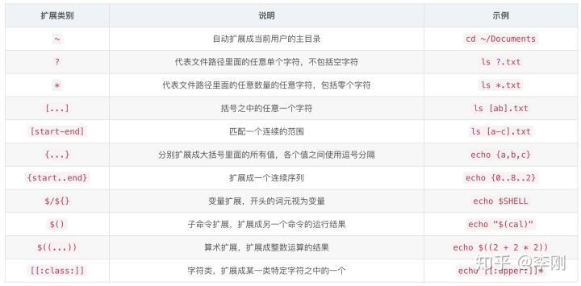

# 从 npm、npx 说起，到 shell

> 背景：目前整个我们前端工程栈有多处 CLI（包括工具、模板等等），CLI 带来了巨大的便利性，但其在 Windows 下执行往往和 Mac/Unix 系统下表现不同。今天想从 `npm run <command>` 命令开始，尽可能的阐述一下整条链~~~



## npm

### script

- 项目的相关脚本，可以集中在一个地方（这里指入口）
- 以利用 npm 提供的很多辅助功能，以及不同项目的脚本命令，只要功能相同，就可以有同样的对外接口（如 npm run test，不管是 mocha 还会 jasmine）

npm 脚本的原理非常简单。每当执行 `npm run`，就会**自动新建一个 Shell**，在这个 Shell 里面执行指定的脚本命令。因此，只要是 Shell（一般是 [**Bash**](../linux/bash.md)）可以运行的命令，就可以写在 npm 脚本里面。

In addition to the shell's pre-existing `PATH`, npm run adds `node_modules/.bin` to the `PATH` provided to scripts. Any binaries provided by locally-installed dependencies can be used without the `node_modules/.bin` prefix.

比较特别的是，`npm run` 新建的这个 Shell，会将当前目录的 `node_modules/.bin` 子目录加入 `PATH` 变量，执行结束后，再将 `PATH` 变量恢复原样。

这意味着，当前目录的 `node_modules/.bin` 子目录里面的所有脚本，都可以直接用脚本名调用，而不必加上路径。比如，当前项目的依赖里面有 Mocha，只要直接写 `mocha test` 就可以了。

```json
"script": {
  "test": "mocha test",
  "test": "./node_modules/.bin/mocha test"
}
```

由于 npm 脚本的唯一要求就是可以在 Shell 执行，因此它不一定是 Node 脚本，任何可执行文件都可以写在里面。npm 脚本的退出码，也遵守 Shell 脚本规则。如果退出码不是 0，npm 就认为这个脚本执行失败。

> 退出码对于命令的串行执行意义重大：[npm 并行&串行执行多个 scripts 命令](https://ligang.blog.csdn.net/article/details/105909789)

The actual shell your script is run within is platform dependent. By default, on Unix-like systems it is the `/bin/sh` command, on Windows it is the `cmd.exe`. The actual shell referred to by `/bin/sh` also depends on the system. As of `npm@5.1.0` you can customize the shell with the `script-shell` configuration.

脚本在 shell 中运行，取决于平台。**类 Unix 系统，是 `/bin/sh` 命令（引用的实际 shell 也取决于系统，通常是 Bash）； windows 系统是 `cmd.exe`**

### bin

```json
{
  "bin": {
    "my-cli": "./cli.js"
  }
}
```

> When in local mode, executables are linked into `./node_modules/.bin` so that they can be made available to scripts run through npm.
>
> Any bin files are symlinked to `./node_modules/.bin/`, so that they may be found by npm scripts when necessary.

```bash
# 此符号链接是在 npm/yarn install @idss/git-commit-cli 时创建的

\$ ls -l node_modules/.bin/idss-git-commit
lrwxr-xr-x 1 ligang staff 37 5 25 18:12 node_modules/.bin/idss-git-commit -> ../@idss/git-commit-cli/git/commit.js
```

- 如果是全局安装，npm 将会使用符号链接把这些文件链接到 `/usr/local/bin/`
- 如果是本地安装，会链接到 `./node_modules/.bin/`

windows 下会生成两个文件：mycli、mycli.cmd

在 windows 下开发，推荐使用 git bash，安装后就拥有了类 linux 的环境。

**环境变量（如：当前工作目录）**

```bash
process.env.PWD || process.env.INIT_CWD
```

- `process.env.PWD` 是 [Node Api](http://nodejs.cn/api/process.html#process_process_env)
- `process.env.INIT_CWD` 是 [Npm/Yarn 追加的环境变量](https://github.com/npm/npm/pull/12356;https://github.com/yarnpkg/yarn/pull/5656)

## npx

npm 从 5.2 版开始，增加了 npx 命令。Node 自带 npm 模块，所以可以直接使用 npx 命令。

### 调用项目内部安装的模块

一般来说，调用 Mocha ，只能在项目脚本和 package.json 的 scripts 字段里面， 如果想在命令行下调用，必须像下面这样。

```bash
# 项目的根目录下执行
$ node-modules/.bin/mocha --version
```

npx 就是想解决这个问题，让项目内部安装的模块用起来更方便，只要像下面这样调用就行了。

```bash
$ npx mocha --version
```

npx 的原理很简单，就是运行的时候，会到 node_modules/.bin 路径和环境变量$PATH 里面，检查命令是否存在。由于 npx 会检查环境变量\$PATH，所以系统命令也可以调用。

```bash
# 等同于 ls
$ npx ls
```

注意，Bash 内置的命令不在 `$PATH` 里面，所以不能用。比如，`cd` 是 Bash 命令，因此就不能用 `npx cd`。

### 避免全局安装模块

```bash
$ npx @vue/cli create project
```

npx 将 `@vue/cli` 下载到一个临时目录，使用以后再删除。所以，以后再次执行上面的命令，会重新下载。

> 使用不同版本的 node

```bash
$ npx node@0.12.8 -v
$ npx -p node@8 npm run build
```

### 执行 GitHub 源码

```bash
# 执行仓库代码
$ npx <username>/<repo_name>#<branch_name>
$ npx 381510688/npm_test my-cli
```

注意，远程代码必须是一个模块，即必须包含 `package.json` 和入口脚本 `bin`。

## Shell

### 含义

- Shell 是一个程序，提供一个与用户对话的环境。这个环境只有一个命令提示符，让用户从键盘输入命令，所以又称为命令行环境（commandline，简写为 CLI）。Shell 接收到用户输入的命令，将命令送入操作系统执行，并将结果返回给用户
- Shell 是一个命令解释器，解释用户输入的命令。它支持变量、条件判断、循环操作等语法，所以用户可以用 Shell 命令写出各种小程序，又称为脚本（script）。这些脚本都通过 Shell 的解释执行，而不通过编译
- Shell 是一个工具箱，提供了各种小工具，供用户方便地使用操作系统的功能
- (YY)：在排序算法中，Shell 是希尔排序的名称。

### 分类

不同系统有不同的 shell

- Bourne Shell（sh）
- **Bourne Again shell（bash）**
- C Shell（csh）
- TENEX C Shell（tcsh）
- Korn shell（ksh）
- Z Shell（zsh）
- Friendly Interactive Shell（fish）

```bash
# 查看当前运行的 Shell

$ echo $SHELL
MacOS: /bin/zsh
Linux: /bin/bash

# 查看当前的 Linux 系统安装的所有 Shell

\$ cat /etc/shells
/bin/bash
/bin/csh
/bin/ksh
/bin/sh
/bin/tcsh
/bin/zsh
```

### Bash

Bash 是目前最常用的 Shell。在 linux 系统中，通常是 Bash。`/bin/zsh` Z Shell 是 Bash 扩展，带有数量庞大的改进。

Bash，Unix shell 的一种，在 1987 年由布莱恩·福克斯为了 GNU 计划而编写。其能运行于大多数 Unix 系统的操作系统之上，包括 Linux 和 Mac OS 都将他作为默认 shell。

> NU 计划（英语：GNU Project）：目标是创建一套完全自由的操作系统，称为 GNU。附带一份《GNU 宣言》等解释为何发起该计划的文章，其中一个理由就是要“重现当年软件界合作互助的团结精神”。
> 在一般的 linux 系统当中（如 redhat），使用 sh 调用执行脚本相当于打开了 bash 的 POSIX 标准模式

```bash
\$ ll -h /bin/sh
lrwxrwxrwx. 1 root root 4 10 月 19 2018 /bin/sh -> bash
```

### 命令行环境

终端模拟器，一个模拟命令行窗口的程序，让用户在一个窗口中使用命令行环境，并且提供各种附加功能，比如调整颜色、字体大小、行距等等。

```bash
# 启动 Bash

\$ bash

# 退出 Bash 环境（也可以同时按下 Ctrl + d）

\$ exit
```

### 基本语法

```bash
command [ arg1 ... [ argN ]]
```

- 使用空格（或 Tab 键）区分不同的参数
- 分号（;）是命令的结束符，使得一行可以放置多个命令
- `Command1 && Command2` 如果 `Command1` 命令运行成功，则继续运行 `Command2` 命令
- `Command1 || Command2` 如果 `Command1` 命令运行失败，则继续运行 `Command2` 命令
-

echo：在屏幕输出一行文本，可以将该命令的参数原样输出

- -n：可以取消末尾的回车符，使得下一个提示符紧跟在输出内容的后面
- -e：会解释引号（双引号和单引号）里面的特殊字符（比如换行符\n）；否则原样输出
-

### 快捷键：

- Ctrl + L：清除屏幕并将当前行移到页面顶部。
- Ctrl + C：中止当前正在执行的命令。
- Shift + PageUp：向上滚动。
- Shift + PageDown：向下滚动。
- Ctrl + U：从光标位置删除到行首。
- Ctrl + K：从光标位置删除到行尾。
- Ctrl + D：关闭 Shell 会话。
- ↑，↓：浏览已执行命令的历史记录。

### 模式扩展

模式扩展与正则表达式的关系是，模式扩展早于正则表达式出现，可以看作是原始的正则表达式。它的功能没有正则那么强大灵活，但是优点是简单和方便



### 变量

环境变量是 Bash 环境自带的变量，进入 Shell 时已经定义好了，可以直接使用

```bash
# 示所有环境变量

\$ env
```

1. Bash 变量名区分大小写，HOME 和 home 是两个不同的变量
2. Bash 没有数据类型的概念，所有的变量值都是字符串

```bash
# 创建变量

\$ myvar="hello world"

# 读取变量

$ echo $myvar

# 删除变量

\$ unset myvar

# 输出变量

\$ export myvar="hello world"
```

`declare` 声明一些特殊类型的变量，比如声明只读类型的变量和整数类型的变量

```bash
\$ declare -i val1=12
```

1. 子 Shell 如果修改继承的变量，不会影响父 Shell

```bash
# 输出变量 \$foo

\$ export foo=bar

# 新建子 Shell

\$ bash

# 读取 \$foo

$ echo $foo
bar

# 修改继承的变量

\$ foo=baz

# 退出子 Shell

\$ exit

# 读取 \$foo

$ echo $foo
bar
```

### Here 文档

Here 文档（here document）是一种输入多行字符串的方法，格式如下。

```bash
<< token
text
token
```

它的格式分成开始标记（`<< token`）和结束标记（`token`）。开始标记是两个小于号 + Here 文档的名称，名称可以随意取，后面必须是一个换行符；结束标记是单独一行顶格写的 Here 文档名称，如果不是顶格，结束标记不起作用。两者之间就是多行字符串的内容。

## 脚本

### Shebang 行

脚本的第一行通常是指定解释器，即这个脚本必须通过什么解释器执行。这一行以#!字符开头，这个字符称为 Shebang，所以这一行就叫做 Shebang 行。

`#!` 后面就是脚本解释器的位置，Bash 脚本的解释器一般是 `/bin/sh` 或 `/bin/bash`。

```bash
#!/bin/sh

# 或者

#!/bin/bash
```

`#!` 与脚本解释器之间有没有空格，都是可以的。

如果 Bash 解释器不放在目录 `/bin`，脚本就无法执行了。为了保险，可以写成下面这样：

```bash
#!/usr/bin/env bash

# node 脚本

#!/usr/bin/env node
```

`#!/usr/bin/env NAME` 这个语法的意思是，让 Shell 查找 `$PATH` 环境变量里面第一个匹配的 NAME。如果你不知道某个命令的具体路径，或者希望兼容其他用户的机器，这样的写法就很有用。

### 执行权限和路径

```bash
# 给所有用户读权限和执行权限

$ chmod 755 script.sh
```

一般需要指定脚本的路径（比如 `path/script.sh`）。如果将脚本放在环境变量\$PATH 指定的目录中，就不需要指定路径了。因为 Bash 会自动到这些目录中，寻找是否存在同名的可执行文件。

```bash
# ~/.bashrc 或 ~/.bash_profile

# 在 ~/.bin 目录下不需要再加 path

$ export PATH=$PATH:~/bin
$ source ~/.bash_profile
```

### 脚本参数

```bash
$ script.sh word1 word2 word3
```

脚本文件内部，可以使用特殊变量，引用这些参数。

- `$0`：脚本文件名，即 `script.sh`。
- `$1~$9`：对应脚本的第一个参数到第九个参数。
- `$#`：参数的总数。
- `$@`：全部的参数，参数之间使用空格分隔。
- `$*`：全部的参数，参数之间使用变量 `$IFS` 值的第一个字符分隔，默认为空格，但是可以自定义。

### 错误处理

如果脚本里面有运行失败的命令（返回值非 0），Bash 默认会继续执行后面的命令（只是显示有错误，并没有终止执行）。

这种行为很不利于脚本安全和除错。实际开发中，如果某个命令失败，往往需要脚本停止执行，防止错误累积。这时，一般采用下面的写法。

```bash
$ command || exit 1
$ command || { echo "command failed"; exit 1; }
```

### set 命令

set 可以控制脚本的安全性和可维护性。https://www.gnu.org/software/bash/manual/html_node/The-Set-Builtin.html

Bash 执行脚本的时候（包括上述讲述的 `npm run script`），会创建一个新的 Shell（这个 Shell 就是脚本的执行环境，Bash 默认给定了这个环境的各种参数）set 命令用来修改 Shell 环境的运行参数，也就是可以定制环境

```bash
#!/usr/bin/env bash
set -euxo
```

- `set -u`：遇到不存在的变量就会报错，并停止执行（默认忽略跳过）
- `set -x`：在运行结果之前，先输出执行的那一行命令（默认情况下，脚本执行后，屏幕只显示运行结果，没有其他内容）
- `set -e`：使得脚本只要发生错误，就终止执行（彻底解决上述「错误处理」；不适用于管道命令）
- `set -o`：只要一个子命令失败，整个管道命令就失败，脚本就会终止执行

### 其他

- read [-options][variable...]：脚本需要在执行过程中，由用户提供一部分数据，这时可以使用 read 命令；它将用户的输入存入一个变量，方便后面的代码使用。用户按下回车键，就表示输入结束
- if commands; then commands
- 循环

```bash
while condition; do
commands
done

# for...in

for variable in list
do
commands
done
```

### cmd.exe

cmd.exe 是微软 Windows 系统的命令处理程序。命令提示符为用户提供了一个命令行界面，该功能通过 Win32 控制台实现。用户可通过命令行运行程序和批处理文件，从而进行系统管理等。此外，命令提示符还支持管道和重定向功能。

Windows 上的旧命令行工具 cmd.exe 处于维护模式，PowerShell 则代表着未来。

PowerShell 是一个 Windows 任务自动化的框架，它由一个命令行 shell 和内置在这个 .NET 框架上的编程语言组成，可以利用 .NET Framework 的强大功能。

```bash
$ .\node_modules\.bin\webpack
```
