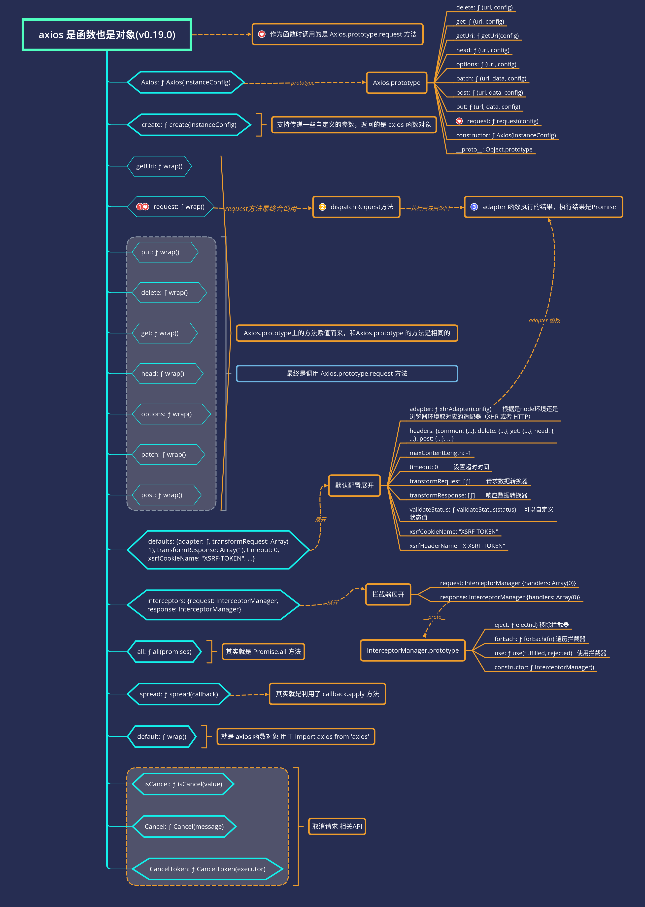

## 1. 前言

文章详细介绍了 `axios` 调试方法。详细介绍了 `axios` 构造函数，拦截器，取消等功能的实现。最后还对比了其他请求库。

本文学习的版本是`v0.19.0`。克隆的官方仓库的`master`分支。
截至目前（2019 年 12 月 14 日），最新一次`commit`是`2019-12-09 15:52 ZhaoXC` `dc4bc49673943e352`，`fix: fix ignore set withCredentials false (#2582)`。

如果你是求职者，项目写了运用了`axios`，面试官可能会问你：

> 1.为什么 `axios` 既可以当函数调用，也可以当对象使用，比如`axios({})`、`axios.get`。
>
> 2.简述 `axios` 调用流程。
>
> 3.有用过拦截器吗？原理是怎样的？
>
> 4.有使用`axios`的取消功能吗？是怎么实现的？
>
> 5.为什么支持浏览器中发送请求也支持`node`发送请求？

## 2. chrome 和 vscode 调试 axios 源码方法

> 1.借助调试
>
> 2.搜索查阅相关高赞文章
>
> 3.把不懂的地方记录下来，查阅相关文档
>
> 4.总结

看源码，调试很重要，所以笔者详细写下 `axios` 源码调试方法，帮助一些可能不知道如何调试的读者。

<details>
<summary>点击查看调试方法</summary>

### 2.1 chrome 调试浏览器环境的 axios

`axios`打包后有`sourcemap`文件。

```bash
# 可以克隆这个仓库代码
git clone https://github.com/lxchuan12/axios-analysis.git
cd axios-analaysis/axios
npm install
npm start
# open [http://localhost:3000](http://localhost:3000)
# chrome F12 source 控制面板  webpack//   .  lib 目录下，根据情况自行断点调试
```

本文就是通过上述的例子`axios/sandbox/client.html`来调试的。

顺便简单提下调试`example`的例子，虽然文章最开始时写了这部分，后来又删了，最后想想还是写下。

找到文件`axios/examples/server.js`，修改代码如下：

```js
server = http.createServer(function (req, res) {
  var url = req.url;
  // 调试 examples
  console.log(url);
  // Process axios itself
  if (/axios\.min\.js$/.test(url)) {
    // 原来的代码 是 axios.min.js
    // pipeFileToResponse(res, '../dist/axios.min.js', 'text/javascript');
    pipeFileToResponse(res, '../dist/axios.js', 'text/javascript');
    return;
  }
  // 原来的代码 是 axios.min.map
  // if (/axios\.min.map$/.test(url)) {
  if (/axios\.map$/.test(url)) {
    // 原来的代码 是 axios.min.map
    // pipeFileToResponse(res, '../dist/axios.min.map', 'text/javascript');
    pipeFileToResponse(res, '../dist/axios.map', 'text/javascript');
    return;
  }
}
```

```bash
# 上述安装好依赖后
# npm run examples 不能同时开启，默认都是3000端口
# 可以指定端口 5000
# npm run examples ===  node ./examples/server.js
node ./examples/server.js -p 5000
```

打开[http://localhost:5000](http://localhost:5000)，然后就可以开心的在`Chrome`浏览器中调试`examples`里的例子了。

`axios` 是支持 `node` 环境发送请求的。接下来看如何用 `vscode` 调试 `node` 环境下的`axios`。

### 2.2 vscode 调试 node 环境的 axios

在根目录下 `axios-analysis/`
创建`.vscode/launch.json`文件如下：

```json
{
  // 使用 IntelliSense 了解相关属性。
  // 悬停以查看现有属性的描述。
  // 欲了解更多信息，请访问: https://go.microsoft.com/fwlink/?linkid=830387
  "version": "0.2.0",
  "configurations": [
    {
      "type": "node",
      "request": "launch",
      "name": "Launch Program",
      "program": "${workspaceFolder}/axios/sandbox/client.js",
      "skipFiles": ["<node_internals>/**"]
    }
  ]
}
```

按`F5`开始调试即可，按照自己的情况，单步跳过`（F10）`、单步调试`（F11）`断点调试。

其实开源项目一般都有贡献指南`axios/CONTRIBUTING.md`，笔者只是把这个指南的基础上修改为引用`sourcemap`的文件可调试。

</details>

## 3. axios 结构

```bash
git clone https://github.com/lxchuan12/axios-analysis.git
cd axios-analaysis/axios
npm install
npm start
```

按照上文说的调试方法， `npm start` 后，直接在 `chrome` 浏览器中调试。
打开 [http://localhost:3000](http://localhost:3000)，在控制台打印出`axios`，估计很多人都没打印出来看过。

```js
console.log({ axios: axios })
```

层层点开来看，`axios` 的结构是怎样的，先有一个大概印象。

笔者画了一张比较详细的图表示。



看完结构图，如果看过`jQuery`、`underscore`和`lodash`源码，会发现其实跟`axios`源码设计类似。

`jQuery` 别名 `$`，`underscore` `loadsh` 别名 `_` 也既是函数，也是对象。比如`jQuery`使用方式。`$('#id')`, `$.ajax`。

接下来看具体源码的实现。可以跟着断点调试一下。

**断点调试要领：**<br>
**赋值语句可以一步跳过，看返回值即可，后续详细再看。**<br>
**函数执行需要断点跟着看，也可以结合注释和上下文倒推这个函数做了什么。**<br>

## 4. axios 源码 初始化

看源码第一步，先看`package.json`。一般都会申明 `main` 主入口文件。

```json
// package.json
{
  "name": "axios",
  "version": "0.19.0",
  "description": "Promise based HTTP client for the browser and node.js",
  "main": "index.js"
  // ...
}
```

主入口文件

```js
// index.js
module.exports = require('./lib/axios')
```

### 4.1 `lib/axios.js`主文件

`axios.js`文件 代码相对比较多。分为三部分展开叙述。

> 1.  第一部分：引入一些工具函数`utils`、`Axios`构造函数、默认配置`defaults`等。<br>
> 2.  第二部分：是生成实例对象 `axios`、`axios.Axios`、`axios.create`等。<br>
> 3.  第三部分取消相关 API 实现，还有`all`、`spread`、导出等实现。<br>

#### 4.1.1 第一部分

引入一些工具函数`utils`、`Axios`构造函数、默认配置`defaults`等。

```js
// 第一部分：
// lib/axios
// 严格模式
'use strict'
// 引入 utils 对象，有很多工具方法。
var utils = require('./utils')
// 引入 bind 方法
var bind = require('./helpers/bind')
// 核心构造函数 Axios
var Axios = require('./core/Axios')
// 合并配置方法
var mergeConfig = require('./core/mergeConfig')
// 引入默认配置
var defaults = require('./defaults')
```

#### 4.1.2 第二部分

是生成实例对象 `axios`、`axios.Axios`、`axios.create`等。

```js
/**
 * Create an instance of Axios
 *
 * @param {Object} defaultConfig The default config for the instance
 * @return {Axios} A new instance of Axios
 */
function createInstance(defaultConfig) {
  // new 一个 Axios 生成实例对象
  var context = new Axios(defaultConfig)
  // bind 返回一个新的 wrap 函数，
  // 也就是为什么调用 axios 是调用 Axios.prototype.request 函数的原因
  var instance = bind(Axios.prototype.request, context)
  // Copy axios.prototype to instance
  // 复制 Axios.prototype 到实例上。
  // 也就是为什么 有 axios.get 等别名方法，
  // 且调用的是 Axios.prototype.get 等别名方法。
  utils.extend(instance, Axios.prototype, context)
  // Copy context to instance
  // 复制 context 到 intance 实例
  // 也就是为什么默认配置 axios.defaults 和拦截器  axios.interceptors 可以使用的原因
  // 其实是new Axios().defaults 和 new Axios().interceptors
  utils.extend(instance, context)
  // 最后返回实例对象，以上代码，在上文的图中都有体现。这时可以仔细看下上图。
  return instance
}

// Create the default instance to be exported
// 导出 创建默认实例
var axios = createInstance(defaults)
// Expose Axios class to allow class inheritance
// 暴露 Axios class 允许 class 继承 也就是可以 new axios.Axios()
// 但  axios 文档中 并没有提到这个，我们平时也用得少。
axios.Axios = Axios

// Factory for creating new instances
// 工厂模式 创建新的实例 用户可以自定义一些参数
axios.create = function create(instanceConfig) {
  return createInstance(mergeConfig(axios.defaults, instanceConfig))
}
```

这里简述下工厂模式。`axios.create`，也就是用户不需要知道内部是怎么实现的。<br>
举个生活的例子，我们买手机，不需要知道手机是怎么做的，就是工厂模式。<br>
看完第二部分，里面涉及几个工具函数，如`bind`、`extend`。接下来讲述这几个工具方法。<br>

#### 4.1.3 工具方法之 bind

`axios/lib/helpers/bind.js`

```js
'use strict'
// 返回一个新的函数 wrap
module.exports = function bind(fn, thisArg) {
  return function wrap() {
    var args = new Array(arguments.length)
    for (var i = 0; i < args.length; i++) {
      args[i] = arguments[i]
    }
    // 把 argument 对象放在数组 args 里
    return fn.apply(thisArg, args)
  }
}
```

传递两个参数函数和`thisArg`指向。<br>
把参数`arguments`生成数组，最后调用返回参数结构。<br>
其实现在 `apply` 支持 `arguments`这样的类数组对象了，不需要手动转数组。<br>
那么为啥作者要转数组，为了性能？当时不支持？或是作者不知道？这就不得而知了。

关于`apply`、`call`和`bind`等不是很熟悉的读者，可以看
[this 关键字](../javascript/this.md#显式绑定)<br>

举个例子

```js
function fn() {
  console.log.apply(console, arguments)
}
fn(1, 2, 3, 4, 5, 6, '若川')
// 1 2 3 4 5 6 '若川'
```

#### 4.1.4 工具方法之 utils.extend

`axios/lib/utils.js`

```js
function extend(a, b, thisArg) {
  forEach(b, function assignValue(val, key) {
    if (thisArg && typeof val === 'function') {
      a[key] = bind(val, thisArg)
    } else {
      a[key] = val
    }
  })
  return a
}
```

其实就是遍历参数 `b` 对象，复制到 `a` 对象上，如果是函数就是则用 `bind` 调用。

#### 4.1.5 工具方法之 utils.forEach

`axios/lib/utils.js`

遍历数组和对象。设计模式称之为迭代器模式。很多源码都有类似这样的遍历函数。比如大家熟知的`jQuery` `$.each`。

```js
/**
 * @param {Object|Array} obj The object to iterate
 * @param {Function} fn The callback to invoke for each item
 */
function forEach(obj, fn) {
  // Don't bother if no value provided
  // 判断 null 和 undefined 直接返回
  if (obj === null || typeof obj === 'undefined') {
    return
  }

  // Force an array if not already something iterable
  // 如果不是对象，放在数组里。
  if (typeof obj !== 'object') {
    /*eslint no-param-reassign:0*/
    obj = [obj]
  }

  // 是数组 则用for 循环，调用 fn 函数。参数类似 Array.prototype.forEach 的前三个参数。
  if (isArray(obj)) {
    // Iterate over array values
    for (var i = 0, l = obj.length; i < l; i++) {
      fn.call(null, obj[i], i, obj)
    }
  } else {
    // Iterate over object keys
    // 用 for in 遍历对象，但 for in 会遍历原型链上可遍历的属性。
    // 所以用 hasOwnProperty 来过滤自身属性了。
    // 其实也可以用Object.keys来遍历，它不遍历原型链上可遍历的属性。
    for (var key in obj) {
      if (Object.prototype.hasOwnProperty.call(obj, key)) {
        fn.call(null, obj[key], key, obj)
      }
    }
  }
}
```

如果对`Object`相关的`API`不熟悉，可以查看[object](../javascript/object.md)

#### 4.1.6 第三部分

取消相关 API 实现，还有`all`、`spread`、导出等实现。

```js
// Expose Cancel & CancelToken
// 导出 Cancel 和 CancelToken
axios.Cancel = require('./cancel/Cancel')
axios.CancelToken = require('./cancel/CancelToken')
axios.isCancel = require('./cancel/isCancel')

// Expose all/spread
// 导出 all 和 spread API
axios.all = function all(promises) {
  return Promise.all(promises)
}
axios.spread = require('./helpers/spread')

module.exports = axios

// Allow use of default import syntax in TypeScript
// 也就是可以以下方式引入
// import axios from 'axios';
module.exports.default = axios
```

这里介绍下 `spread`，取消的`API`暂时不做分析，后文再详细分析。

假设你有这样的需求。

```js
function f(x, y, z) {}
var args = [1, 2, 3]
f.apply(null, args)
```

那么可以用`spread`方法。用法：

```js
axios.spread(function(x, y, z) {})([1, 2, 3])
```

实现也比较简单。源码实现：

```js
/**
 * @param {Function} callback
 * @returns {Function}
 */
module.exports = function spread(callback) {
  return function wrap(arr) {
    return callback.apply(null, arr)
  }
}
```

上文`var context = new Axios(defaultConfig);`，接下来介绍核心构造函数`Axios`。

### 4.2 核心构造函数 Axios

`axios/lib/core/Axios.js`

构造函数`Axios`。

```js
function Axios(instanceConfig) {
  // 默认参数
  this.defaults = instanceConfig
  // 拦截器 请求和响应拦截器
  this.interceptors = {
    request: new InterceptorManager(),
    response: new InterceptorManager(),
  }
}
```

```js
Axios.prototype.request = function(config) {
  // 省略，这个是核心方法，后文结合例子详细描述
  // code ...
  var promise = Promise.resolve(config)
  // code ...
  return promise
}
// 这是获取 Uri 的函数，这里省略
Axios.prototype.getUri = function() {}
// 提供一些请求方法的别名
// Provide aliases for supported request methods
// 遍历执行
// 也就是为啥我们可以 axios.get 等别名的方式调用，而且调用的是 Axios.prototype.request 方法
// 这个也在上面的 axios 结构图上有所体现。
utils.forEach(['delete', 'get', 'head', 'options'], function forEachMethodNoData(method) {
  /*eslint func-names:0*/
  Axios.prototype[method] = function(url, config) {
    return this.request(
      utils.merge(config || {}, {
        method: method,
        url: url,
      })
    )
  }
})

utils.forEach(['post', 'put', 'patch'], function forEachMethodWithData(method) {
  /*eslint func-names:0*/
  Axios.prototype[method] = function(url, data, config) {
    return this.request(
      utils.merge(config || {}, {
        method: method,
        url: url,
        data: data,
      })
    )
  }
})

module.exports = Axios
```

接下来看拦截器部分。

### 4.3 拦截器管理构造函数 InterceptorManager

请求前拦截，和请求后拦截。<br>
在`Axios.prototype.request`函数里使用，具体怎么实现的拦截的，后文配合例子详细讲述。<br>

[axios github 仓库 拦截器文档](https://github.com/axios/axios#interceptors)

如何使用：

```js
// Add a request interceptor
// 添加请求前拦截器
axios.interceptors.request.use(
  function(config) {
    // Do something before request is sent
    return config
  },
  function(error) {
    // Do something with request error
    return Promise.reject(error)
  }
)

// Add a response interceptor
// 添加请求后拦截器
axios.interceptors.response.use(
  function(response) {
    // Any status code that lie within the range of 2xx cause this function to trigger
    // Do something with response data
    return response
  },
  function(error) {
    // Any status codes that falls outside the range of 2xx cause this function to trigger
    // Do something with response error
    return Promise.reject(error)
  }
)
```

如果想把拦截器移除，可以用`eject`方法。

```js
const myInterceptor = axios.interceptors.request.use(function() {
  /*...*/
})
axios.interceptors.request.eject(myInterceptor)
```

拦截器也可以添加自定义的实例上。

```js
const instance = axios.create()
instance.interceptors.request.use(function() {
  /*...*/
})
```

源码实现：

构造函数，`handles` 用于存储拦截器函数。

```js
function InterceptorManager() {
  this.handlers = []
}
```

接下来声明了三个方法：使用、移除、遍历。

#### 4.3.1 InterceptorManager.prototype.use 使用

传递两个函数作为参数，数组中的一项存储的是`{fulfilled: function(){}, rejected: function(){}}`。返回数字 `ID`，用于移除拦截器。

```js
/**
 * @param {Function} fulfilled The function to handle `then` for a `Promise`
 * @param {Function} rejected The function to handle `reject` for a `Promise`
 *
 * @return {Number} 返回ID 是为了用 eject 移除
 */
InterceptorManager.prototype.use = function use(fulfilled, rejected) {
  this.handlers.push({
    fulfilled: fulfilled,
    rejected: rejected,
  })
  return this.handlers.length - 1
}
```

#### 4.3.2 InterceptorManager.prototype.eject 移除

根据 `use` 返回的 `ID` 移除 拦截器。

```js
/**
 * @param {Number} id The ID that was returned by `use`
 */
InterceptorManager.prototype.eject = function eject(id) {
  if (this.handlers[id]) {
    this.handlers[id] = null
  }
}
```

有点类似定时器`setTimeout` 和 `setInterval`，返回值是`id`。用`clearTimeout` 和`clearInterval`来清除定时器。

```js
// 提一下 定时器回调函数是可以传参的，返回值 timer 是数字
var timer = setInterval(
  (name) => {
    console.log(name)
  },
  1000,
  '若川'
)
console.log(timer) // 数字 ID
// 在控制台等会再输入执行这句，定时器就被清除了
clearInterval(timer)
```

#### 4.3.3 InterceptorManager.prototype.forEach 遍历

遍历执行所有拦截器，传递一个回调函数（每一个拦截器函数作为参数）调用，被移除的一项是`null`，所以不会执行，也就达到了移除的效果。

```js
/**
 * @param {Function} fn The function to call for each interceptor
 */
InterceptorManager.prototype.forEach = function forEach(fn) {
  utils.forEach(this.handlers, function forEachHandler(h) {
    if (h !== null) {
      fn(h)
    }
  })
}
```
