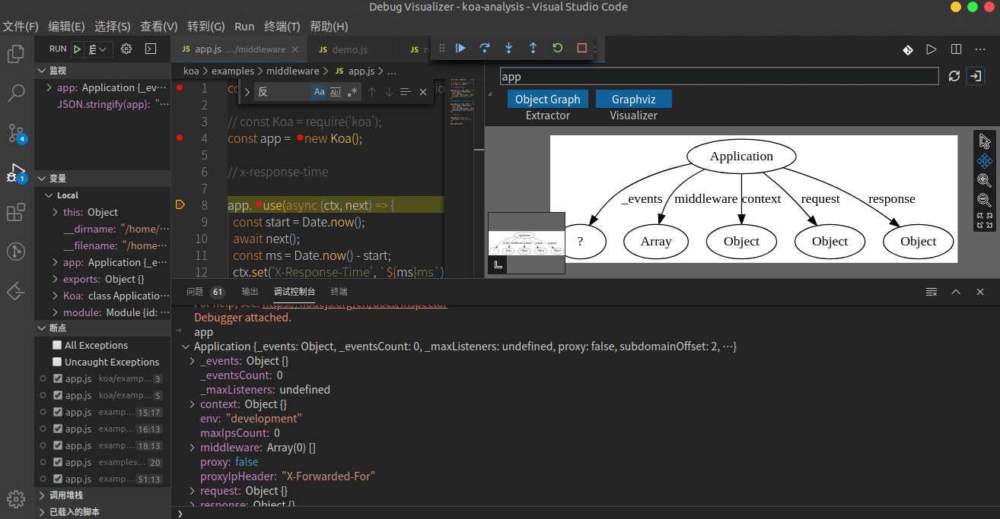
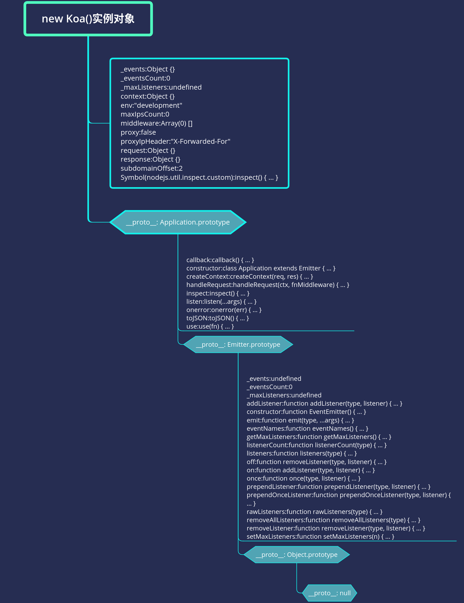

## 1. 前言

文章通过例子调试`koa`，梳理`koa`的主流程，来理解`koa-compose`洋葱模型原理和`co`库的原理，相信看完一定会有所收获。

本文学习的`koa`版本是`v2.11.0`。克隆的官方仓库的`master`分支。
截至目前（2020 年 3 月 11 日），最新一次`commit`是`2020-01-04 07:41 Olle Jonsson` `eda27608`，`build: Drop unused Travis sudo: false directive (#1416)`。

如果你简历上一不小心写了熟悉`koa`，面试官大概率会问：

> 1、`koa`洋葱模型怎么实现的。<br>
> 2、如果中间件中的`next()`方法报错了怎么办。<br>
> 3、`co`的原理是怎样的。<br>

## 2. vscode 调试 koa 源码方法

看源码，调试很重要，所以我详细写下 `koa` 源码调试方法，帮助一些可能不知道如何调试的读者。

```bash
git clone https://github.com/koajs/koa.git
```

```json
// package.json
{
  "name": "koa",
  "version": "2.11.0",
  "description": "Koa web app framework",
  "main": "lib/application.js"
}
```

克隆源码后，看`package.json`找到`main`，就知道入口文件是`lib/application.js`了。

大概看完项目结构后发现没有`examples`文件夹（一般项目都会有这个文件夹，告知用户如何使用该项目），这时仔细看`README.md`。
如果看英文`README.md`有些吃力，会发现在`Community`标题下有一个[中文文档 v2.x](https://github.com/demopark/koa-docs-Zh-CN)。同时也有一个[`examples`仓库](https://github.com/koajs/examples)。

```bash
git clone https://github.com/koajs/examples.git
```

这时再开心的把`examples`克隆到自己电脑。可以安装好依赖，逐个研究学习下这里的例子，然后可能就一不小心掌握了`koa`的基本用法。当然，我这里不详细写这一块了，我是自己手写一些例子来调试。

继续看文档会发现**使用指南**讲述`编写中间件`。

### 2.1 使用文档中的中间件`koa-compose`例子来调试

学习 `koa-compose` 前，先看图。


在`koa`中，请求响应都放在中间件的第一个参数`context`对象中了。

再引用[Koa 中文文档](https://github.com/demopark/koa-docs-Zh-CN/blob/master/guide.md#debugging-koa)中的一段：

如果您是前端开发人员，您可以将 `next()`; 之前的任意代码视为“捕获”阶段，这个简易的 `gif` 说明了 `async` 函数如何使我们能够恰当地利用堆栈流来实现请求和响应流：


> 1. 创建一个跟踪响应时间的日期
> 2. 等待下一个中间件的控制
> 3. 创建另一个日期跟踪持续时间
> 4. 等待下一个中间件的控制
> 5. 将响应主体设置为“Hello World”
> 6. 计算持续时间
> 7. 输出日志行
> 8. 计算响应时间
> 9. 设置 `X-Response-Time` 头字段
> 10. 交给 Koa 处理响应

读者们看完这个 gif 图，也可以思考下如何实现的。根据表现，可以猜测是`next`是一个函数，而且返回的可能是一个`promise`，被`await`调用。

在 examples 项目路径下配置新建 `.vscode/launch.json` 文件，`program`配置为指定文件`conditional-middleware/app.js`文件。

<details>
<summary>.vscode/launch.json 代码，点击这里展开/收缩，可以复制</summary>

```json
{
  "version": "0.2.0",
  "configurations": [
    {
      "type": "node",
      "request": "launch",
      "name": "启动程序",
      "skipFiles": ["<node_internals>/**"],
      "program": "${workspaceFolder}/conditional-middleware/app.js"
    }
  ]
}
```

</details>

按`F5键`开始调试，调试时先走主流程，必要的地方打上断点，不用一开始就关心细枝末节。

> **断点调试要领：**<br> > **赋值语句可以一步跳过，看返回值即可，后续详细再看。**<br> > **函数执行需要断点跟着看，也可以结合注释和上下文倒推这个函数做了什么。**<br>

上述比较啰嗦的写了一堆调试方法。主要是想着`授人予鱼不如授人予渔`，这样换成其他源码也会调试了。

简单说下`chrome`调试`nodejs`，`chrome`浏览器打开`chrome://inspect`，点击配置**configure...**配置`127.0.0.1:端口号`(端口号在`Vscode` 调试控制台显示了)。<br>
更多可以查看[English Debugging Guide](https://nodejs.org/en/docs/inspector)<br>
[中文调试指南](https://nodejs.org/zh-cn/docs/guides/debugging-getting-started/)<br>
喜欢看视频的读者也可以看慕课网这个视频[node.js 调试入门](https://www.imooc.com/learn/1093)，讲得还是比较详细的。<br>
不过我感觉在`chrome`调试`nodejs`项目体验不是很好（可能是我方式不对），所以我大部分具体的代码时都放在`html`文件`script`形式，在`chrome`调试了。

## 3. 先看看 `new Koa()` 结果`app`是什么

看源码我习惯性看**它的实例对象结构**，一般所有属性和方法都放在实例对象上了，而且会通过原型链查找形式查找最顶端的属性和方法。

用文件调试时，先看下执行`new Koa()`之后，`app`是什么，有个初步印象。

```js
const Koa = require('koa')
// 这里打个断点
const app = new Koa()
// x-response-time

// 这里打个断点
app.use(async (ctx, next) => {})
```

在调试控制台`ctrl + 反引号键（一般在Tab上方的按键）唤起`，输入`app`，按`enter`键打印`app`。会有一张这样的图。



`VScode`也有一个代码调试神器插件[`Debug Visualizer`](https://marketplace.visualstudio.com/items?itemName=hediet.debug-visualizer)。

安装好后插件后，按`ctrl + shift + p`，输入`Open a new Debug Visualizer View`，来使用，输入`app`，显示是图上白色部分。

不过目前体验来看，相对还比较鸡肋，只能显示一级，而且只能显示对象，相信以后会更好。更多玩法可以查看它的文档。

我把 koa 实例对象比较完整的用`xmind`画出来了，大概看看就好，有个初步印象。



接着，我们可以看下`app 实例、context、request、request`的官方文档。

### 3.1 app 实例、context、request、request 官方 API 文档

- [index API](https://github.com/demopark/koa-docs-Zh-CN/blob/master/api/index.md) | [context API](https://github.com/demopark/koa-docs-Zh-CN/blob/master/api/context.md) | [request API](https://github.com/demopark/koa-docs-Zh-CN/blob/master/api/request.md) | [response API](https://github.com/demopark/koa-docs-Zh-CN/blob/master/api/response.md)

可以真正使用的时候再去仔细看文档。

## 4. koa 主流程梳理简化

通过`F5启动调试（直接跳到下一个断点处）`、`F10单步跳过`、`F11单步调试`等，配合重要的地方断点，调试完整体代码，其实比较容易整理出如下主流程的代码。

```js
class Emitter {
  // node 内置模块
  constructor() {}
}
class Koa extends Emitter {
  constructor(options) {
    super()
    options = options || {}
    this.middleware = []
    this.context = {
      method: 'GET',
      url: '/url',
      body: undefined,
      set: function(key, val) {
        console.log('context.set', key, val)
      },
    }
  }
  use(fn) {
    this.middleware.push(fn)
    return this
  }
  listen() {
    const fnMiddleware = compose(this.middleware)
    const ctx = this.context
    const handleResponse = () => respond(ctx)
    const onerror = function() {
      console.log('onerror')
    }
    fnMiddleware(ctx)
      .then(handleResponse)
      .catch(onerror)
  }
}
function respond(ctx) {
  console.log('handleResponse')
  console.log('response.end', ctx.body)
}
```

重点就在`listen`函数里的`compose`这个函数，接下来我们就详细来**欣赏**下这个函数。

## 5. koa-compose 源码（洋葱模型实现）

通过`app.use()` 添加了若干函数，但是要把它们串起来执行呀。像上文的`gif`图一样。

`compose`函数，传入一个数组，返回一个函数。对入参是不是数组和校验数组每一项是不是函数。

```js
function compose(middleware) {
  if (!Array.isArray(middleware)) throw new TypeError('Middleware stack must be an array!')
  for (const fn of middleware) {
    if (typeof fn !== 'function') throw new TypeError('Middleware must be composed of functions!')
  }

  //  传入对象 context 返回Promise
  return function(context, next) {
    // last called middleware #
    let index = -1
    return dispatch(0)
    function dispatch(i) {
      if (i <= index) return Promise.reject(new Error('next() called multiple times'))
      index = i
      let fn = middleware[i]
      if (i === middleware.length) fn = next
      if (!fn) return Promise.resolve()
      try {
        return Promise.resolve(fn(context, dispatch.bind(null, i + 1)))
      } catch (err) {
        return Promise.reject(err)
      }
    }
  }
}
```

`compose`就是类似这样的结构（移除一些判断）。

```js
// 这样就可能更好理解了。
const [fn1, fn2, fn3] = this.middleware
const fnMiddleware = function(context) {
  return Promise.resolve(
    fn1(context, function next() {
      return Promise.resolve(
        fn2(context, function next() {
          return Promise.resolve(
            fn3(context, function next() {
              return Promise.resolve()
            })
          )
        })
      )
    })
  )
}
fnMiddleware(ctx)
  .then(handleResponse)
  .catch(onerror)
```

> 也就是说`koa-compose`返回的是一个`Promise`，`Promise`中取出第一个函数（`app.use`添加的中间件），传入`context`和第一个`next`函数来执行。<br>
> 第一个`next`函数里也是返回的是一个`Promise`，`Promise`中取出第二个函数（`app.use`添加的中间件），传入`context`和第二个`next`函数来执行。<br>
> 第二个`next`函数里也是返回的是一个`Promise`，`Promise`中取出第三个函数（`app.use`添加的中间件），传入`context`和第三个`next`函数来执行。<br>
> 第三个...<br>
> 以此类推。最后一个中间件中有调用`next`函数，则返回`Promise.resolve`。如果没有，则不执行`next`函数。
> 这样就把所有中间件串联起来了。这也就是我们常说的洋葱模型。<br>

**不得不说非常惊艳，“玩还是大神会玩”**。

这种把函数存储下来的方式，在很多源码中都有看到。比如`lodash`源码的惰性求值，`vuex`也是把`action`等函数存储下，最后才去调用。

搞懂了`koa-compose` 洋葱模型实现的代码，其他代码就不在话下了。

## 6. 错误处理

[中文文档 错误处理](https://github.com/demopark/koa-docs-Zh-CN/blob/master/error-handling.md)

仔细看文档，文档中写了三种捕获错误的方式。

- `ctx.onerror` 中间件中的错误捕获
- `app.on('error', (err) => {})` 最外层实例事件监听形式
  也可以看看例子[koajs/examples/errors/app.js 文件](https://github.com/koajs/examples/blob/master/errors/app.js)
- `app.onerror = (err) => {}` 重写`onerror`自定义形式
  也可以看[测试用例 onerror](https://github.com/lxchuan12/koa-analysis/blob/master/koa/test/context/onerror.js)

```js
class Application extends Emitter {
  // 代码有简化组合
  listen() {
    const fnMiddleware = compose(this.middleware)
    if (!this.listenerCount('error')) this.on('error', this.onerror)
    const onerror = (err) => ctx.onerror(err)
    fnMiddleware(ctx)
      .then(handleResponse)
      .catch(onerror)
  }
  onerror(err) {
    // 代码省略
    // ...
  }
}
```

**ctx.onerror**

`lib/context.js`文件中，有一个函数`onerror`，而且有这么一行代码`this.app.emit('error', err, this)`。

```js
module.exports = {
  onerror() {
    // delegate
    // app 是在new Koa() 实例
    this.app.emit('error', err, this)
  },
}
```

```js
app.use(async (ctx, next) => {
  try {
    await next()
  } catch (err) {
    err.status = err.statusCode || err.status || 500
    throw err
  }
})
```

`try catch` 错误或被`fnMiddleware(ctx).then(handleResponse).catch(onerror);`，这里的`onerror`是`ctx.onerror`<br>
而`ctx.onerror`函数中又调用了`this.app.emit('error', err, this)`，所以在最外围`app.on('error'，err => {})`可以捕获中间件链中的错误。
因为`koa`继承自`events模块`，所以有`emit`和`on`等方法）
