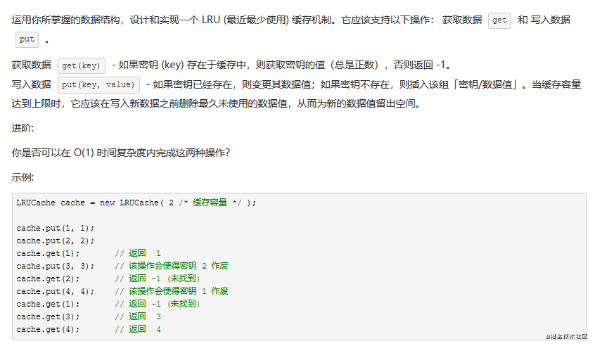

# 手写 js 系列

## 1. 实现一个 compose 函数

#### 用法如下

```javascript
function fn1(x) {
  return x + 1
}
function fn2(x) {
  return x + 2
}
function fn3(x) {
  return x + 3
}
function fn4(x) {
  return x + 4
}
const fun = compose(fn1, fn2, fn3, fn4)
console.log(fun(0)) // 0+4+3+2+1=10
```

#### 实现代码如下:

```javascript
function compose(...fn) {
  if (!fn.length) return (v) => v
  if (fn.length === 1) return fn[0]
  return fn.reduce((pre, cur) => (...args) => pre(cur(...args)))
}
```

## 2. 数组扁平化

实现一个方法使多维数组变成一维数组

#### 递归版本如下

```javascript
function flatter(arr) {
  if (!arr.length) return
  return arr.reduce((pre, cur) => (Array.isArray(cur) ? [...pre, ...flatter(cur)] : [...pre, cur]), [])
}
// console.log(flatter([1, 2, [1, [2, 3, [4, 5, [6]]]]]))
```

#### 迭代版本如下:

```javascript
function flatter(arr) {
  if (!arr.length) return
  while (arr.some((item) => Array.isArray(item))) {
    arr = [].concat(...arr)
  }
  return arr
}
// console.log(flatter([1, 2, [1, [2, 3, [4, 5, [6]]]]]))
```

## 3. 实现有并行限制的 Promise 调度器

实现一个带并发限制的异步调度器 Scheduler，保证同时运行的任务最多有两个

```javascript
addTask(1000, '1')
addTask(500, '2')
addTask(300, '3')
addTask(400, '4')
/* 输出顺序是：2 3 1 4

整个的完整执行流程：

一开始1、2两个任务开始执行
500ms时，2任务执行完毕，输出2，任务3开始执行
800ms时，3任务执行完毕，输出3，任务4开始执行
1000ms时，1任务执行完毕，输出1，此时只剩下4任务在执行
1200ms时，4任务执行完毕，输出4 */
```

#### 实现代码如下:

```javascript
class Scheduler {
  constructor(limit) {
    this.queue = []
    this.maxCount = limit
    this.runCounts = 0
  }
  add(time, order) {
    const promiseCreator = () => {
      return new Promise((resolve, reject) => {
        setTimeout(() => {
          console.log(order)
          resolve()
        }, time)
      })
    }
    this.queue.push(promiseCreator)
  }
  taskStart() {
    for (let i = 0; i < this.maxCount; i++) {
      this.request()
    }
  }
  request() {
    if (!this.queue || !this.queue.length || this.runCounts >= this.maxCount) {
      return
    }
    this.runCounts++
    this.queue
      .shift()()
      .then(() => {
        this.runCounts--
        this.request()
      })
  }
}
const scheduler = new Scheduler(2)
const addTask = (time, order) => {
  scheduler.add(time, order)
}
addTask(1000, '1')
addTask(500, '2')
addTask(300, '3')
addTask(400, '4')
scheduler.taskStart()
```

## 4. 发布订阅模式

实现一个发布订阅模式拥有 on emit once off 方法

#### 实现代码如下:

```javascript
class EventEmitter {
  constructor() {
    this.events = {}
  }
  // 实现订阅
  on(type, callBack) {
    if (!this.events[type]) {
      this.events[type] = [callBack]
    } else {
      this.events[type].push(callBack)
    }
  }
  // 删除订阅
  off(type, callBack) {
    if (!this.events[type]) return
    this.events[type] = this.events[type].filter((item) => {
      return item !== callBack
    })
  }
  // 只执行一次订阅事件
  once(type, callBack) {
    function fn() {
      callBack()
      this.off(type, fn)
    }
    this.on(type, fn)
  }
  // 触发事件
  emit(type, ...rest) {
    this.events[type] && this.events[type].forEach((fn) => fn.apply(this, rest))
  }
}
// 使用如下
// const event = new EventEmitter()

// const handle = (...rest) => {
//   console.log(rest)
// }

// event.on("click", handle)

// event.emit("click", 1, 2, 3, 4)

// event.off("click", handle)

// event.emit("click", 1, 2)

// event.once("dbClick", () => {
//   console.log(123456)
// })
// event.emit("dbClick")
// event.emit("dbClick")
```

## 5. settimeout 模拟实现 setinterval(带清除定时器的版本)

setinterval 用来实现循环定时调用 可能会存在一定的问题 可以用 settimeout 解决。每个 setTimeout 产生的任务会直接 push 到任务队列中；而 setInterval 在每次把任务 push 到任务队列前，都要进行一下判断（看上次的任务是否仍在队列中，如果有则不添加，没有则添加）。

#### 实现代码如下:

```javascript
function mySettimeout(fn, t) {
  let timer = null
  function interval() {
    fn()
    timer = setTimeout(interval, t)
  }
  interval()
  return {
    cancel: () => {
      clearTimeout(timer)
    },
  }
}
// let fun = mySettimeout(() => {
//   console.log(1)
// }, 1000)
// fun.cancel() 清除定时器
```

## 6. 寄生组合继承

较好的 js 继承方式

#### 实现代码如下:

```javascript
function Parent(name) {
  this.name = name
  this.say = () => {
    console.log(1)
  }
}
Parent.prototype.play = () => {
  console.log(2)
}
function Children(name) {
  Parent.call(this)
  this.name = name
}
Children.prototype = Object.create(Parent.prototype)
Children.prototype.constructor = Children
// let child = new Children("1")
// console.log(child.name)
// child.say()
// child.play()
```

## 7. new 操作符

#### 实现代码如下:

```javascript
function myNew(fn, ...args) {
  const obj = Object.create(fn.prototype)
  const res = fn.call(obj, ...args)
  return res instanceof Object ? res : obj
}
// 用法如下：
// function Person(name, age) {
//   this.name = name
//   this.age = age
// }
// Person.prototype.say = function() {
//   console.log(this.age)
// }
// let p1 = myNew(Person, "mj", 18)
// console.log(p1.name)
// console.log(p1)
// p1.say()
```

## 8. 手写 call apply bind

#### 实现代码如下:

```javascript
Function.prototype.myCall = function(context, ...args) {
  // 参数是否存在，如果存在则转为Object类型，否则直接取window对象为默认对象
  context = context ? Object(context) : window
  // 创造唯一的key值  作为我们构造的context内部方法名
  const fn = Symbol()
  context[fn] = this //this指向调用call的函数
  // 执行函数并返回结果 调用this指向context
  const result = context[fn](...args)
  delete context[fn]
  return result
}

// apply原理一致  只是第二个参数是传入的数组
Function.prototype.myApply = function(context, args) {
  // 参数是否存在，如果存在则转为Object类型，否则直接取window对象为默认对象
  context = context ? Object(context) : window
  // 创造唯一的key值  作为我们构造的context内部方法名
  const fn = Symbol()
  context[fn] = this
  // 执行函数并返回结果
  return context[fn](...args)
}

//bind实现要复杂一点  因为他考虑的情况比较多 还要涉及到参数合并(类似函数柯里化)
Function.prototype.myBind = function(context, ...args) {
  // 参数是否存在，如果存在则转为Object类型，否则直接取window对象为默认对象
  context = context ? Object(context) : window
  // 创造唯一的key值  作为我们构造的context内部方法名
  const fn = Symbol()
  context[fn] = this
  const _this = this
  //  bind情况要复杂一点
  const result = function(...innerArgs) {
    // 第一种情况 :若是将 bind 绑定之后的函数当作构造函数，通过 new 操作符使用，则不绑定传入的 this，而是将 this 指向实例化出来的对象
    // 此时由于new操作符作用  this指向result实例对象  而result又继承自传入的_this 根据原型链知识可得出以下结论
    // this.__proto__ === result.prototype   //this instanceof result =>true
    // this.__proto__.__proto__ === result.prototype.__proto__ === _this.prototype; //this instanceof _this =>true
    if (this instanceof _this === true) {
      // 此时this指向指向result的实例  这时候不需要改变this指向
      this[fn] = _this
      this[fn](...[...args, ...innerArgs]) //这里使用es6的方法让bind支持参数合并
      delete this[fn]
    } else {
      // 如果只是作为普通函数调用  那就很简单了 直接改变this指向为传入的context
      context[fn](...[...args, ...innerArgs])
      delete context[fn]
    }
  }
  // 如果绑定的是构造函数 那么需要继承构造函数原型属性和方法
  // 实现继承的方式: 使用Object.create
  result.prototype = Object.create(this.prototype)
  return result
}

//用法如下

function Person(name, age) {
  console.log(name) //'我是参数传进来的name'
  console.log(age) //'我是参数传进来的age'
  console.log(this) //构造函数this指向实例对象
}
// 构造函数原型的方法
Person.prototype.say = function() {
  console.log(123)
}
let obj = {
  objName: '我是obj传进来的name',
  objAge: '我是obj传进来的age',
}
// 普通函数
function normalFun(name, age) {
  console.log(name) //'我是参数传进来的name'
  console.log(age) //'我是参数传进来的age'
  console.log(this) //普通函数this指向绑定bind的第一个参数 也就是例子中的obj
  console.log(this.objName) //'我是obj传进来的name'
  console.log(this.objAge) //'我是obj传进来的age'
}

// 先测试作为构造函数调用
let bindFun = Person.myBind(obj, '我是参数传进来的name')
let a = new bindFun('我是参数传进来的age')
a.say() //123

// 再测试作为普通函数调用
let bindFun = normalFun.myBind(obj, '我是参数传进来的name')
bindFun('我是参数传进来的age')
```

## 9. 深拷贝（考虑到复制 Symbol 类型）

#### 实现代码如下:

```javascript
function isObject(val) {
  return typeof val === 'object' && val !== null
}

function deepClone(obj, hash = new WeakMap()) {
  if (!isObject(obj)) return obj
  if (hash.has(obj)) {
    return hash.get(obj)
  }
  const target = Array.isArray(obj) ? [] : {}
  hash.set(obj, target)
  Reflect.ownKeys(obj).forEach((item) => {
    if (isObject(obj[item])) {
      target[item] = deepClone(obj[item], hash)
    } else {
      target[item] = obj[item]
    }
  })

  return target
}

// const obj1 = {
//   a: 1,
//   b: { a: 2 },
// }
// const obj2 = deepClone(obj1)
// console.log(obj1)
```

## 10. 手写 instanceof 操作符

#### 实现代码如下:

```javascript
function myInstanceof(left, right) {
  while (true) {
    if (left === null) {
      return false
    }
    if (left.__proto__ === right.prototype) {
      return true
    }
    left = left.__proto__
  }
}
```

## 11. 柯里化

柯里化（Currying），又称部分求值（Partial Evaluation），是把接受多个参数的函数变换成接受一个单一参数（最初函数的第一个参数）的函数，并且返回接受余下的参数而且返回结果的新函数的技术。核心思想是把多参数传入的函数拆成单参数（或部分）函数，内部再返回调用下一个单参数（或部分）函数，依次处理剩余的参数。

#### 实现代码如下:

```javascript
function currying(fn, ...args) {
  const length = fn.length
  let allArgs = [...args]
  const res = (...newArgs) => {
    allArgs = [...allArgs, ...newArgs]
    if (allArgs.length === length) {
      return fn(...allArgs)
    } else {
      return res
    }
  }
  return res
}

// 用法如下：
// const add = (a, b, c) => a + b + c
// const a = currying(add, 1)
// console.log(a(2, 3))
```

## 12. 冒泡排序--时间复杂度 n^2

#### 实现代码如下:

```javascript
function bubbleSort(arr) {
  // 缓存数组长度
  const len = arr.length
  // 外层循环用于控制从头到尾的比较+交换到底有多少轮
  for (let i = 0; i < len; i++) {
    // 内层循环用于完成每一轮遍历过程中的重复比较+交换
    for (let j = 0; j < len - 1; j++) {
      // 若相邻元素前面的数比后面的大
      if (arr[j] > arr[j + 1]) {
        // 交换两者
        ;[arr[j], arr[j + 1]] = [arr[j + 1], arr[j]]
      }
    }
  }
  // 返回数组
  return arr
}
// console.log(bubbleSort([3, 6, 2, 4, 1]))
```

## 13. 选择排序--时间复杂度 n^2

#### 实现代码如下:

```javascript
function selectSort(arr) {
  // 缓存数组长度
  const len = arr.length
  // 定义 minIndex，缓存当前区间最小值的索引，注意是索引
  let minIndex
  // i 是当前排序区间的起点
  for (let i = 0; i < len - 1; i++) {
    // 初始化 minIndex 为当前区间第一个元素
    minIndex = i
    // i、j分别定义当前区间的上下界，i是左边界，j是右边界
    for (let j = i + 1; j < len; j++) {
      // 若 j 处的数据项比当前最小值还要小，则更新最小值索引为 j
      if (arr[j] < arr[minIndex]) {
        minIndex = j
      }
    }
    // 如果 minIndex 对应元素不是目前的头部元素，则交换两者
    if (minIndex !== i) {
      ;[arr[i], arr[minIndex]] = [arr[minIndex], arr[i]]
    }
  }
  return arr
}
// console.log(selectSort([3, 6, 2, 4, 1]))
```

## 14. 插入排序--时间复杂度 n^2

#### 实现代码如下:

```javascript
function insertSort(arr) {
  for (let i = 1; i < arr.length; i++) {
    let j = i
    while (j > 0 && arr[j] < arr[j - 1]) {
      ;[arr[j], arr[j - 1]] = [arr[j - 1], arr[j]]
      j--
    }
  }
  return arr
}
// console.log(insertSort([3, 6, 2, 4, 1]))
```

## 15. 快速排序--时间复杂度 nlogn~ n^2 之间

#### 实现代码如下:

```javascript
function quickSort(arr) {
  if (arr.length < 2) return arr

  const cur = arr[0]
  const left = arr.filter((v, i) => v <= cur && i !== 0)
  const right = arr.filter((v) => v > cur)
  return [...quickSort(left), cur, ...quickSort(right)]
}
// console.log(quickSort([3, 6, 2, 4, 1]))
```

## 16. 归并排序--时间复杂度 nlog(n)

#### 实现代码如下:

```javascript
function merge(left, right) {
  const res = []
  let i = 0
  let j = 0
  while (i < left.length && j < right.length) {
    if (left[i] < right[j]) {
      res.push(left[i])
      i++
    } else {
      res.push(right[j])
      j++
    }
  }
  if (i < left.length) {
    res.push(...left.slice(i))
  } else {
    res.push(...right.slice(j))
  }
  return res
}

function mergeSort(arr) {
  if (arr.length < 2) return arr

  const mid = Math.floor(arr.length / 2)
  const left = mergeSort(arr.slice(0, mid))
  const right = mergeSort(arr.slice(mid))
  return merge(left, right)
}
// console.log(mergeSort([3, 6, 2, 4, 1]))
```

## 17. 二分查找--时间复杂度 log2(n)

如何确定一个数在一个有序数组中的位置

#### 实现代码如下:

```javascript
function search(arr, target, start, end) {
  let targetIndex = -1

  let mid = Math.floor((start + end) / 2)

  if (arr[mid] === target) {
    targetIndex = mid
    return targetIndex
  }

  if (start >= end) {
    return targetIndex
  }

  if (arr[mid] < target) {
    return search(arr, target, mid + 1, end)
  } else {
    return search(arr, target, start, mid - 1)
  }
}
const dataArr = [1, 2, 3, 4, 5, 6, 7, 8, 9]
const position = search(dataArr, 6, 0, dataArr.length - 1)
if (position !== -1) {
  console.log(`目标元素在数组中的位置:${position}`)
} else {
  console.log('目标元素不在数组中')
}
```

## 18. 实现 LazyMan

题目描述：

```javascript
实现一个LazyMan，可以按照以下方式调用:
LazyMan(“Hank”)输出:
Hi! This is Hank!

LazyMan(“Hank”).sleep(10).eat(“dinner”)输出
Hi! This is Hank!
//等待10秒..
Wake up after 10
Eat dinner~

LazyMan(“Hank”).eat(“dinner”).eat(“supper”)输出
Hi This is Hank!
Eat dinner~
Eat supper~

LazyMan(“Hank”).eat(“supper”).sleepFirst(5)输出
//等待5秒
Wake up after 5
Hi This is Hank!
Eat supper
```

#### 实现代码如下:

```javascript
class _LazyMan {
  constructor(name) {
    this.tasks = []
    const task = () => {
      console.log(`Hi! This is ${name}`)
      this.next()
    }
    this.tasks.push(task)
    setTimeout(() => {
      // 把 this.next() 放到调用栈清空之后执行
      this.next()
    }, 0)
  }
  next() {
    const task = this.tasks.shift() // 取第一个任务执行
    task && task()
  }
  sleep(time) {
    this._sleepWrapper(time, false)
    return this // 链式调用
  }
  sleepFirst(time) {
    this._sleepWrapper(time, true)
    return this
  }
  _sleepWrapper(time, first) {
    const task = () => {
      setTimeout(() => {
        console.log(`Wake up after ${time}`)
        this.next()
      }, time * 1000)
    }
    if (first) {
      this.tasks.unshift(task) // 放到任务队列顶部
    } else {
      this.tasks.push(task) // 放到任务队列尾部
    }
  }
  eat(name) {
    const task = () => {
      console.log(`Eat ${name}`)
      this.next()
    }
    this.tasks.push(task)
    return this
  }
}
function LazyMan(name) {
  return new _LazyMan(name)
}
```

## 19 防抖节流

#### 实现代码如下:

```javascript
// 防抖
function debounce(fn, delay = 300) {
  //默认300毫秒
  let timer
  return function() {
    const args = arguments
    if (timer) {
      clearTimeout(timer)
    }
    timer = setTimeout(() => {
      fn.apply(this, args) // 改变this指向为调用debounce所指的对象
    }, delay)
  }
}

window.addEventListener(
  'scroll',
  debounce(() => {
    console.log(111)
  }, 1000)
)

// 节流
// 设置一个标志
function throttle(fn, delay) {
  let flag = true
  return () => {
    if (!flag) return
    flag = false
    timer = setTimeout(() => {
      fn()
      flag = true
    }, delay)
  }
}

window.addEventListener(
  'scroll',
  throttle(() => {
    console.log(111)
  }, 1000)
)
```

## 20 写版本号排序的方法(降序)

题目描述:有一组版本号如下['0.1.1', '2.2.2', '0.301.1', '4.2', '4.3.5', '4.3.4.5']。现在需要对其进行排序，排序的结果为 ['4.3.5','4.3.4.5','2.2.2','0.301.1','0.1.1']

#### 实现代码如下:

```javascript
arr = ['0.1.1', '2.2.2', '0.301.1', '4.2', '4.3.5', '4.3.4.5']
arr.sort((a, b) => {
  let i = 0
  const arr1 = a.split('.')
  const arr2 = b.split('.')

  while (true) {
    const s1 = arr1[i]
    const s2 = arr2[i]
    i++
    if (s1 === undefined || s2 === undefined) {
      return arr2.length - arr1.length
    }

    if (s1 === s2) continue

    return s2 - s1
  }
})
console.log(arr)
```

## 21 LRU 算法



#### 实现代码如下:

```javascript
//  一个Map对象在迭代时会根据对象中元素的插入顺序来进行
// 新添加的元素会被插入到map的末尾，整个栈倒序查看
class LRUCache {
  constructor(capacity) {
    this.secretKey = new Map()
    this.capacity = capacity
  }
  get(key) {
    if (this.secretKey.has(key)) {
      let tempValue = this.secretKey.get(key)
      this.secretKey.delete(key)
      this.secretKey.set(key, tempValue)
      return tempValue
    } else return -1
  }
  put(key, value) {
    // key存在，仅修改值
    if (this.secretKey.has(key)) {
      this.secretKey.delete(key)
      this.secretKey.set(key, value)
    }
    // key不存在，cache未满
    else if (this.secretKey.size < this.capacity) {
      this.secretKey.set(key, value)
    }
    // 添加新key，删除旧key
    else {
      this.secretKey.set(key, value)
      // 删除map的第一个元素，即为最长未使用的
      this.secretKey.delete(this.secretKey.keys().next().value)
    }
  }
}
let cache = new LRUCache(2)
cache.put(1, 1)
cache.put(2, 2)
console.log('cache.get(1)', cache.get(1)) // 返回  1
cache.put(3, 3) // 该操作会使得密钥 2 作废
console.log('cache.get(2)', cache.get(2)) // 返回 -1 (未找到)
cache.put(4, 4) // 该操作会使得密钥 1 作废
console.log('cache.get(1)', cache.get(1)) // 返回 -1 (未找到)
console.log('cache.get(3)', cache.get(3)) // 返回  3
console.log('cache.get(4)', cache.get(4)) // 返回  4
```

## 22 实现一个 add 方法

题目描述：实现一个 add 方法 使计算结果能够满足如下预期： add(1)(2)(3)(4)=add(1,2,3)(4)=10 。其实就是考函数柯里化。

#### 实现代码如下:

```javascript
function add(...args) {
  let allArgs = [...args]
  function fn(...newArgs) {
    allArgs = [...allArgs, ...newArgs]
    return fn
  }
  fn.toString = function() {
    if (!allArgs.length) {
      return
    }
    return allArgs.reduce((sum, cur) => sum + cur)
  }
  return fn
}
```

## 23 Promise 以及相关方法的实现

题目描述：手写 Promise 以及 Promise.all Promise.race 的实现

#### 实现代码如下:

```javascript
class Mypromise {
  constructor(fn) {
    // 表示状态
    this.state = 'pending'
    // 表示then注册的成功函数
    this.successFun = []
    // 表示then注册的失败函数
    this.failFun = []

    let resolve = (val) => {
      // 保持状态改变不可变（resolve和reject只准触发一种）
      if (this.state !== 'pending') return

      // 成功触发时机  改变状态 同时执行在then注册的回调事件
      this.state = 'success'
      // 为了保证then事件先注册（主要是考虑在promise里面写同步代码） promise规范 这里为模拟异步
      setTimeout(() => {
        // 执行当前事件里面所有的注册函数
        this.successFun.forEach((item) => item.call(this, val))
      })
    }

    let reject = (err) => {
      if (this.state !== 'pending') return
      // 失败触发时机  改变状态 同时执行在then注册的回调事件
      this.state = 'fail'
      // 为了保证then事件先注册（主要是考虑在promise里面写同步代码） promise规范 这里模拟异步
      setTimeout(() => {
        this.failFun.forEach((item) => item.call(this, err))
      })
    }
    // 调用函数
    try {
      fn(resolve, reject)
    } catch (error) {
      reject(error)
    }
  }

  // 实例方法 then
  then(resolveCallback, rejectCallback) {
    // 判断回调是否是函数
    resolveCallback = typeof resolveCallback !== 'function' ? (v) => v : resolveCallback
    rejectCallback =
      typeof rejectCallback !== 'function'
        ? (err) => {
            throw err
          }
        : rejectCallback
    // 为了保持链式调用  继续返回promise
    return new Mypromise((resolve, reject) => {
      // 将回调注册到successFun事件集合里面去
      this.successFun.push((val) => {
        try {
          //    执行回调函数
          let x = resolveCallback(val)
          //（最难的一点）
          // 如果回调函数结果是普通值 那么就resolve出去给下一个then链式调用  如果是一个promise对象（代表又是一个异步） 那么调用x的then方法 将resolve和reject传进去 等到x内部的异步 执行完毕的时候（状态完成）就会自动执行传入的resolve 这样就控制了链式调用的顺序
          x instanceof Mypromise ? x.then(resolve, reject) : resolve(x)
        } catch (error) {
          reject(error)
        }
      })

      this.failFun.push((val) => {
        try {
          //    执行回调函数
          let x = rejectCallback(val)
          x instanceof Mypromise ? x.then(resolve, reject) : reject(x)
        } catch (error) {
          reject(error)
        }
      })
    })
  }
  //静态方法
  static all(promiseArr) {
    let result = []
    //声明一个计数器 每一个promise返回就加一
    let count = 0
    return new Mypromise((resolve, reject) => {
      for (let i = 0; i < promiseArr.length; i++) {
        //这里用 Promise.resolve包装一下 防止不是Promise类型传进来
        Promise.resolve(promiseArr[i]).then(
          (res) => {
            //这里不能直接push数组  因为要控制顺序一一对应(感谢评论区指正)
            result[i] = res
            count++
            //只有全部的promise执行成功之后才resolve出去
            if (count === promiseArr.length) {
              resolve(result)
            }
          },
          (err) => {
            reject(err)
          }
        )
      }
    })
  }
  //静态方法
  static race(promiseArr) {
    return new Mypromise((resolve, reject) => {
      for (let i = 0; i < promiseArr.length; i++) {
        Promise.resolve(promiseArr[i]).then(
          (res) => {
            //promise数组只要有任何一个promise 状态变更  就可以返回
            resolve(res)
          },
          (err) => {
            reject(err)
          }
        )
      }
    })
  }
}

// 使用
let promise1 = new Mypromise((resolve, reject) => {
  setTimeout(() => {
    resolve(123)
  }, 2000)
})
let promise2 = new Mypromise((resolve, reject) => {
  setTimeout(() => {
    resolve(1234)
  }, 1000)
})

Mypromise.all([promise1, promise2]).then((res) => {
  console.log(res)
})

Mypromise.race([promise1, promise2]).then((res) => {
  console.log(res)
})

promise1
  .then(
    (res) => {
      console.log(res) //过两秒输出123
      return new Mypromise((resolve, reject) => {
        setTimeout(() => {
          resolve('success')
        }, 1000)
      })
    },
    (err) => {
      console.log(err)
    }
  )
  .then(
    (res) => {
      console.log(res) //再过一秒输出success
    },
    (err) => {
      console.log(err)
    }
  )
```
