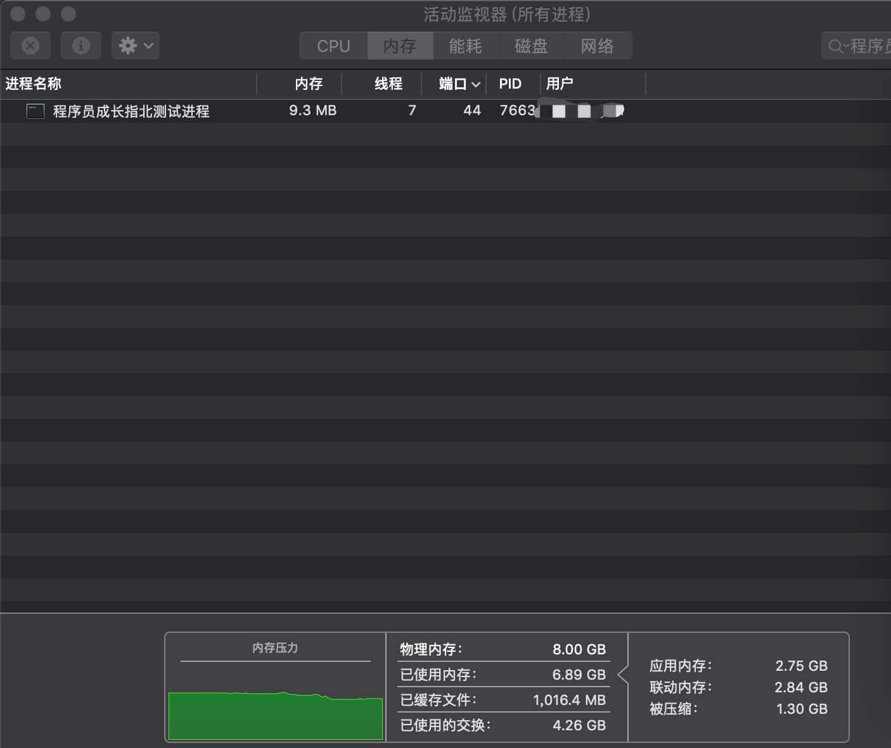
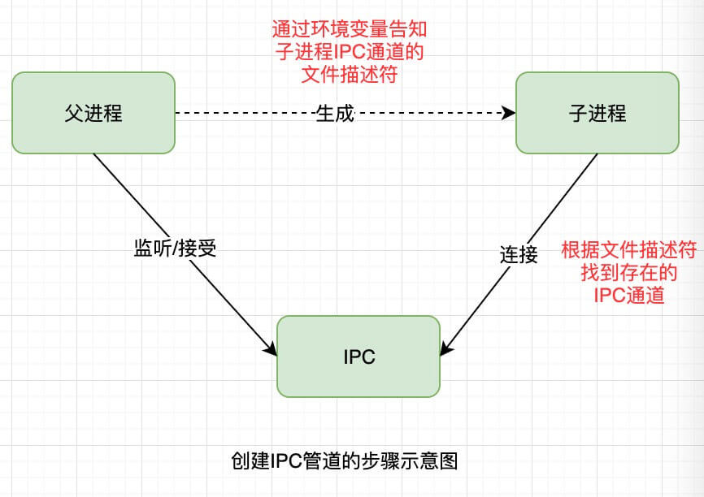

**前言**

`进程`与`线程`是一个程序员的必知概念，面试经常被问及，但是一些文章内容只是讲讲理论知识，可能一些小伙伴并没有真的理解，在实际开发中应用也比较少。本篇文章除了介绍概念，通过 Node.js 的角度讲解`进程`与`线程`，并且讲解一些在项目中的实战的应用，让你不仅能迎战面试官还可以在实战中完美应用。

## 文章导览


## 面试会问

> - Node.js 是单线程吗？
> - Node.js 做耗时的计算时候，如何避免阻塞？
> - Node.js 如何实现多进程的开启和关闭？
> - Node.js 可以创建线程吗？
> - 你们开发过程中如何实现进程守护的？
> - 除了使用第三方模块，你们自己是否封装过一个多进程架构?

## 进程

进程`Process`是计算机中的程序关于某数据集合上的一次运行活动，是系统进行资源分配和调度的基本单位，是操作系统结构的基础，进程是线程的容器（来自百科）。进程是资源分配的最小单位。我们启动一个服务、运行一个实例，就是开一个服务进程，例如 Java 里的 JVM 本身就是一个进程，Node.js 里通过 `node app.js` 开启一个服务进程，多进程就是进程的复制（fork），fork 出来的每个进程都拥有自己的独立空间地址、数据栈，一个进程无法访问另外一个进程里定义的变量、数据结构，只有建立了 IPC 通信，进程之间才可数据共享。

- Node.js 开启服务进程例子

```javascript
const http = require('http')

const server = http.createServer()
server.listen(3000, () => {
  process.title = 'mj测试进程'
  console.log('进程id', process.pid)
})
```

运行上面代码后，以下为 Mac 系统自带的监控工具 “活动监视器” 所展示的效果，可以看到我们刚开启的 Nodejs 进程 7663



## 线程

线程是操作系统能够进行运算调度的最小单位，首先我们要清楚线程是隶属于进程的，被包含于进程之中。**一个线程只能隶属于一个进程，但是一个进程是可以拥有多个线程的**。

### 单线程

**单线程就是一个进程只开一个线程**

Javascript 就是属于单线程，程序顺序执行(这里暂且不提 JS 异步)，可以想象一下队列，前面一个执行完之后，后面才可以执行，当你在使用单线程语言编码时切勿有过多耗时的同步操作，否则线程会造成阻塞，导致后续响应无法处理。你如果采用 Javascript 进行编码时候，请尽可能的利用 Javascript 异步操作的特性。

#### 经典计算耗时造成线程阻塞的例子

```javascript
const http = require('http')
const longComputation = () => {
  let sum = 0
  for (let i = 0; i < 1e10; i++) {
    sum += i
  }
  return sum
}
const server = http.createServer()
server.on('request', (req, res) => {
  if (req.url === '/compute') {
    console.info('计算开始', new Date())
    const sum = longComputation()
    console.info('计算结束', new Date())
    return res.end(`Sum is ${sum}`)
  } else {
    res.end('Ok')
  }
})

server.listen(3000)
//打印结果
//计算开始 2019-07-28T07:08:49.849Z
//计算结束 2019-07-28T07:09:04.522Z
```

查看打印结果，当我们调用`127.0.0.1:3000/compute`
的时候，如果想要调用其他的路由地址比如 127.0.0.1/大约需要 15 秒时间，也可以说一个用户请求完第一个`compute`接口后需要等待 15 秒，这对于用户来说是极其不友好的。下文我会通过创建多进程的方式`child_process.fork` 和`cluster` 来解决解决这个问题。

#### 单线程的一些说明

- Node.js 虽然是单线程模型，但是其基于事件驱动、异步非阻塞模式，可以应用于高并发场景，避免了线程创建、线程之间上下文切换所产生的资源开销。
- 当你的项目中需要有大量计算，CPU 耗时的操作时候，要注意考虑开启多进程来完成了。
- Node.js 开发过程中，错误会引起整个应用退出，应用的健壮性值得考验，尤其是错误的异常抛出，以及进程守护是必须要做的。
- 单线程无法利用多核 CPU，但是后来 Node.js 提供的 API 以及一些第三方工具相应都得到了解决，文章后面都会讲到。

## Node.js 中的进程与线程

Node.js 是 Javascript 在服务端的运行环境，构建在 chrome 的 V8 引擎之上，基于事件驱动、非阻塞 I/O 模型，充分利用操作系统提供的异步 I/O 进行多任务的执行，适合于 I/O 密集型的应用场景，因为异步，程序无需阻塞等待结果返回，而是基于回调通知的机制，原本同步模式等待的时间，则可以用来处理其它任务，

> 科普：在 Web 服务器方面，著名的 Nginx 也是采用此模式（事件驱动），避免了多线程的线程创建、线程上下文切换的开销，Nginx 采用 C 语言进行编写，主要用来做高性能的 Web 服务器，不适合做业务。

Web 业务开发中，如果你有高并发应用场景那么 Node.js 会是你不错的选择。

在单核 CPU 系统之上我们采用 单进程 + 单线程 的模式来开发。在多核 CPU 系统之上，可以通过 `child_process.fork` 开启多个进程（Node.js 在 v0.8 版本之后新增了 Cluster 来实现多进程架构） ，即 多进程 + 单线程 模式。注意：开启多进程不是为了解决高并发，主要是解决了单进程模式下 Node.js CPU 利用率不足的情况，充分利用多核 CPU 的性能。

### Node.js 中的进程

#### process 模块

Node.js 中的进程 Process 是一个全局对象，无需 require 直接使用，给我们提供了当前进程中的相关信息。官方文档提供了详细的说明，感兴趣的可以亲自实践下 Process 文档。

- `process.env`：环境变量，例如通过 `process.env.NODE_ENV` 获取不同环境项目配置信息
- `process.nextTick`：这个在谈及 `Event Loop` 时经常为会提到
- `process.pid`：获取当前进程 id
- `process.ppid`：当前进程对应的父进程
- `process.cwd()`：获取当前进程工作目录，
- `process.platform`：获取当前进程运行的操作系统平台
- `process.uptime()`：当前进程已运行时间，例如：pm2 守护进程的 uptime 值
- 进程事件：`process.on('uncaughtException', cb)` 捕获异常信息、`process.on('exit', cb)`进程退出监听
- 三个标准流：`process.stdout` 标准输出、`process.stdin` 标准输入、`process.stderr` 标准错误输出
- `process.title` 指定进程名称，有的时候需要给进程指定一个名称

以上仅列举了部分常用到功能点，除了 Process 之外 Node.js 还提供了 child_process 模块用来对子进程进行操作，在下文 Nodejs 进程创建会继续讲述。

#### Node.js 进程创建

进程创建有多种方式，本篇文章以 child_process 模块和 cluster 模块进行讲解。

**child_process 模块**

child_process 是 Node.js 的内置模块，node 官网地址：[child_process 官网地址](http://nodejs.cn/api/child_process.html#child_process_child_process)

几个常用函数：四种方式

- `child_process.spawn()`：适用于返回大量数据，例如图像处理，二进制数据处理。
- `child_process.exec()`：适用于小量数据，maxBuffer 默认值为 200 \* 1024 超出这个默认值将会导致程序崩溃，数据量过大可采用 spawn。
- `child_process.execFile()`：类似 `child_process.exec()`，区别是不能通过 shell 来执行，不支持像 I/O 重定向和文件查找这样的行为
- `child_process.fork()`： 衍生新的进程，进程之间是相互独立的，每个进程都有自己的 V8 实例、内存，系统资源是有限的，不建议衍生太多的子进程出来，通长根据系统**CPU 核心数**设置。

> CPU 核心数这里特别说明下，fork 确实可以开启多个进程，但是并不建议衍生出来太多的进程，cpu 核心数的获取方式`const cpus = require('os').cpus()`,这里 cpus 返回一个对象数组，包含所安装的每个 CPU/内核的信息，二者总和的数组哦。假设主机装有两个 cpu，每个 cpu 有 4 个核，那么总核数就是 8。

**fork 开启子进程 Demo**

fork 开启子进程解决文章起初的计算耗时造成线程阻塞。
在进行 compute 计算时创建子进程，子进程计算完成通过 `send` 方法将结果发送给主进程，主进程通过 `message` 监听到信息后处理并退出。

---

fork_app.js

```javascript
const http = require('http')
const fork = require('child_process').fork

const server = http.createServer((req, res) => {
  if (req.url == '/compute') {
    const compute = fork('./fork_compute.js')
    compute.send('开启一个新的子进程')

    // 当一个子进程使用 process.send() 发送消息时会触发 'message' 事件
    compute.on('message', (sum) => {
      res.end(`Sum is ${sum}`)
      compute.kill()
    })

    // 子进程监听到一些错误消息退出
    compute.on('close', (code, signal) => {
      console.log(`收到close事件，子进程收到信号 ${signal} 而终止，退出码 ${code}`)
      compute.kill()
    })
  } else {
    res.end(`ok`)
  }
})
server.listen(3000, '127.0.0.1', () => {
  console.log(`server started at http://127.0.0.1:${3000}`)
})
```

---

fork_compute.js

针对文初需要进行计算的的例子我们创建子进程拆分出来单独进行运算。

```javascript
const computation = () => {
  let sum = 0
  console.info('计算开始')
  console.time('计算耗时')

  for (let i = 0; i < 1e10; i++) {
    sum += i
  }

  console.info('计算结束')
  console.timeEnd('计算耗时')
  return sum
}

process.on('message', (msg) => {
  console.log(msg, 'process.pid', process.pid) // 子进程id
  const sum = computation()

  // 如果Node.js进程是通过进程间通信产生的，那么，process.send()方法可以用来给父进程发送消息
  process.send(sum)
})
```

##### cluster 模块

cluster 开启子进程 Demo

```javascript
const http = require('http')
const numCPUs = require('os').cpus().length
const cluster = require('cluster')
if (cluster.isMaster) {
  console.log('Master process id is', process.pid)
  // fork workers
  for (let i = 0; i < numCPUs; i++) {
    cluster.fork()
  }
  cluster.on('exit', function(worker, code, signal) {
    console.log('worker process died id', worker.process.pid)
  })
} else {
  // Worker可以共享同一个TCP连接
  // 这里是一个http服务器
  http
    .createServer(function(req, res) {
      res.writeHead(200)
      res.end('hello word')
    })
    .listen(8000)
}
```

###### cluster 原理分析


cluster 模块调用 fork 方法来创建子进程，该方法与 child_process 中的 fork 是同一个方法。
cluster 模块采用的是经典的主从模型，Cluster 会创建一个 master，然后根据你指定的数量复制出多个子进程，可以使用`cluster.isMaster`属性判断当前进程是 master 还是 worker(工作进程)。由 master 进程来管理所有的子进程，主进程不负责具体的任务处理，主要工作是负责调度和管理。

cluster 模块使用内置的负载均衡来更好地处理线程之间的压力，该负载均衡使用了`Round-robin`算法（也被称之为循环算法）。当使用 Round-robin 调度策略时，master accepts()所有传入的连接请求，然后将相应的 TCP 请求处理发送给选中的工作进程（该方式仍然通过 IPC 来进行通信）。

开启多进程时候端口疑问讲解：如果多个 Node 进程监听同一个端口时会出现 `Error:listen EADDRIUNS`的错误，而 cluster 模块为什么可以让多个子进程监听同一个端口呢?原因是 master 进程内部启动了一个 TCP 服务器，而真正监听端口的只有这个服务器，当来自前端的请求触发服务器的 connection 事件后，master 会将对应的 socket 句柄发送给子进程。

##### child_process 模块与 cluster 模块总结

无论是 child_process 模块还是 cluster 模块，为了解决 Node.js 实例单线程运行，无法利用多核 CPU 的问题而出现的。核心就是**父进程（即 master 进程）负责监听端口，接收到新的请求后将其分发给下面的 worker 进程**。

cluster 模块的一个弊端：


cluster 内部隐式的构建 TCP 服务器的方式来说对使用者确实简单和透明了很多，但是这种方式无法像使用 child_process 那样灵活，因为一个主进程只能管理一组相同的工作进程，而自行通过 child_process 来创建工作进程，一个主进程可以控制多组进程。原因是 child_process 操作子进程时，可以隐式的创建多个 TCP 服务器，对比上面的两幅图应该能理解我说的内容。

#### Node.js 进程通信原理

前面讲解的无论是 child_process 模块，还是 cluster 模块，都需要主进程和工作进程之间的通信。通过 fork()或者其他 API，创建了子进程之后，为了实现父子进程之间的通信，父子进程之间才能通过 message 和 send()传递信息。

IPC 这个词我想大家并不陌生，不管那一张开发语言只要提到进程通信，都会提到它。IPC 的全称是 Inter-Process Communication,即进程间通信。它的目的是为了让不同的进程能够互相访问资源并进行协调工作。实现进程间通信的技术有很多，如命名管道，匿名管道，socket，信号量，共享内存，消息队列等。Node 中实现 IPC 通道是依赖于 libuv。windows 下由命名管道(name pipe)实现，\*nix 系统则采用 Unix Domain Socket 实现。表现在应用层上的进程间通信只有简单的 message 事件和 send()方法，接口十分简洁和消息化。

IPC 创建和实现示意图


IPC 通信管道是如何创建的



父进程在实际创建子进程之前，会创建`IPC通道`并监听它，然后才`真正的`创建出`子进程`，这个过程中也会通过环境变量（NODE_CHANNEL_FD）告诉子进程这个 IPC 通道的文件描述符。子进程在启动的过程中，根据文件描述符去连接这个已存在的 IPC 通道，从而完成父子进程之间的连接。

#### Node.js 句柄传递

讲句柄之前，先想一个问题，send 句柄发送的时候，真的是将服务器对象发送给了子进程？

##### 子进程对象 send()方法可以发送的句柄类型

- net.Socket TCP 套接字
- net.Server TCP 服务器，任意建立在 TCP 服务上的应用层服务都可以享受它带来的好处
- net.Native C++层面的 TCP 套接字或 IPC 管道
- dgram.Socket UDP 套接字
- dgram.Native C++层面的 UDP 套接字

##### send 句柄发送原理分析

结合句柄的发送与还原示意图更容易理解。


`send()`方法在将消息发送到 IPC 管道前，实际将消息组装成了两个对象，一个参数是 handler，另一个是 message。message 参数如下所示：

```javascript
{
  cmd:'NODE_HANDLE',
  type:'net.Server',
  msg:message
}
```

发送到 IPC 管道中的实际上是我们要发送的句柄文件描述符。这个 message 对象在写入到 IPC 管道时，也会通过`JSON.stringfy()`进行序列化。所以最终发送到 IPC 通道中的信息都是字符串，send()方法能发送消息和句柄并不意味着它能发送任何对象。

连接了 IPC 通道的子线程可以读取父进程发来的消息，将字符串通过 JSON.parse()解析还原为对象后，才触发 message 事件将消息传递给应用层使用。在这个过程中，消息对象还要被进行过滤处理，message.cmd 的值如果以 NODE\_为前缀，它将响应一个内部事件 internalMessage，如果 message.cmd 值为 NODE_HANDLE,它将取出`message.type`值和得到的文件描述符一起还原出一个对应的对象。

以发送的 TCP 服务器句柄为例，子进程收到消息后的还原过程代码如下:

```javascript
function(message,handle,emit){
    var self = this;

    var server = new net.Server();
    server.listen(handler,function(){
      emit(server);
    });
}
```

这段还原代码，`子进程根据message.type创建对应的TCP服务器对象，然后监听到文件描述符上`。由于底层细节不被应用层感知，所以子进程中，开发者会有一种服务器对象就是从父进程中直接传递过来的错觉。

> Node 进程之间只有消息传递，不会真正的传递对象，这种错觉是抽象封装的结果。目前 Node 只支持我前面提到的几种句柄，并非任意类型的句柄都能在进程之间传递，除非它有完整的发送和还原的过程。

#### Node.js 多进程架构模型

我们自己实现一个多进程架构守护 Demo


编写主进程

master.js 主要处理以下逻辑：

- 创建一个 server 并监听 3000 端口。
- 根据系统 cpus 开启多个子进程
- 通过子进程对象的 send 方法发送消息到子进程进行通信
- 在主进程中监听了子进程的变化，如果是自杀信号重新启动一个工作进程。
- 主进程在监听到退出消息的时候，先退出子进程在退出主进程

```javascript
// master.js
const fork = require('child_process').fork
const cpus = require('os').cpus()

const server = require('net').createServer()
server.listen(3000)
process.title = 'node-master'

const workers = {}
const createWorker = () => {
  const worker = fork('worker.js')
  worker.on('message', function(message) {
    if (message.act === 'suicide') {
      createWorker()
    }
  })
  worker.on('exit', function(code, signal) {
    console.log('worker process exited, code: %s signal: %s', code, signal)
    delete workers[worker.pid]
  })
  worker.send('server', server)
  workers[worker.pid] = worker
  console.log('worker process created, pid: %s ppid: %s', worker.pid, process.pid)
}

for (let i = 0; i < cpus.length; i++) {
  createWorker()
}

process.once('SIGINT', close.bind(this, 'SIGINT')) // kill(2) Ctrl-C
process.once('SIGQUIT', close.bind(this, 'SIGQUIT')) // kill(3) Ctrl-\
process.once('SIGTERM', close.bind(this, 'SIGTERM')) // kill(15) default
process.once('exit', close.bind(this))

function close(code) {
  console.log('进程退出！', code)

  if (code !== 0) {
    for (let pid in workers) {
      console.log('master process exited, kill worker pid: ', pid)
      workers[pid].kill('SIGINT')
    }
  }

  process.exit(0)
}
```

工作进程

worker.js 子进程处理逻辑如下：

- 创建一个 server 对象，注意这里最开始并没有监听 3000 端口
- 通过 message 事件接收主进程 send 方法发送的消息
- 监听 uncaughtException 事件，捕获未处理的异常，发送自杀信息由主进程重建进程，子进程在链接关闭之后退出

```javascript
// worker.js
const http = require('http')
const server = http.createServer((req, res) => {
  res.writeHead(200, {
    'Content-Type': 'text/plan',
  })
  res.end('I am worker, pid: ' + process.pid + ', ppid: ' + process.ppid)
  throw new Error('worker process exception!') // 测试异常进程退出、重启
})

let worker
process.title = 'node-worker'
process.on('message', function(message, sendHandle) {
  if (message === 'server') {
    worker = sendHandle
    worker.on('connection', function(socket) {
      server.emit('connection', socket)
    })
  }
})

process.on('uncaughtException', function(err) {
  console.log(err)
  process.send({ act: 'suicide' })
  worker.close(function() {
    process.exit(1)
  })
})
```

#### Node.js 进程守护

##### 什么是进程守护？

每次启动 Node.js 程序都需要在命令窗口输入命令 `node app.js` 才能启动，但如果把命令窗口关闭则 Node.js 程序服务就会立刻断掉。除此之外，当我们这个 Node.js 服务意外崩溃了就不能自动重启进程了。这些现象都不是我们想要看到的，所以需要通过某些方式来守护这个开启的进程，执行 node app.js 开启一个服务进程之后，我还可以在这个终端上做些别的事情，且不会相互影响。，当出现问题可以自动重启。

##### 如何实现进程守护

这里我只说一些第三方的进程守护框架，pm2 和 forever ，它们都可以实现进程守护，底层也都是通过上面讲的 child_process 模块和 cluster 模块 实现的，这里就不再提它们的原理。

pm2 指定生产环境启动一个名为 test 的 node 服务

```
pm2 start app.js --env production --name test
```

**pm2 常用 api**

- `pm2 stop Name/processID` 停止某个服务，通过服务名称或者服务进程 ID
- `pm2 delete Name/processID` 删除某个服务，通过服务名称或者服务进程 ID

- `pm2 logs [Name]` 查看日志，如果添加服务名称，则指定查看某个服务的日志，不加则查看所有日志

- `pm2 start app.js -i 4` 集群，`-i <number of workers>`参数用来告诉 PM2 以 cluster_mode 的形式运行你的 app（对应的叫 fork_mode），后面的数字表示要启动的工作线程的数量。如果给定的数字为 0，PM2 则会根据你 CPU 核心的数量来生成对应的工作线程。注意一般在生产环境使用 cluster_mode 模式，测试或者本地环境一般使用 fork 模式，方便测试到错误。
- `pm2 reload Name pm2 restart Name` 应用程序代码有更新，可以用重载来加载新代码，也可以用重启来完成,reload 可以做到 0 秒宕机加载新的代码，restart 则是重新启动，生产环境中多用 reload 来完成代码更新！
- `pm2 show Name` 查看服务详情
- `pm2 list` 查看 pm2 中所有项目
- `pm2 monit`用 monit 可以打开实时监视器去查看资源占用情况

**pm2 官网地址:**

[http://pm2.keymetrics.io/docs/usage/quick-start/](http://pm2.keymetrics.io/docs/usage/quick-start/)

forever 就不特殊说明了，官网地址:

[https://github.com/foreverjs/forever](https://github.com/foreverjs/forever)

> 注意：二者更推荐 pm2，看一下二者对比就知道我为什么更推荐使用 pm2 了。https://www.jianshu.com/p/fdc12d82b661

#### linux 关闭一个进程

- 查找与进程相关的 PID 号

  `ps aux | grep server`

说明:

```
  root 20158  0.0  5.0 1251592 95396 ?  Sl   5月17   1:19 node /srv/mini-program-api/launch_pm2.js
```

上面是执行命令后在 linux 中显示的结果，第二个参数就是进程对应的 PID

- 杀死进程

1.  以优雅的方式结束进程

`kill -l PID`

    `-l`选项告诉 `kill` 命令用好像启动进程的用户已注销的方式结束进程。

当使用该选项时，`kill`命令也试图杀死所留下的子进程。
但这个命令也不是总能成功--或许仍然需要先手工杀死子进程，然后再杀死父进程。

2.  kill 命令用于终止进程

例如： `kill -9 [PID]`

`-9` 表示强迫进程立即停止

这个强大和危险的命令迫使进程在运行时突然终止，进程在结束后不能自我清理。
危害是导致系统资源无法正常释放，一般不推荐使用，除非其他办法都无效。
当使用此命令时，一定要通过 ps -ef 确认没有剩下任何僵尸进程。
只能通过终止父进程来消除僵尸进程。如果僵尸进程被 init 收养，问题就比较严重了。
杀死 init 进程意味着关闭系统。
如果系统中有僵尸进程，并且其父进程是 init，
而且僵尸进程占用了大量的系统资源，那么就需要在某个时候重启机器以清除进程表了。

1. killall 命令

杀死同一进程组内的所有进程。其允许指定要终止的进程的名称，而非 PID。

`killall httpd`

### Node.js 线程

#### Node.js 关于单线程的误区

```javascript
const http = require('http')

const server = http.createServer()
server.listen(3000, () => {
  process.title = 'mj测试进程'
  console.log('进程id', process.pid)
})
```

仍然看本文第一段代码，创建了 http 服务，开启了一个进程，都说了 Node.js 是单线程，所以 Node 启动后线程数应该为 1，但是为什么会开启 7 个线程呢？难道 Javascript 不是单线程不知道小伙伴们有没有这个疑问？

解释一下这个原因：

Node 中最核心的是 v8 引擎，在 Node 启动后，会创建 v8 的实例，这个实例是多线程的。

- 主线程：编译、执行代码。
- 编译/优化线程：在主线程执行的时候，可以优化代码。
- 分析器线程：记录分析代码运行时间，为 Crankshaft 优化代码执行提供依据。
- 垃圾回收的几个线程。

所以大家常说的 Node 是单线程的指的是 JavaScript 的执行是单线程的(开发者编写的代码运行在单线程环境中)，但 Javascript 的宿主环境，无论是 Node 还是浏览器都是多线程的因为 libuv 中有线程池的概念存在的，libuv 会通过类似线程池的实现来模拟不同操作系统的异步调用，这对开发者来说是不可见的。

#### 某些异步 IO 会占用额外的线程

还是上面那个例子，我们在定时器执行的同时，去读一个文件：

```javascript
const fs = require('fs')
setInterval(() => {
  console.log(new Date().getTime())
}, 3000)

fs.readFile('./index.html', () => {})
```

线程数量变成了 11 个，这是因为在 Node 中有一些 IO 操作（DNS，FS）和一些 CPU 密集计算（Zlib，Crypto）会启用 Node 的线程池，而线程池默认大小为 4，因为线程数变成了 11。
我们可以手动更改线程池默认大小：

```
process.env.UV_THREADPOOL_SIZE = 64
```

一行代码轻松把线程变成 71。

##### Libuv

Libuv 是一个跨平台的异步 IO 库，它结合了 UNIX 下的 libev 和 Windows 下的 IOCP 的特性，最早由 Node 的作者开发，专门为 Node 提供多平台下的异步 IO 支持。Libuv 本身是由 C++语言实现的，Node 中的非阻塞 IO 以及事件循环的底层机制都是由 libuv 实现的。

libuv 架构图


在 Window 环境下，libuv 直接使用 Windows 的 IOCP 来实现异步 IO。在非 Windows 环境下，libuv 使用多线程来模拟异步 IO。

注意下面我要说的话，Node 的异步调用是由 libuv 来支持的，以上面的读取文件的例子，读文件实质的系统调用是由 libuv 来完成的，Node 只是负责调用 libuv 的接口，等数据返回后再执行对应的回调方法。

#### Node.js 线程创建

直到 Node 10.5.0 的发布，官方才给出了一个实验性质的模块 worker_threads 给 Node 提供真正的多线程能力。

先看下简单的 demo：

```javascript
const { isMainThread, parentPort, workerData, threadId, MessageChannel, MessagePort, Worker } = require('worker_threads')

function mainThread() {
  for (let i = 0; i < 5; i++) {
    const worker = new Worker(__filename, { workerData: i })
    worker.on('exit', (code) => {
      console.log(`main: worker stopped with exit code ${code}`)
    })
    worker.on('message', (msg) => {
      console.log(`main: receive ${msg}`)
      worker.postMessage(msg + 1)
    })
  }
}

function workerThread() {
  console.log(`worker: workerDate ${workerData}`)
  parentPort.on('message', (msg) => {
    console.log(`worker: receive ${msg}`)
  })
  parentPort.postMessage(workerData)
}

if (isMainThread) {
  mainThread()
} else {
  workerThread()
}
```

上述代码在主线程中开启五个子线程，并且主线程向子线程发送简单的消息。

由于 worker_thread 目前仍然处于实验阶段，所以启动时需要增加 --experimental-worker flag，运行后观察活动监视器，开启了 5 个子线程


##### worker_thread 模块

[worker_thread 核心代码](https://github.com/nodejs/node/blob/master/lib/worker_threads.js)

worker_thread 模块中有 4 个对象和 2 个类，可以自己去看上面的源码。

- isMainThread: 是否是主线程，源码中是通过 threadId === 0 进行判断的。
- MessagePort: 用于线程之间的通信，继承自 EventEmitter。
- MessageChannel: 用于创建异步、双向通信的通道实例。
- threadId: 线程 ID。
- Worker: 用于在主线程中创建子线程。第一个参数为 filename，表示子线程执行的入口。
- parentPort: 在 worker 线程里是表示父进程的 MessagePort 类型的对象，在主线程里为 null
- workerData: 用于在主进程中向子进程传递数据（data 副本）

## 总结

**多进程 vs 多线程**

对比一下多线程与多进程：

| 属性       | 多进程                                           | 多线程                                   | 比较           |
| ---------- | ------------------------------------------------ | ---------------------------------------- | -------------- |
| 数据       | 数据共享复杂，需要用 IPC；数据是分开的，同步简单 | 因为共享进程数据，数据共享简单，同步复杂 | 各有千秋       |
| CPU、内存  | 占用内存多，切换复杂，CPU 利用率低               | 占用内存少，切换简单，CPU 利用率高       | 多线程更好     |
| 销毁、切换 | 创建销毁、切换复杂，速度慢                       | 创建销毁、切换简单，速度很快             | 多线程更好     |
| coding     | 编码简单、调试方便                               | 编码、调试复杂                           | 编码、调试复杂 |
| 可靠性     | 进程独立运行，不会相互影响                       | 线程同呼吸共命运                         | 多进程更好     |
| 分布式     | 可用于多机多核分布式，易于扩展                   | 只能用于多核分布式                       | 多进程更好     |

参考文章：

- [Node 中 child_process 模块的使用](https://juejin.im/post/5b10a814f265da6e2a08a6f7)
- 朴灵老师的书籍【Node.js 深入浅出】
