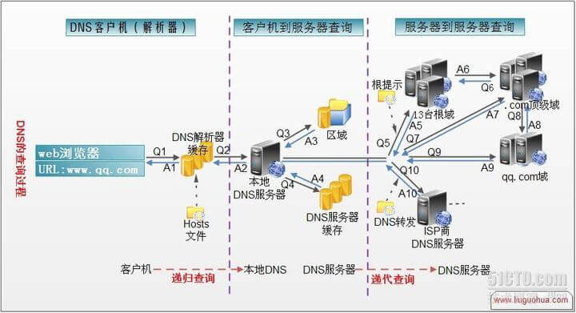

# 二、发送请求

在前一部分，我们介绍了浏览器缓存。当一个请求走过了各级前端缓存后，就会需要实际发送一个请求了。

> 在 HTTP 缓存中，我们其实也有发送请求；或者是在 HTTP/2 Push 下，使用了之前连接中推送的资源。不过为了保证思路的连贯，我还是把「发送请求」这个章节整体放在「缓存」之后了。

介绍网络请求其实可以包含复杂的网络知识。不过，今天咱们的旅程主要聚焦于“前端性能优化”。因此，主要会介绍一些在这个环节中，前端性能优化可能会做的事儿。

## 1. 避免多余重定向

重定向是一个比较常用的技术手段。在一些情况下，你可能进行了服务迁移，修改了原有的 uri。这时候就可以使用重定向，把访问原网址的用户重定向到新的 uri。还有是在一些登录场景下，会使用到重定向技术。

重定向分为 301 的永久重定向和 302 的临时重定向。建议贴合语义，例如服务迁移的情况下，使用 301 重定向。对 SEO 也会更友好。

同时也不要滥用重定向。曾今也见过有业务在访问后重定向 3 次的情况，其实里面有些是不必要的。每次重定向都是有请求耗时的，建议避免过多的重定向。

## 2. DNS 预解析

基本我们访问远程服务的时候，不会直接使用服务的出口 IP，而是使用域名。所以请求的一个重要环节就是域名解析。

DNS 服务本身是一个树状层级结构，其解析是一个递归与迭代的过程。例如 github.com 的大致解析流程如下：

1. 先检查本地 hosts 文件中是否有映射，有则使用；
2. 查找本地 DNS 缓存，有则返回；
3. 根据配置在 TCP/IP 参数中设置 DNS 查询服务器，并向其进行查询，这里先称为本地 DNS；
4. 如果该服务器无法解析域名（没有缓存），且不需要转发，则会向根服务器请求；
5. 根服务器根据域名类型判断对应的顶级域名服务器（.com），返回给本地 DNS，然后重复该过程，直到找到该域名；
6. 当然，如果设置了转发，本地 DNS 会将请求逐级转发，直到转发服务器返回或者也不能解析。



更详细的介绍可以看[这篇文章](https://www.zhihu.com/question/23042131)<sup>[1]</sup>。

这里我们需要了解的是：

- 首先，DNS 解析流程可能会很长，耗时很高，所以整个 DNS 服务，包括客户端都会有缓存机制，这个作为前端不好涉入；
- 其次，在 DNS 解析上，前端还是可以通过浏览器提供的其他手段来“加速”的。

[DNS Prefetch](https://www.w3.org/TR/resource-hints/#dns-prefetch)<sup>[2]</sup> 就是浏览器提供给我们的一个 API。它是 Resource Hint 的一部分。它可以告诉浏览器：过会我就可能要去 yourwebsite.com 上下载一个资源啦，帮我先解析一下域名吧。这样之后用户点击某个按钮，触发了 yourwebsite.com 域名下的远程请求时，就略去了 DNS 解析的步骤。使用方式很简单：

```HTML
<link rel="dns-prefetch" href="//yourwebsite.com">
```

当然，浏览器并不保证一定会去解析域名，可能会根据当前的网络、负载等状况做决定。标准里也明确写了 👇

> user agent SHOULD resolve as early as possible

## 3. 预先建立连接

我们知道，建立连接不仅需要 DNS 查询，还需要进行 TCP 协议握手，有些还会有 TLS/SSL 协议，这些都会导致连接的耗时。使用 [Preconnect](https://www.w3.org/TR/resource-hints/#preconnect)<sup>[3]</sup> 可以帮助你告诉浏览器：“我有一些资源会用到某个源（origin），你可以帮我预先建立连接。”

根据规范，当你使用 Preconnect 时，浏览器大致做了如下处理：

- 首先，解析 Preconnect 的 url；
- 其次，根据当前 link 元素中的属性进行 cors 的设置；
- 然后，默认先将 credential 设为 `true`，如果 cors 为 `Anonymous` 并且存在跨域，则将 credential 置为 `false`；
- 最后，进行连接。

使用 Preconnect 只需要将 `rel` 属性设为 `preconnect` 即可：

```HTML
<link rel="preconnect" href="//sample.com">
```

当然，你也可以设置 CORS：

```HTML
<link rel="preconnect" href="//sample.com" crossorigin>
```

需要注意的是，标准并没有硬性规定浏览器一定要（而是 SHOULD）完成整个连接过程，与 DNS Prefetch 类似，浏览器可以视情况完成部分工作。

## 4. 使用 CDN

当我们实际把网络包发向我们的目标地址时，肯定希望越快到达目的地越好（对应的，也会希望越快获得响应）。而网络传输是有极限的，同样一个北京的用户，访问北京的服务器显然要比广州快很多。同时，服务的负载也会影响响应的速度。

对于静态资源，我们可以考虑通过 CDN 来降低时延。

对于使用 CDN 的资源，DNS 解析会将 CDN 资源的域名解析到 CDN 服务的负载均衡器上，负载均衡器可以通过请求的信息获取用户对应的地理区域，从而通过负载均衡算法，在背后的诸多服务器中，综合选择一台地理位置近、负载低的机器来提供服务。例如为北京联通用户解析北京的服务器 IP。这样，用户在之后访问 CDN 资源时都是访问北京服务器，距离近，速度快。

想了解更多 CDN 的工作方式可以阅读[这篇文章](https://yq.aliyun.com/articles/577708)<sup>[4]</sup>。

---

下图是请求声明周期中各个阶段的示意图，可以帮助我们理解发送请求（以及接收响应）的流程。


---

在缓存没法满足我们的情况下，就要开始真正发送请求了。从前端性能优化视角，我们会关注重定向、DNS 解析等问题，从而加速请求。但这块还预留了一小部分 —— 服务端的处理与响应。

过去，我们会将前端局限在浏览器中，但是随着 NodeJS 的兴起，很多业务都引入了基于 NodeJS 的 BFF 来为前端（客户端端）提供服务。所以咱们这次的旅程也会简单聊一下，在这一阶段可以做的一些优化。

---

## 参考资料

1. [DNS 的解析过程](https://www.zhihu.com/question/23042131)
1. [Resource Hints - DNS Prefetch](https://www.w3.org/TR/resource-hints/#dns-prefetch)
1. [Resource Hints - Preconnect](https://www.w3.org/TR/resource-hints/#preconnect)
1. [CDN 之我见：原理篇](https://yq.aliyun.com/articles/577708)
1. [Understanding Resource Timing](https://developers.google.com/web/tools/chrome-devtools/network/understanding-resource-timing)
1. [TCP 3-Way Handshake Process](https://www.geeksforgeeks.org/tcp-3-way-handshake-process/)
1. [TCP 4 wave hands](https://www.geeksforgeeks.org/tcp-connection-termination/)
1. [图文还原 HTTPS 原理](https://mp.weixin.qq.com/s/3NKOCOeIUF2SGJnY7II9hA)
1. [URL redirection (wikipedia)](https://en.wikipedia.org/wiki/URL_redirection)
