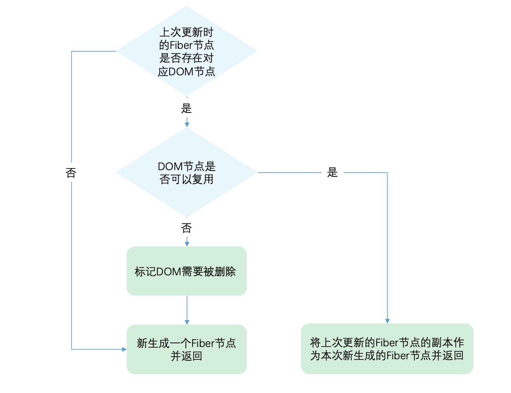

## 概览

在[beginWork](./render.md#reconcilechildren)我们提到

> 对于`update`的组件，他会将当前组件与该组件在上次更新时对应的 Fiber 节点比较（也就是俗称的 Diff 算法），将比较的结果生成新 Fiber 节点。

这一章我们讲解`Diff算法`的实现。

> 你可以从[这里](https://zh-hans.reactjs.org/docs/reconciliation.html#the-diffing-algorithm)看到`Diff算法`的介绍。

::: warning 为了防止概念混淆，这里再强调下

一个`DOM节点`在某一时刻最多会有 4 个节点和他相关。

1. `current Fiber`。如果该`DOM节点`已在页面中，`current Fiber`代表该`DOM节点`对应的`Fiber节点`。

2. `workInProgress Fiber`。如果该`DOM节点`将在本次更新中渲染到页面中，`workInProgress Fiber`代表该`DOM节点`对应的`Fiber节点`。

3. `DOM节点`本身。

4. `JSX对象`。即`ClassComponent`的`render`方法的返回结果，或`FunctionComponent`的调用结果。`JSX对象`中包含描述`DOM节点`的信息。

`Diff算法`的本质是对比 1 和 4，生成 2。

:::

### Diff 的瓶颈以及 React 如何应对

由于`Diff`操作本身也会带来性能损耗，React 文档中提到，即使在最前沿的算法中，将前后两棵树完全比对的算法的复杂程度为 $O(n^3)$，其中`n`是树中元素的数量。

如果在`React`中使用了该算法，那么展示 1000 个元素所需要执行的计算量将在十亿的量级范围。这个开销实在是太过高昂。

为了降低算法复杂度，`React`的`diff`会预设三个限制：

1. 只对同级元素进行`Diff`。如果一个`DOM节点`在前后两次更新中跨越了层级，那么`React`不会尝试复用它。

2. 两个不同类型的元素会产生出不同的树。如果元素由`div`变为`p`，React 会销毁`div`及其子孙节点，并新建`p`及其子孙节点。

3. 开发者可以通过 `key prop` 来暗示哪些子元素在不同的渲染下能保持稳定。考虑如下例子：

```jsx
// 更新前
<div>
  <p key="ka">ka</p>
  <h3 key="song">song</h3>
</div>

// 更新后
<div>
  <h3 key="song">song</h3>
  <p key="ka">ka</p>
</div>

```

如果没有`key`，`React`会认为`div`的第一个子节点由`p`变为`h3`，第二个子节点由`h3`变为`p`。这符合限制 2 的设定，会销毁并新建。

但是当我们用`key`指明了节点前后对应关系后，`React`知道`key === "ka"`的`p`在更新后还存在，所以`DOM节点`可以复用，只是需要交换下顺序。

这就是`React`为了应对算法性能瓶颈做出的三条限制。

### Diff 是如何实现的

我们从`Diff`的入口函数`reconcileChildFibers`出发，该函数会根据`newChild`（即`JSX对象`）类型调用不同的处理函数。

> 你可以从[这里](https://github.com/facebook/react/blob/1fb18e22ae66fdb1dc127347e169e73948778e5a/packages/react-reconciler/src/ReactChildFiber.new.js#L1280)看到`reconcileChildFibers`的源码。

```js
// 根据newChild类型选择不同diff函数处理
function reconcileChildFibers(returnFiber: Fiber, currentFirstChild: Fiber | null, newChild: any): Fiber | null {
  const isObject = typeof newChild === 'object' && newChild !== null

  if (isObject) {
    // object类型，可能是 REACT_ELEMENT_TYPE 或 REACT_PORTAL_TYPE
    switch (newChild.$$typeof) {
      case REACT_ELEMENT_TYPE:
      // 调用 reconcileSingleElement 处理
      // // ...省略其他case
    }
  }

  if (typeof newChild === 'string' || typeof newChild === 'number') {
    // 调用 reconcileSingleTextNode 处理
    // ...省略
  }

  if (isArray(newChild)) {
    // 调用 reconcileChildrenArray 处理
    // ...省略
  }

  // 一些其他情况调用处理函数
  // ...省略

  // 以上都没有命中，删除节点
  return deleteRemainingChildren(returnFiber, currentFirstChild)
}
```

我们可以从同级的节点数量将 Diff 分为两类：

1. 当`newChild`类型为`object`、`number`、`string`，代表同级只有一个节点

2. 当`newChild`类型为`Array`，同级有多个节点

在接下来我们会分别讨论这两类节点的`Diff`。

## 单节点 Diff

对于单个节点，我们以类型`object`为例，会进入`reconcileSingleElement`

> 你可以从[这里](https://github.com/facebook/react/blob/1fb18e22ae66fdb1dc127347e169e73948778e5a/packages/react-reconciler/src/ReactChildFiber.new.js#L1141)看到`reconcileSingleElement`源码

```javascript
const isObject = typeof newChild === 'object' && newChild !== null

if (isObject) {
  // 对象类型，可能是 REACT_ELEMENT_TYPE 或 REACT_PORTAL_TYPE
  switch (newChild.$$typeof) {
    case REACT_ELEMENT_TYPE:
    // 调用 reconcileSingleElement 处理
    // ...其他case
  }
}
```

这个函数会做如下事情：



让我们看看第二步**判断 DOM 节点是否可以复用**是如何实现的。

```javascript
function reconcileSingleElement(returnFiber: Fiber, currentFirstChild: Fiber | null, element: ReactElement): Fiber {
  const key = element.key
  let child = currentFirstChild

  // 首先判断是否存在对应DOM节点
  while (child !== null) {
    // 上一次更新存在DOM节点，接下来判断是否可复用

    // 首先比较key是否相同
    if (child.key === key) {
      // key相同，接下来比较type是否相同

      switch (child.tag) {
        // ...省略case

        default: {
          if (child.elementType === element.type) {
            // type相同则表示可以复用
            // 返回复用的fiber
            return existing
          }

          // type不同则跳出switch
          break
        }
      }
      // 代码执行到这里代表：key相同但是type不同
      // 将该fiber及其兄弟fiber标记为删除
      deleteRemainingChildren(returnFiber, child)
      break
    } else {
      // key不同，将该fiber标记为删除
      deleteChild(returnFiber, child)
    }
    child = child.sibling
  }

  // 创建新Fiber，并返回 ...省略
}
```

还记得我们刚才提到的，React 预设的限制么，

从代码可以看出，React 通过先判断`key`是否相同，如果`key`相同则判断`type`是否相同，只有都相同时一个`DOM节点`才能复用。

这里有个细节需要关注下：

- 当`child !== null`且`key相同`且`type不同`时执行`deleteRemainingChildren`将`child`及其兄弟`fiber`都标记删除。

- 当`child !== null`且`key不同`时仅将`child`标记删除。

考虑如下例子：

当前页面有 3 个`li`，我们要全部删除，再插入一个`p`。

```js
// 当前页面显示的
ul > li * 3

// 这次需要更新的
ul > p
```

由于本次更新时只有一个`p`，属于单一节点的`Diff`，会走上面介绍的代码逻辑。

在`reconcileSingleElement`中遍历之前的 3 个`fiber`（对应的`DOM`为 3 个`li`），寻找本次更新的`p`是否可以复用之前的 3 个`fiber`中某个的`DOM`。

当`key相同`且`type不同`时，代表我们已经找到本次更新的`p`对应的上次的`fiber`，但是`p`与`li` `type`不同，不能复用。既然唯一的可能性已经不能复用，则剩下的`fiber`都没有机会了，所以都需要标记删除。

当`key不同`时只代表遍历到的该`fiber`不能被`p`复用，后面还有兄弟`fiber`还没有遍历到。所以仅仅标记该`fiber`删除。

### 练习题

让我们来做几道习题巩固下吧：

请判断如下`JSX对象`对应的`DOM`元素是否可以复用：

```jsx
// 习题1 更新前
<div>ka song</div>
// 更新后
<p>ka song</p>

// 习题2 更新前
<div key="xxx">ka song</div>
// 更新后
<div key="ooo">ka song</div>

// 习题3 更新前
<div key="xxx">ka song</div>
// 更新后
<p key="ooo">ka song</p>

// 习题4 更新前
<div key="xxx">ka song</div>
// 更新后
<div key="xxx">xiao bei</div>

```

公布答案：

习题 1: 未设置`key prop`默认 `key = null;`，所以更新前后 key 相同，都为`null`，但是更新前`type`为`div`，更新后为`p`，`type`改变则不能复用。

习题 2: 更新前后`key`改变，不需要再判断`type`，不能复用。

习题 3: 更新前后`key`改变，不需要再判断`type`，不能复用。

习题 4: 更新前后`key`与`type`都未改变，可以复用。`children`变化，`DOM`的子元素需要更新。

## 多节点 Diff

上面我们介绍了单一节点的`Diff`，现在考虑我们有一个`FunctionComponent`：

```jsx
function List() {
  return (
    <ul>
      <li key='0'>0</li>
      <li key='1'>1</li>
      <li key='2'>2</li>
      <li key='3'>3</li>
    </ul>
  )
}
```

他的返回值`JSX对象`的`children`属性不是单一节点，而是包含四个对象的数组

```js
{
  $$typeof: Symbol(react.element),
  key: null,
  props: {
    children: [
      {$$typeof: Symbol(react.element), type: "li", key: "0", ref: null, props: {…}, …}
      {$$typeof: Symbol(react.element), type: "li", key: "1", ref: null, props: {…}, …}
      {$$typeof: Symbol(react.element), type: "li", key: "2", ref: null, props: {…}, …}
      {$$typeof: Symbol(react.element), type: "li", key: "3", ref: null, props: {…}, …}
    ]
  },
  ref: null,
  type: "ul"
}
```

这种情况下，`reconcileChildFibers`的`newChild`参数类型为`Array`，在`reconcileChildFibers`函数内部对应如下情况：

> 你可以在[这里](https://github.com/facebook/react/blob/1fb18e22ae66fdb1dc127347e169e73948778e5a/packages/react-reconciler/src/ReactChildFiber.new.js#L1352)看到这段源码逻辑

```js
if (isArray(newChild)) {
  // 调用 reconcileChildrenArray 处理
  // ...省略
}
```

我们来看看，如何处理同级多个节点的`Diff`。

### 情况

首先归纳下我们需要处理的情况：

我们以**之前**代表更新前的`JSX对象`，**之后**代表更新后的`JSX对象`

#### 情况 1：节点更新

```html
<!-- 之前 -->
<ul>
  <li key="0" className="before">0</li>
  <li></li>
  <li key="1">1</li>
  <li></li>
</ul>

<!-- 之后 情况1 —— 节点属性变化 -->
<ul>
  <li key="0" className="after">0</li>
  <li></li>
  <li key="1">1</li>
  <li></li>
</ul>

<!-- 之后 情况2 —— 节点类型更新 -->
<ul>
  <div key="0">0</div>
  <li key="1">1</li>
  <li></li>
</ul>
```

#### 情况 2：节点新增或减少

```html
<!-- 之前 -->
<ul>
  <li key="0">0</li>
  <li></li>
  <li key="1">1</li>
  <li></li>
</ul>

<!-- 之后 情况1 —— 新增节点 -->
<ul>
  <li key="0">0</li>
  <li></li>
  <li key="1">1</li>
  <li></li>
  <li key="2">2</li>
  <li></li>
</ul>

<!-- 之后 情况2 —— 删除节点 -->
<ul>
  <li key="1">1</li>
  <li></li>
</ul>
```

#### 情况 3：节点位置变化

```html
<!-- 之前 -->
<ul>
  <li key="0">0</li>
  <li></li>
  <li key="1">1</li>
  <li></li>
</ul>

<!-- 之后 -->
<ul>
  <li key="1">1</li>
  <li></li>
  <li key="0">0</li>
  <li></li>
</ul>
```

同级多个节点的`Diff`，一定属于以上三种情况中的一种或多种。

### Diff 的思路

该如何设计算法呢？如果让我设计一个`Diff算法`，我首先想到的方案是：

1. 判断当前节点的更新属于哪种情况
2. 如果是`新增`，执行新增逻辑
3. 如果是`删除`，执行删除逻辑
4. 如果是`更新`，执行更新逻辑

按这个方案，其实有个隐含的前提——**不同操作的优先级是相同的**

但是`React团队`发现，在日常开发中，相较于`新增`和`删除`，`更新`组件发生的频率更高。所以`Diff`会优先判断当前节点是否属于`更新`。

::: warning 注意
在我们做数组相关的算法题时，经常使用**双指针**从数组头和尾同时遍历以提高效率，但是这里却不行。

虽然本次更新的`JSX对象` `newChildren`为数组形式，但是和`newChildren`中每个组件进行比较的是`current fiber`，同级的`Fiber节点`是由`sibling`指针链接形成的单链表，即不支持双指针遍历。

即 `newChildren[0]`与`fiber`比较，`newChildren[1]`与`fiber.sibling`比较。

所以无法使用**双指针**优化。
:::

基于以上原因，`Diff算法`的整体逻辑会经历两轮遍历：

第一轮遍历：处理`更新`的节点。

第二轮遍历：处理剩下的不属于`更新`的节点。

### 第一轮遍历

第一轮遍历步骤如下：

1. `let i = 0`，遍历`newChildren`，将`newChildren[i]`与`oldFiber`比较，判断`DOM节点`是否可复用。

2. 如果可复用，`i++`，继续比较`newChildren[i]`与`oldFiber.sibling`，可以复用则继续遍历。

3. 如果不可复用，分两种情况：

- `key`不同导致不可复用，立即跳出整个遍历，**第一轮遍历结束。**

- `key`相同`type`不同导致不可复用，会将`oldFiber`标记为`DELETION`，并继续遍历

4. 如果`newChildren`遍历完（即`i === newChildren.length - 1`）或者`oldFiber`遍历完（即`oldFiber.sibling === null`），跳出遍历，**第一轮遍历结束。**

> 你可以从[这里](https://github.com/facebook/react/blob/1fb18e22ae66fdb1dc127347e169e73948778e5a/packages/react-reconciler/src/ReactChildFiber.new.js#L818)看到这轮遍历的源码

当遍历结束后，会有两种结果：

#### 步骤 3 跳出的遍历

此时`newChildren`没有遍历完，`oldFiber`也没有遍历完。

举个例子，考虑如下代码：

```jsx
// 之前
<li key="0">0</li>
<li key="1">1</li>
<li key="2">2</li>

// 之后
<li key="0">0</li>
<li key="2">1</li>
<li key="1">2</li>
```

第一个节点可复用，遍历到`key === 2`的节点发现`key`改变，不可复用，跳出遍历，等待第二轮遍历处理。

此时`oldFiber`剩下`key === 1`、`key === 2`未遍历，`newChildren`剩下`key === 2`、`key === 1`未遍历。

#### 步骤 4 跳出的遍历

可能`newChildren`遍历完，或`oldFiber`遍历完，或它们同时遍历完。

举个例子，考虑如下代码：

```jsx
// 之前
<li key="0" className="a">0</li>
<li key="1" className="b">1</li>

// 之后 情况1 —— newChildren与oldFiber都遍历完
<li key="0" className="aa">0</li>
<li key="1" className="bb">1</li>

// 之后 情况2 —— newChildren没遍历完，oldFiber遍历完
// newChildren剩下 key==="2" 未遍历
<li key="0" className="aa">0</li>
<li key="1" className="bb">1</li>
<li key="2" className="cc">2</li>

// 之后 情况3 —— newChildren遍历完，oldFiber没遍历完
// oldFiber剩下 key==="1" 未遍历
<li key="0" className="aa">0</li>
```

带着第一轮遍历的结果，我们开始第二轮遍历。

### 第二轮遍历

对于第一轮遍历的结果，我们分别讨论：

#### `newChildren`与`oldFiber`同时遍历完

那就是最理想的情况：只需在第一轮遍历进行组件[`更新`](https://github.com/facebook/react/blob/1fb18e22ae66fdb1dc127347e169e73948778e5a/packages/react-reconciler/src/ReactChildFiber.new.js#L825)。此时`Diff`结束。

#### `newChildren`没遍历完，`oldFiber`遍历完

已有的`DOM节点`都复用了，这时还有新加入的节点，意味着本次更新有新节点插入，我们只需要遍历剩下的`newChildren`为生成的`workInProgress fiber`依次标记`Placement`。

> 你可以在[这里](https://github.com/facebook/react/blob/1fb18e22ae66fdb1dc127347e169e73948778e5a/packages/react-reconciler/src/ReactChildFiber.new.js#L869)看到这段源码逻辑

#### `newChildren`遍历完，`oldFiber`没遍历完

意味着本次更新比之前的节点数量少，有节点被删除了。所以需要遍历剩下的`oldFiber`，依次标记`Deletion`。

> 你可以在[这里](https://github.com/facebook/react/blob/1fb18e22ae66fdb1dc127347e169e73948778e5a/packages/react-reconciler/src/ReactChildFiber.new.js#L863)看到这段源码逻辑

#### `newChildren`与`oldFiber`都没遍历完

这意味着有节点在这次更新中改变了位置。

这是`Diff算法`最精髓也是最难懂的部分。我们接下来会重点讲解。

> 你可以在[这里](https://github.com/facebook/react/blob/1fb18e22ae66fdb1dc127347e169e73948778e5a/packages/react-reconciler/src/ReactChildFiber.new.js#L893)看到这段源码逻辑

### 处理移动的节点

由于有节点改变了位置，所以不能再用位置索引`i`对比前后的节点，那么如何才能将同一个节点在两次更新中对应上呢？

我们需要使用`key`。

为了快速的找到`key`对应的`oldFiber`，我们将所有还未处理的`oldFiber`存入以`key`为 key，`oldFiber`为 value 的`Map`中。

```javascript
const existingChildren = mapRemainingChildren(returnFiber, oldFiber)
```

> 你可以在[这里](https://github.com/facebook/react/blob/1fb18e22ae66fdb1dc127347e169e73948778e5a/packages/react-reconciler/src/ReactChildFiber.new.js#L890)看到这段源码逻辑

接下来遍历剩余的`newChildren`，通过`newChildren[i].key`就能在`existingChildren`中找到`key`相同的`oldFiber`。

### 标记节点是否移动

既然我们的目标是寻找移动的节点，那么我们需要明确：节点是否移动是以什么为参照物？

我们的参照物是：最后一个可复用的节点在`oldFiber`中的位置索引（用变量`lastPlacedIndex`表示）。

由于本次更新中节点是按`newChildren`的顺序排列。在遍历`newChildren`过程中，每个`遍历到的可复用节点`一定是当前遍历到的`所有可复用节点`中**最靠右的那个**，即一定在`lastPlacedIndex`对应的`可复用的节点`在本次更新中位置的后面。

那么我们只需要比较`遍历到的可复用节点`在上次更新时是否也在`lastPlacedIndex`对应的`oldFiber`后面，就能知道两次更新中这两个节点的相对位置改变没有。

我们用变量`oldIndex`表示`遍历到的可复用节点`在`oldFiber`中的位置索引。如果`oldIndex < lastPlacedIndex`，代表本次更新该节点需要向右移动。

`lastPlacedIndex`初始为`0`，每遍历一个可复用的节点，如果`oldIndex >= lastPlacedIndex`，则`lastPlacedIndex = oldIndex`。

单纯文字表达比较晦涩，这里我们提供两个 Demo，你可以对照着理解。

### Demo1

在 Demo 中我们简化下书写，每个字母代表一个节点，字母的值代表节点的`key`

```jsx

// 之前
abcd

// 之后
acdb

===第一轮遍历开始===
a（之后）vs a（之前）
key不变，可复用
此时 a 对应的oldFiber（之前的a）在之前的数组（abcd）中索引为0
所以 lastPlacedIndex = 0;

继续第一轮遍历...

c（之后）vs b（之前）
key改变，不能复用，跳出第一轮遍历
此时 lastPlacedIndex === 0;
===第一轮遍历结束===

===第二轮遍历开始===
newChildren === cdb，没用完，不需要执行删除旧节点
oldFiber === bcd，没用完，不需要执行插入新节点

将剩余oldFiber（bcd）保存为map

// 当前oldFiber：bcd
// 当前newChildren：cdb

继续遍历剩余newChildren

key === c 在 oldFiber中存在
const oldIndex = c（之前）.index;
此时 oldIndex === 2;  // 之前节点为 abcd，所以c.index === 2
比较 oldIndex 与 lastPlacedIndex;

如果 oldIndex >= lastPlacedIndex 代表该可复用节点不需要移动
并将 lastPlacedIndex = oldIndex;
如果 oldIndex < lastplacedIndex 该可复用节点之前插入的位置索引小于这次更新需要插入的位置索引，代表该节点需要向右移动

在例子中，oldIndex 2 > lastPlacedIndex 0，
则 lastPlacedIndex = 2;
c节点位置不变

继续遍历剩余newChildren

// 当前oldFiber：bd
// 当前newChildren：db

key === d 在 oldFiber中存在
const oldIndex = d（之前）.index;
oldIndex 3 > lastPlacedIndex 2 // 之前节点为 abcd，所以d.index === 3
则 lastPlacedIndex = 3;
d节点位置不变

继续遍历剩余newChildren

// 当前oldFiber：b
// 当前newChildren：b

key === b 在 oldFiber中存在
const oldIndex = b（之前）.index;
oldIndex 1 < lastPlacedIndex 3 // 之前节点为 abcd，所以b.index === 1
则 b节点需要向右移动
===第二轮遍历结束===

最终acd 3个节点都没有移动，b节点被标记为移动

```

### Demo2

```jsx
// 之前
abcd

// 之后
dabc

===第一轮遍历开始===
d（之后）vs a（之前）
key改变，不能复用，跳出遍历
===第一轮遍历结束===

===第二轮遍历开始===
newChildren === dabc，没用完，不需要执行删除旧节点
oldFiber === abcd，没用完，不需要执行插入新节点

将剩余oldFiber（abcd）保存为map

继续遍历剩余newChildren

// 当前oldFiber：abcd
// 当前newChildren dabc

key === d 在 oldFiber中存在
const oldIndex = d（之前）.index;
此时 oldIndex === 3; // 之前节点为 abcd，所以d.index === 3
比较 oldIndex 与 lastPlacedIndex;
oldIndex 3 > lastPlacedIndex 0
则 lastPlacedIndex = 3;
d节点位置不变

继续遍历剩余newChildren

// 当前oldFiber：abc
// 当前newChildren abc

key === a 在 oldFiber中存在
const oldIndex = a（之前）.index; // 之前节点为 abcd，所以a.index === 0
此时 oldIndex === 0;
比较 oldIndex 与 lastPlacedIndex;
oldIndex 0 < lastPlacedIndex 3
则 a节点需要向右移动

继续遍历剩余newChildren

// 当前oldFiber：bc
// 当前newChildren bc

key === b 在 oldFiber中存在
const oldIndex = b（之前）.index; // 之前节点为 abcd，所以b.index === 1
此时 oldIndex === 1;
比较 oldIndex 与 lastPlacedIndex;
oldIndex 1 < lastPlacedIndex 3
则 b节点需要向右移动

继续遍历剩余newChildren

// 当前oldFiber：c
// 当前newChildren c

key === c 在 oldFiber中存在
const oldIndex = c（之前）.index; // 之前节点为 abcd，所以c.index === 2
此时 oldIndex === 2;
比较 oldIndex 与 lastPlacedIndex;
oldIndex 2 < lastPlacedIndex 3
则 c节点需要向右移动

===第二轮遍历结束===

```

可以看到，我们以为从 `abcd` 变为 `dabc`，只需要将`d`移动到前面。

但实际上 React 保持`d`不变，将`abc`分别移动到了`d`的后面。

从这点可以看出，考虑性能，我们要尽量减少将节点从后面移动到前面的操作。
