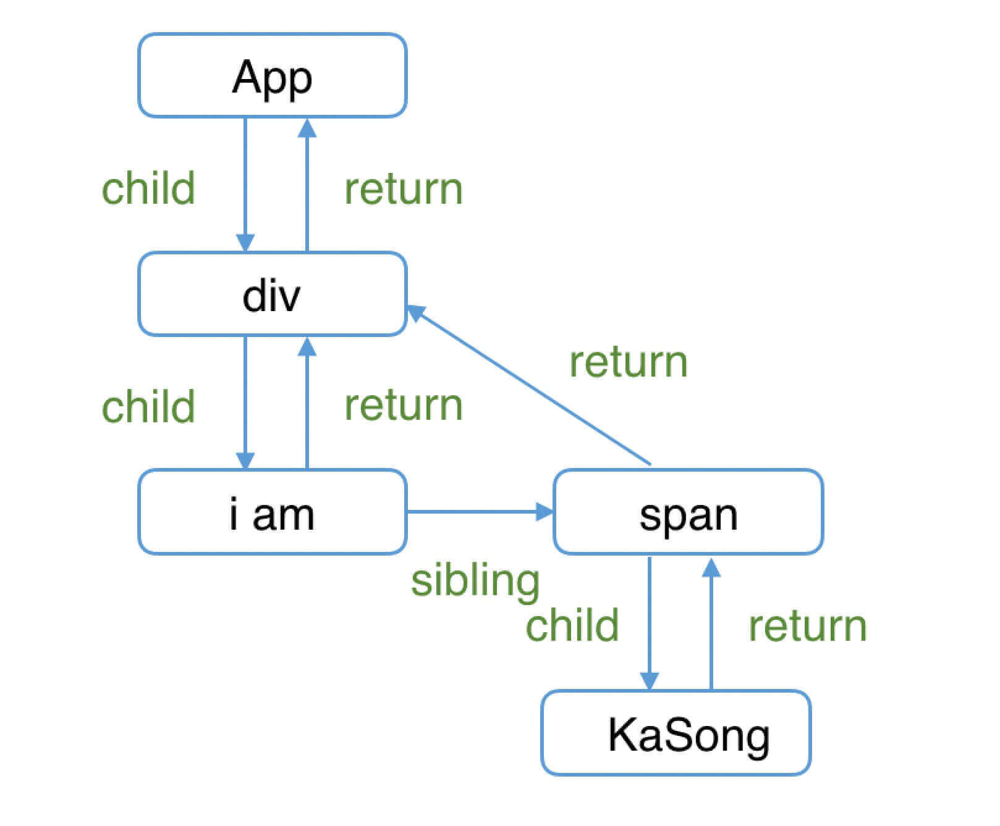
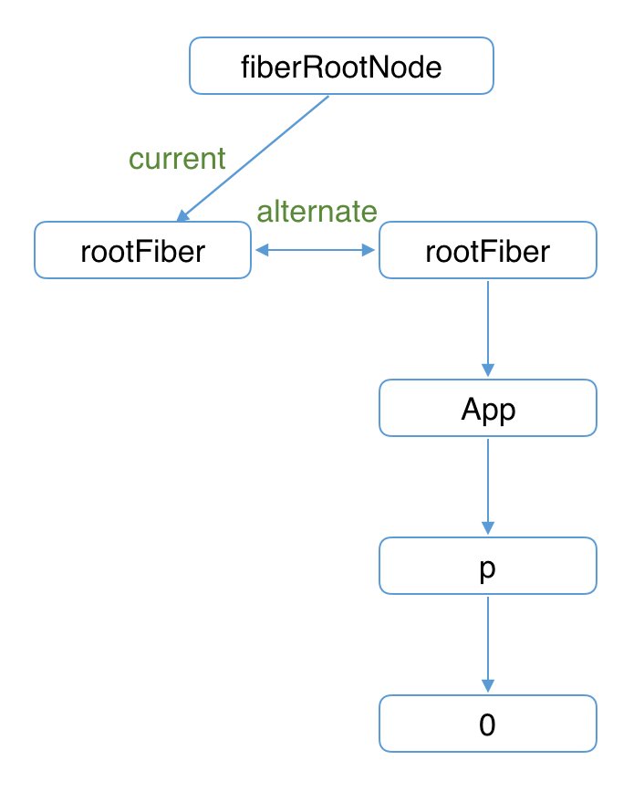
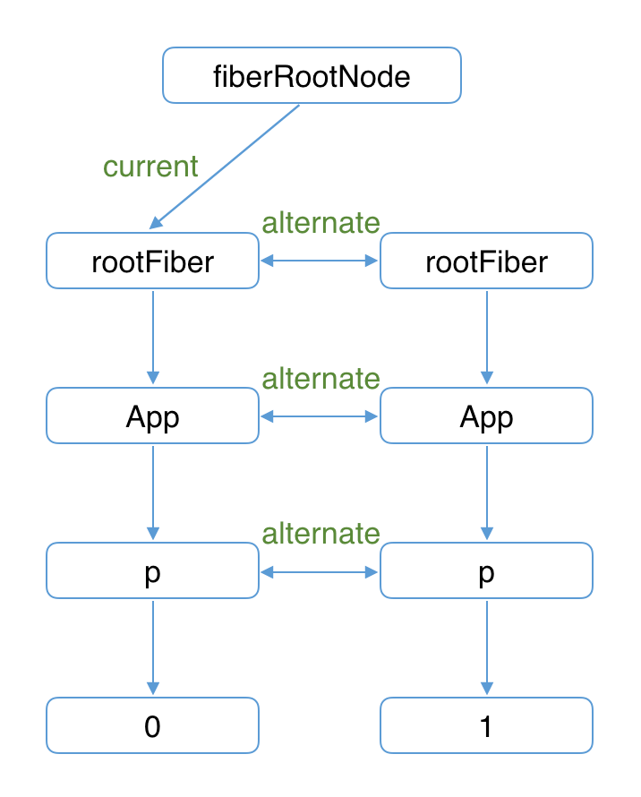
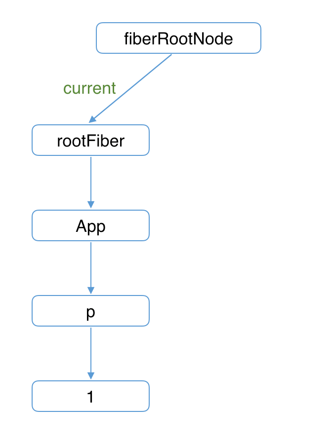

## Fiber 的起源

> 最早的`Fiber`官方解释来源于[2016 年 React 团队成员 Acdlite 的一篇介绍](https://github.com/acdlite/react-fiber-architecture)。

从上一章的学习我们知道：

在`React15`及以前，`Reconciler`采用递归的方式创建虚拟 DOM，递归过程是不能中断的。如果组件树的层级很深，递归会占用线程很多时间，造成卡顿。

为了解决这个问题，`React16`将**递归的无法中断的更新**重构为**异步的可中断更新**，由于曾经用于递归的**虚拟 DOM**数据结构已经无法满足需要。于是，全新的`Fiber`架构应运而生。

## Fiber 的含义

`Fiber`包含三层含义：

1. 作为架构来说，之前`React15`的`Reconciler`采用递归的方式执行，数据保存在递归调用栈中，所以被称为`stack Reconciler`。`React16`的`Reconciler`基于`Fiber节点`实现，被称为`Fiber Reconciler`。

2. 作为静态的数据结构来说，每个`Fiber节点`对应一个`React element`，保存了该组件的类型（函数组件/类组件/原生组件...）、对应的 DOM 节点等信息。

3. 作为动态的工作单元来说，每个`Fiber节点`保存了本次更新中该组件改变的状态、要执行的工作（需要被删除/被插入页面中/被更新...）。

## Fiber 的心智模型

React 核心团队成员[Sebastian Markbåge](https://github.com/sebmarkbage/)（`React Hooks`的发明者）曾说：我们在`React`中做的就是践行`代数效应`（Algebraic Effects）。

那么，`代数效应`是什么呢？他和`React`有什么关系呢。

### 什么是代数效应

`代数效应`是`函数式编程`中的一个概念，用于将`副作用`从`函数`调用中分离。

接下来我们用`虚构的语法`来解释。

假设我们有一个函数`getTotalPicNum`，传入 2 个`用户名称`后，分别查找该用户在平台保存的图片数量，最后将图片数量相加后返回。

```js
function getTotalPicNum(user1, user2) {
  const picNum1 = getPicNum(user1)
  const picNum2 = getPicNum(user2)

  return picNum1 + picNum2
}
```

在`getTotalPicNum`中，我们不关注`getPicNum`的实现，只在乎“获取到两个数字后将他们相加的结果返回”这一过程。

接下来我们来实现`getPicNum`。

"用户在平台保存的图片数量"是保存在服务器中的。所以，为了获取该值，我们需要发起异步请求。

为了尽量保持`getTotalPicNum`的调用方式不变，我们首先想到了使用`async await`：

```js
async function getTotalPicNum(user1, user2) {
  const picNum1 = await getPicNum(user1)
  const picNum2 = await getPicNum(user2)

  return picNum1 + picNum2
}
```

但是，`async await`是有`传染性`的 —— 当一个函数变为`async`后，这意味着调用他的函数也需要是`async`，这破坏了`getTotalPicNum`的同步特性。

有没有什么办法能保持`getTotalPicNum`保持现有调用方式不变的情况下实现异步请求呢？

没有。不过我们可以`虚构`一个。

我们虚构一个类似`try...catch`的语法 —— `try...handle`与两个操作符`perform`、`resume`。

```js
function getPicNum(name) {
  const picNum = perform name;
  return picNum;
}

try {
  getTotalPicNum('kaSong', 'xiaoMing');
} handle (who) {
  switch (who) {
    case 'kaSong':
      resume with 230;
    case 'xiaoMing':
      resume with 122;
    default:
      resume with 0;
  }
}
```

当执行到`getTotalPicNum`内部的`getPicNum`方法时，会执行`perform name`。

此时函数调用栈会从`getPicNum`方法内跳出，被最近一个`try...handle`捕获。类似`throw Error`后被最近一个`try...catch`捕获。

类似`throw Error`后`Error`会作为`catch`的参数，`perform name`后`name`会作为`handle`的参数。

与`try...catch`最大的不同在于：当`Error`被`catch`捕获后，之前的调用栈就销毁了。而`handle`执行`resume`后会回到之前`perform`的调用栈。

对于`case 'kaSong'`，执行完`resume with 230;`后调用栈会回到`getPicNum`，此时`picNum === 230`

::: warning 注意

再次申明，`try...handle`的语法是虚构的，只是为了演示`代数效应`的思想。

:::

总结一下：`代数效应`能够将`副作用`（例子中为`请求图片数量`）从函数逻辑中分离，使函数关注点保持纯粹。

并且，从例子中可以看出，`perform resume`不需要区分同步异步。

### 代数效应在 React 中的应用

那么`代数效应`与`React`有什么关系呢？最明显的例子就是`Hooks`。

对于类似`useState`、`useReducer`、`useRef`这样的`Hook`，我们不需要关注`FunctionComponent`的`state`在`Hook`中是如何保存的，`React`会为我们处理。

我们只需要假设`useState`返回的是我们想要的`state`，并编写业务逻辑就行。

```js
function App() {
  const [num, updateNum] = useState(0)

  return <button onClick={() => updateNum((num) => num + 1)}>{num}</button>
}
```

如果这个例子还不够明显，可以看看官方的 [Suspense Demo](https://codesandbox.io/s/frosty-hermann-bztrp?file=/src/index.js:152-160)

在`Demo`中`ProfileDetails`用于展示`用户名称`。而`用户名称`是`异步请求`的。

但是`Demo`中完全是`同步`的写法。

```js
function ProfileDetails() {
  const user = resource.user.read()
  return <h1>{user.name}</h1>
}
```

### 代数效应与 Generator

从`React15`到`React16`，协调器（`Reconciler`）重构的一大目的是：将老的`同步更新`的架构变为`异步可中断更新`。

`异步可中断更新`可以理解为：`更新`在执行过程中可能会被打断（浏览器时间分片用尽或有更高优任务插队），当可以继续执行时恢复之前执行的中间状态。

这就是`代数效应`中`try...handle`的作用。

其实，浏览器原生就支持类似的实现，这就是`Generator`。

但是`Generator`的一些缺陷使`React`团队放弃了他：

- 类似`async`，`Generator`也是`传染性`的，使用了`Generator`则上下文的其他函数也需要作出改变。这样心智负担比较重。

- `Generator`执行的`中间状态`是上下文关联的。

考虑如下例子：

```js
function* doWork(A, B, C) {
  var x = doExpensiveWorkA(A)
  yield
  var y = x + doExpensiveWorkB(B)
  yield
  var z = y + doExpensiveWorkC(C)
  return z
}
```

每当浏览器有空闲时间都会依次执行其中一个`doExpensiveWork`，当时间用尽则会中断，当再次恢复时会从中断位置继续执行。

只考虑“单一优先级任务的中断与继续”情况下`Generator`可以很好的实现`异步可中断更新`。

但是当我们考虑“高优先级任务插队”的情况，如果此时已经完成`doExpensiveWorkA`与`doExpensiveWorkB`计算出`x`与`y`。

此时`B`组件接收到一个`高优更新`，由于`Generator`执行的`中间状态`是上下文关联的，所以计算`y`时无法复用之前已经计算出的`x`，需要重新计算。

如果通过`全局变量`保存之前执行的`中间状态`，又会引入新的复杂度。

> 更详细的解释可以参考[这个 issue](https://github.com/facebook/react/issues/7942#issuecomment-254987818)

基于这些原因，`React`没有采用`Generator`实现`协调器`。

### 代数效应与 Fiber

`Fiber`并不是计算机术语中的新名词，他的中文翻译叫做`纤程`，与进程（Process）、线程（Thread）、协程（Coroutine）同为程序执行过程。

在很多文章中将`纤程`理解为`协程`的一种实现。在`JS`中，`协程`的实现便是`Generator`。

所以，我们可以将`纤程`(Fiber)、`协程`(Generator)理解为`代数效应`思想在`JS`中的体现。

`React Fiber`可以理解为：

`React`内部实现的一套状态更新机制。支持任务不同`优先级`，可中断与恢复，并且恢复后可以复用之前的`中间状态`。

其中每个任务更新单元为`React Element`对应的`Fiber节点`。

下面，我们具体讲解`Fiber 的结构`。

## Fiber 的结构

你可以从这里看到[Fiber 节点的属性定义](https://github.com/facebook/react/blob/1fb18e22ae66fdb1dc127347e169e73948778e5a/packages/react-reconciler/src/ReactFiber.new.js#L117)。虽然属性很多，但我们可以按三层含义将他们分类来看

```js
function FiberNode(tag: WorkTag, pendingProps: mixed, key: null | string, mode: TypeOfMode) {
  // 作为静态数据结构的属性
  this.tag = tag
  this.key = key
  this.elementType = null
  this.type = null
  this.stateNode = null

  // 用于连接其他Fiber节点形成Fiber树
  this.return = null
  this.child = null
  this.sibling = null
  this.index = 0

  this.ref = null

  // 作为动态的工作单元的属性
  this.pendingProps = pendingProps
  this.memoizedProps = null
  this.updateQueue = null
  this.memoizedState = null
  this.dependencies = null

  this.mode = mode

  this.effectTag = NoEffect
  this.nextEffect = null

  this.firstEffect = null
  this.lastEffect = null

  // 调度优先级相关
  this.lanes = NoLanes
  this.childLanes = NoLanes

  // 指向该fiber在另一次更新时对应的fiber
  this.alternate = null
}
```

### 作为架构来说

每个 Fiber 节点有个对应的`React element`，多个`Fiber节点`是如何连接形成树呢？靠如下三个属性：

```js
// 指向父级Fiber节点
this.return = null
// 指向子Fiber节点
this.child = null
// 指向右边第一个兄弟Fiber节点
this.sibling = null
```

举个例子，如下的组件结构：

```js
function App() {
  return (
    <div>
      i am
      <span>KaSong</span>
    </div>
  )
}
```

对应的`Fiber树`结构：



> 这里需要提一下，为什么父级指针叫做`return`而不是`parent`或者`father`呢？因为作为一个工作单元，`return`指节点执行完`completeWork`（本章后面会介绍）后会返回的下一个节点。子`Fiber节点`及其兄弟节点完成工作后会返回其父级节点，所以用`return`指代父级节点。

### 作为静态的数据结构

作为一种静态的数据结构，保存了组件相关的信息：

```js
// Fiber对应组件的类型 Function/Class/Host...
this.tag = tag
// key属性
this.key = key
// 大部分情况同type，某些情况不同，比如FunctionComponent使用React.memo包裹
this.elementType = null
// 对于 FunctionComponent，指函数本身，对于ClassComponent，指class，对于HostComponent，指DOM节点tagName
this.type = null
// Fiber对应的真实DOM节点
this.stateNode = null
```

### 作为动态的工作单元

作为动态的工作单元，`Fiber`中如下参数保存了本次更新相关的信息，我们会在后续的更新流程中使用到具体属性时再详细介绍

```js
// 保存本次更新造成的状态改变相关信息
this.pendingProps = pendingProps
this.memoizedProps = null
this.updateQueue = null
this.memoizedState = null
this.dependencies = null

this.mode = mode

// 保存本次更新会造成的DOM操作
this.effectTag = NoEffect
this.nextEffect = null

this.firstEffect = null
this.lastEffect = null
```

如下两个字段保存调度优先级相关的信息，会在讲解`Scheduler`时介绍。

```js
// 调度优先级相关
this.lanes = NoLanes
this.childLanes = NoLanes
```

::: warning 注意
在 2020 年 5 月，调度优先级策略经历了比较大的重构。以`expirationTime`属性为代表的优先级模型被`lane`取代。详见[这个 PR](https://github.com/facebook/react/pull/18796)
:::

我们了解了`Fiber`的起源与架构，其中`Fiber节点`可以构成`Fiber树`。那么`Fiber树`和页面呈现的`DOM树`有什么关系，`React`又是如何更新`DOM`的呢？

在下面讲解 Fiber 的工作原理。

## Fiber 的工作原理

我们了解了`Fiber`是什么，知道`Fiber节点`可以保存对应的`DOM节点`。

相应的，`Fiber节点`构成的`Fiber树`就对应`DOM树`。

那么如何更新`DOM`呢？这需要用到被称为“双缓存”的技术。

### 什么是“双缓存”

当我们用`canvas`绘制动画，每一帧绘制前都会调用`ctx.clearRect`清除上一帧的画面。

如果当前帧画面计算量比较大，导致清除上一帧画面到绘制当前帧画面之间有较长间隙，就会出现白屏。

为了解决这个问题，我们可以在内存中绘制当前帧动画，绘制完毕后直接用当前帧替换上一帧画面，由于省去了两帧替换间的计算时间，不会出现从白屏到出现画面的闪烁情况。

这种**在内存中构建并直接替换**的技术叫做[双缓存](https://baike.baidu.com/item/%E5%8F%8C%E7%BC%93%E5%86%B2)。

`React`使用“双缓存”来完成`Fiber树`的构建与替换——对应着`DOM树`的创建与更新。

### 双缓存 Fiber 树

在`React`中最多会同时存在两棵`Fiber树`。当前屏幕上显示内容对应的`Fiber树`称为`current Fiber树`，正在内存中构建的`Fiber树`称为`workInProgress Fiber树`。

`current Fiber树`中的`Fiber节点`被称为`current fiber`，`workInProgress Fiber树`中的`Fiber节点`被称为`workInProgress fiber`，他们通过`alternate`属性连接。

```js
currentFiber.alternate === workInProgressFiber
workInProgressFiber.alternate === currentFiber
```

`React`应用的根节点通过使`current`指针在不同`Fiber树`的`rootFiber`间切换来完成`current Fiber`树指向的切换。

即当`workInProgress Fiber树`构建完成交给`Renderer`渲染在页面上后，应用根节点的`current`指针指向`workInProgress Fiber树`，此时`workInProgress Fiber树`就变为`current Fiber树`。

每次状态更新都会产生新的`workInProgress Fiber树`，通过`current`与`workInProgress`的替换，完成`DOM`更新。

接下来我们以具体例子讲解`mount时`、`update时`的构建/替换流程。

### mount 时

考虑如下例子：

```js
function App() {
  const [num, add] = useState(0)
  return <p onClick={() => add(num + 1)}>{num}</p>
}

ReactDOM.render(<App />, document.getElementById('root'))
```

1. 首次执行`ReactDOM.render`会创建`fiberRootNode`（源码中叫`fiberRoot`）和`rootFiber`。其中`fiberRootNode`是整个应用的根节点，`rootFiber`是`<App/>`所在组件树的根节点。

之所以要区分`fiberRootNode`与`rootFiber`，是因为在应用中我们可以多次调用`ReactDOM.render`渲染不同的组件树，他们会拥有不同的`rootFiber`。但是整个应用的根节点只有一个，那就是`fiberRootNode`。

`fiberRootNode`的`current`会指向当前页面上已渲染内容对应`Fiber树`，即`current Fiber树`。

```js
fiberRootNode.current = rootFiber
```

由于是首屏渲染，页面中还没有挂载任何`DOM`，所以`fiberRootNode.current`指向的`rootFiber`没有任何`子Fiber节点`（即`current Fiber树`为空）。

1. 接下来进入`render阶段`，根据组件返回的`JSX`在内存中依次创建`Fiber节点`并连接在一起构建`Fiber树`，被称为`workInProgress Fiber树`。（下图中右侧为内存中构建的树，左侧为页面显示的树）

在构建`workInProgress Fiber树`时会尝试复用`current Fiber树`中已有的`Fiber节点`内的属性，在`首屏渲染`时只有`rootFiber`存在对应的`current fiber`（即`rootFiber.alternate`）。



3. 图中右侧已构建完的`workInProgress Fiber树`在`commit阶段`渲染到页面。

此时`DOM`更新为右侧树对应的样子。`fiberRootNode`的`current`指针指向`workInProgress Fiber树`使其变为`current Fiber 树`。

### update 时

1. 接下来我们点击`p节点`触发状态改变，这会开启一次新的`render阶段`并构建一棵新的`workInProgress Fiber 树`。



和`mount`时一样，`workInProgress fiber`的创建可以复用`current Fiber树`对应的节点数据。

> 这个决定是否复用的过程就是 Diff 算法，后面章节会详细讲解

2. `workInProgress Fiber 树`在`render阶段`完成构建后进入`commit阶段`渲染到页面上。渲染完毕后，`workInProgress Fiber 树`变为`current Fiber 树`。



<!-- ### 总结

本文介绍了`Fiber树`的构建与替换过程，这个过程伴随着`DOM`的更新。

那么在构建过程中每个`Fiber节点`具体是如何创建的呢？我们会在`架构篇`的[render 阶段]()讲解。 -->
