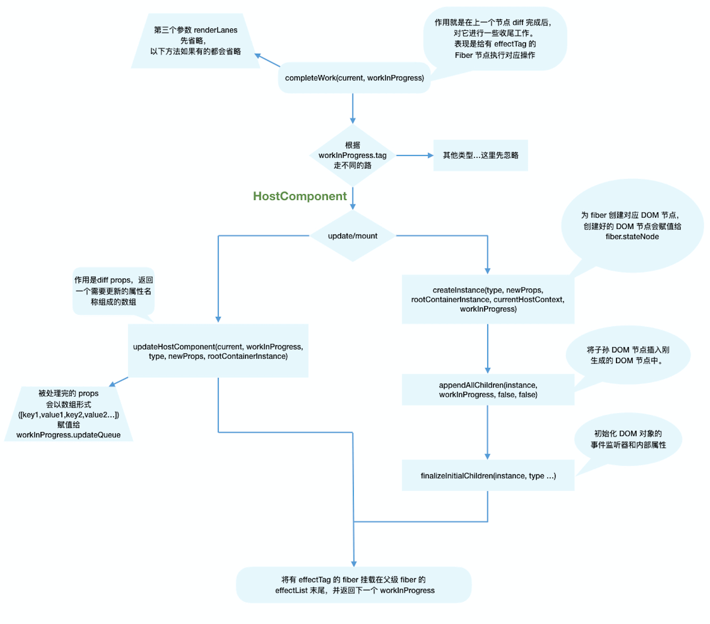

## 流程概览

本章我们会讲解`Fiber节点`是如何被创建并构建`Fiber树`的。

`render阶段`开始于`performSyncWorkOnRoot`或`performConcurrentWorkOnRoot`方法的调用。这取决于本次更新是同步更新还是异步更新。

我们现在还不需要学习这两个方法，只需要知道在这两个方法中会调用如下两个方法：

```js
// performSyncWorkOnRoot会调用该方法
function workLoopSync() {
  while (workInProgress !== null) {
    performUnitOfWork(workInProgress)
  }
}

// performConcurrentWorkOnRoot会调用该方法
function workLoopConcurrent() {
  while (workInProgress !== null && !shouldYield()) {
    performUnitOfWork(workInProgress)
  }
}
```

可以看到，他们唯一的区别是是否调用`shouldYield`。如果当前浏览器帧没有剩余时间，`shouldYield`会中止循环，直到浏览器有空闲时间后再继续遍历。

`workInProgress`代表当前已创建的`workInProgress fiber`。

`performUnitOfWork`方法会创建下一个`Fiber节点`并赋值给`workInProgress`，并将`workInProgress`与已创建的`Fiber节点`连接起来构成`Fiber树`。

> 你可以从[这里](https://github.com/facebook/react/blob/970fa122d8188bafa600e9b5214833487fbf1092/packages/react-reconciler/src/ReactFiberWorkLoop.new.js#L1599)看到`workLoopConcurrent`的源码

我们知道`Fiber Reconciler`是从`Stack Reconciler`重构而来，通过遍历的方式实现可中断的递归，所以`performUnitOfWork`的工作可以分为两部分：“递”和“归”。

### “递”阶段

首先从`rootFiber`开始向下深度优先遍历。为遍历到的每个`Fiber节点`调用[beginWork 方法](https://github.com/facebook/react/blob/970fa122d8188bafa600e9b5214833487fbf1092/packages/react-reconciler/src/ReactFiberBeginWork.new.js#L3058)。

该方法会根据传入的`Fiber节点`创建`子Fiber节点`，并将这两个`Fiber节点`连接起来。

当遍历到叶子节点（即没有子组件的组件）时就会进入“归”阶段。

### “归”阶段

在“归”阶段会调用[completeWork](https://github.com/facebook/react/blob/970fa122d8188bafa600e9b5214833487fbf1092/packages/react-reconciler/src/ReactFiberCompleteWork.new.js#L652)处理`Fiber节点`。

当某个`Fiber节点`执行完`completeWork`，如果其存在`兄弟Fiber节点`（即`fiber.sibling !== null`），会进入其`兄弟Fiber`的“递”阶段。

如果不存在`兄弟Fiber`，会进入`父级Fiber`的“归”阶段。

“递”和“归”阶段会交错执行直到“归”到`rootFiber`。至此，`render阶段`的工作就结束了。

### 例子

以上一节的例子举例：

```js
function App() {
  return (
    <div>
      i am
      <span>KaSong</span>
    </div>
  )
}

ReactDOM.render(<App />, document.getElementById('root'))
```

对应的`Fiber树`结构：


`render阶段`会依次执行：

```js
1. rootFiber beginWork
2. App Fiber beginWork
3. div Fiber beginWork
4. "i am" Fiber beginWork
5. "i am" Fiber completeWork
6. span Fiber beginWork
7. span Fiber completeWork
8. div Fiber completeWork
9. App Fiber completeWork
10. rootFiber completeWork
```

::: warning 注意
之所以没有 “KaSong” Fiber 的 beginWork/completeWork，是因为作为一种性能优化手段，针对只有单一文本子节点的`Fiber`，`React`会特殊处理。
:::

我在`beginWork`和`completeWork`调用时打印`fiber.tag`和`fiber.type`。

你可以从[ReactWorkTags.js](https://github.com/facebook/react/blob/970fa122d8188bafa600e9b5214833487fbf1092/packages/react-reconciler/src/ReactWorkTags.js)看到`Fiber节点`的所有`tag`定义。

相信多调试几次，你一定能明白方法的调用顺序

::: details performUnitOfWork 的递归版本

如果将`performUnitOfWork`转化为递归版本，大体代码如下：

```js
function performUnitOfWork(fiber) {
  // 执行beginWork

  if (fiber.child) {
    performUnitOfWork(fiber.child)
  }

  // 执行completeWork

  if (fiber.sibling) {
    performUnitOfWork(fiber.sibling)
  }
}
```

:::

接下来讲解`beginWork`和`completeWork`做的具体工作。

## beginWork

`render阶段`的工作可以分为“递”阶段和“归”阶段。其中“递”阶段会执行`beginWork`，“归”阶段会执行`completeWork`。这一节我们看看“递”阶段的`beginWork`方法究竟做了什么。

### 方法概览

可以从[源码这里](https://github.com/facebook/react/blob/1fb18e22ae66fdb1dc127347e169e73948778e5a/packages/react-reconciler/src/ReactFiberBeginWork.new.js#L3075)看到`beginWork`的定义。整个方法大概有 500 行代码。

从上一节我们已经知道，`beginWork`的工作是传入`当前Fiber节点`，创建`子Fiber节点`，我们从传参来看看具体是如何做的。

#### 从传参看方法执行

```js
function beginWork(current: Fiber | null, workInProgress: Fiber, renderLanes: Lanes): Fiber | null {
  // ...省略函数体
}
```

其中传参：

- current：当前组件对应的`Fiber节点`在上一次更新时的`Fiber节点`，即`workInProgress.alternate`
- workInProgress：当前组件对应的`Fiber节点`
- renderLanes：优先级相关，在讲解`Scheduler`时再讲解

从双缓存机制知道，除 `rootFiber` 以外， 组件`mount`时，由于是首次渲染，是不存在当前组件对应的`Fiber节点`在上一次更新时的`Fiber节点`，即`mount`时`current === null`。

组件`update`时，由于之前已经`mount`过，所以`current !== null`。

所以我们可以通过`current === null ?`来区分组件是处于`mount`还是`update`。

基于此原因，`beginWork`的工作可以分为两部分：

- `update`时：如果`current`存在，在满足一定条件时可以复用`current`节点，这样就能克隆`current.child`作为`workInProgress.child`，而不需要新建`workInProgress.child`。

- `mount`时：除`fiberRootNode`以外，`current === null`。会根据`fiber.tag`不同，创建不同类型的`子Fiber节点`

```js
function beginWork(current: Fiber | null, workInProgress: Fiber, renderLanes: Lanes): Fiber | null {
  // update时：如果current存在可能存在优化路径，可以复用current（即上一次更新的Fiber节点）
  if (current !== null) {
    // ...省略

    // 复用current
    return bailoutOnAlreadyFinishedWork(current, workInProgress, renderLanes)
  } else {
    didReceiveUpdate = false
  }

  // mount时：根据tag不同，创建不同的子Fiber节点
  switch (workInProgress.tag) {
    case IndeterminateComponent:
    // ...省略
    case LazyComponent:
    // ...省略
    case FunctionComponent:
    // ...省略
    case ClassComponent:
    // ...省略
    case HostRoot:
    // ...省略
    case HostComponent:
    // ...省略
    case HostText:
    // ...省略
    // ...省略其他类型
  }
}
```

### update 时

我们可以看到，满足如下情况时`didReceiveUpdate === false`（即可以直接复用前一次更新的`子Fiber`，不需要新建`子Fiber`）

1. `oldProps === newProps && workInProgress.type === current.type`，即`props`与`fiber.type`不变
2. `!includesSomeLane(renderLanes, updateLanes)`，即当前`Fiber节点`优先级不够，会在讲解`Scheduler`时介绍

```js
if (current !== null) {
  const oldProps = current.memoizedProps
  const newProps = workInProgress.pendingProps

  if (oldProps !== newProps || hasLegacyContextChanged() || (__DEV__ ? workInProgress.type !== current.type : false)) {
    didReceiveUpdate = true
  } else if (!includesSomeLane(renderLanes, updateLanes)) {
    didReceiveUpdate = false
    switch (
      workInProgress.tag
      // 省略处理
    ) {
    }
    return bailoutOnAlreadyFinishedWork(current, workInProgress, renderLanes)
  } else {
    didReceiveUpdate = false
  }
} else {
  didReceiveUpdate = false
}
```

### mount 时

当不满足优化路径时，我们就进入第二部分，新建`子Fiber`。

我们可以看到，根据`fiber.tag`不同，进入不同类型`Fiber`的创建逻辑。

> 可以从[这里](https://github.com/facebook/react/blob/1fb18e22ae66fdb1dc127347e169e73948778e5a/packages/react-reconciler/src/ReactWorkTags.js)看到`tag`对应的组件类型

```js
// mount时：根据tag不同，创建不同的Fiber节点
switch (workInProgress.tag) {
  case IndeterminateComponent:
  // ...省略
  case LazyComponent:
  // ...省略
  case FunctionComponent:
  // ...省略
  case ClassComponent:
  // ...省略
  case HostRoot:
  // ...省略
  case HostComponent:
  // ...省略
  case HostText:
  // ...省略
  // ...省略其他类型
}
```

对于我们常见的组件类型，如（`FunctionComponent`/`ClassComponent`/`HostComponent`），最终会进入[reconcileChildren](https://github.com/facebook/react/blob/1fb18e22ae66fdb1dc127347e169e73948778e5a/packages/react-reconciler/src/ReactFiberBeginWork.new.js#L233)方法。

### reconcileChildren

从该函数名就能看出这是`Reconciler`模块的核心部分。那么他究竟做了什么呢？

- 对于`mount`的组件，他会创建新的`子Fiber节点`

- 对于`update`的组件，他会将当前组件与该组件在上次更新时对应的`Fiber节点`比较（也就是俗称的`Diff`算法），将比较的结果生成新`Fiber节点`

```js
export function reconcileChildren(current: Fiber | null, workInProgress: Fiber, nextChildren: any, renderLanes: Lanes) {
  if (current === null) {
    // 对于mount的组件
    workInProgress.child = mountChildFibers(workInProgress, null, nextChildren, renderLanes)
  } else {
    // 对于update的组件
    workInProgress.child = reconcileChildFibers(workInProgress, current.child, nextChildren, renderLanes)
  }
}
```

从代码可以看出，和`beginWork`一样，他也是通过`current === null ?`区分`mount`与`update`。

不论走哪个逻辑，最终他会生成新的子`Fiber节点`并赋值给`workInProgress.child`，作为本次`beginWork`[返回值](https://github.com/facebook/react/blob/1fb18e22ae66fdb1dc127347e169e73948778e5a/packages/react-reconciler/src/ReactFiberBeginWork.new.js#L1158)，并作为下次`performUnitOfWork`执行时`workInProgress`的[传参](https://github.com/facebook/react/blob/1fb18e22ae66fdb1dc127347e169e73948778e5a/packages/react-reconciler/src/ReactFiberWorkLoop.new.js#L1702)。

::: warning 注意
值得一提的是，`mountChildFibers`与`reconcileChildFibers`这两个方法的逻辑基本一致。唯一的区别是：`reconcileChildFibers`会为生成的`Fiber节点`带上`effectTag`属性，而`mountChildFibers`不会。
:::

### effectTag

我们知道，`render阶段`的工作是在内存中进行，当工作结束后会通知`Renderer`需要执行的`DOM`操作。要执行`DOM`操作的具体类型就保存在`fiber.effectTag`中。

> 你可以从[这里](https://github.com/facebook/react/blob/1fb18e22ae66fdb1dc127347e169e73948778e5a/packages/react-reconciler/src/ReactSideEffectTags.js)看到`effectTag`对应的`DOM`操作

比如：

```js
// DOM需要插入到页面中
export const Placement = /*                */ 0b00000000000010
// DOM需要更新
export const Update = /*                   */ 0b00000000000100
// DOM需要插入到页面中并更新
export const PlacementAndUpdate = /*       */ 0b00000000000110
// DOM需要删除
export const Deletion = /*                 */ 0b00000000001000
```

> 通过二进制表示`effectTag`，可以方便的使用位操作为`fiber.effectTag`赋值多个`effect`。

那么，如果要通知`Renderer`将`Fiber节点`对应的`DOM节点`插入页面中，需要满足两个条件：

1. `fiber.stateNode`存在，即`Fiber节点`中保存了对应的`DOM节点`

2. `(fiber.effectTag & Placement) !== 0`，即`Fiber节点`存在`Placement effectTag`

我们知道，`mount`时，`fiber.stateNode === null`，且在`reconcileChildren`中调用的`mountChildFibers`不会为`Fiber节点`赋值`effectTag`。那么首屏渲染如何完成呢？

针对第一个问题，`fiber.stateNode`会在`completeWork`中创建，我们会在下面介绍。

第二个问题的答案十分巧妙：假设`mountChildFibers`也会赋值`effectTag`，那么可以预见`mount`时整棵`Fiber树`所有节点都会有`Placement effectTag`。那么`commit阶段`在执行`DOM`操作时每个节点都会执行一次插入操作，这样大量的`DOM`操作是极低效的。

为了解决这个问题，在`mount`时只有`rootFiber`会赋值`Placement effectTag`，在`commit阶段`只会执行一次插入操作。

第一个进入`beginWork`方法的`Fiber节点`就是`rootFiber`，他的`alternate`指向`current rootFiber`（即它存在`current`）。

> 为什么`rootFiber`节点存在`current`（即`rootFiber.alternate`），我们在[双缓存机制一节 mount 时的第二步](./fiber.md#mount-时)已经讲过

由于存在`current`，`rootFiber`在`reconcileChildren`时会走`reconcileChildFibers`逻辑。

而之后通过`beginWork`创建的`Fiber节点`是不存在`current`的（即 `fiber.alternate === null`），会走`mountChildFibers`逻辑

### `beginWork` 流程图：


## completeWork

让我们看看`completeWork`会做什么工作。

你可以从[这里](https://github.com/facebook/react/blob/1fb18e22ae66fdb1dc127347e169e73948778e5a/packages/react-reconciler/src/ReactFiberCompleteWork.new.js#L673)看到`completeWork`方法定义。

类似`beginWork`，`completeWork`也是针对不同`fiber.tag`调用不同的处理逻辑。

```js
function completeWork(
  current: Fiber | null,
  workInProgress: Fiber,
  renderLanes: Lanes,
): Fiber | null {
  const newProps = workInProgress.pendingProps;

  switch (workInProgress.tag) {
    case IndeterminateComponent:
    case LazyComponent:
    case SimpleMemoComponent:
    case FunctionComponent:
    case ForwardRef:
    case Fragment:
    case Mode:
    case Profiler:
    case ContextConsumer:
    case MemoComponent:
      return null;
    case ClassComponent: {
      // ...省略
      return null;
    }
    case HostRoot: {
      // ...省略
      updateHostContainer(workInProgress);
      return null;
    }
    case HostComponent: {
      // ...省略
      return null;
    }
  // ...省略
```

我们重点关注页面渲染所必须的`HostComponent`（即原生`DOM组件`对应的`Fiber节点`），其他类型`Fiber`的处理留在具体功能实现时讲解。

### 处理 HostComponent

和`beginWork`一样，我们根据`current === null ?`判断是`mount`还是`update`。

同时针对`HostComponent`，判断`update`时我们还需要考虑`workInProgress.stateNode != null ?`（即该`Fiber节点`是否存在对应的`DOM节点`）

```js
case HostComponent: {
  popHostContext(workInProgress);
  const rootContainerInstance = getRootHostContainer();
  const type = workInProgress.type;

  if (current !== null && workInProgress.stateNode != null) {
    // update的情况
    // ...省略
  } else {
    // mount的情况
    // ...省略
  }
  return null;
}
```

### update 时

当`update`时，`Fiber节点`已经存在对应`DOM节点`，所以不需要生成`DOM节点`。需要做的主要是处理`props`，比如：

- `onClick`、`onChange`等回调函数的注册
- 处理`style prop`
- 处理`DANGEROUSLY_SET_INNER_HTML prop`
- 处理`children prop`

我们去掉一些当前不需要关注的功能（比如`ref`）。可以看到最主要的逻辑是调用`updateHostComponent`方法。

```js
if (current !== null && workInProgress.stateNode != null) {
  // update的情况
  updateHostComponent(current, workInProgress, type, newProps, rootContainerInstance)
}
```

你可以从[这里](https://github.com/facebook/react/blob/1fb18e22ae66fdb1dc127347e169e73948778e5a/packages/react-reconciler/src/ReactFiberCompleteWork.new.js#L225)看到`updateHostComponent`方法定义。

在`updateHostComponent`内部，被处理完的`props`会被赋值给`workInProgress.updateQueue`，并最终会在`commit阶段`被渲染在页面上。

```ts
workInProgress.updateQueue = (updatePayload: any);
```

其中`updatePayload`为数组形式，他的偶数索引的值为变化的`prop key`，奇数索引的值为变化的`prop value`。

`updateHostComponent`方法内打印了`Fiber节点`对应的`type`与`updatePayload`。

你可以直观的感受`updatePayload`的数据结构。

### mount 时

同样，我们省略了不相关的逻辑。可以看到，`mount`时的主要逻辑包括三个：

- 为`Fiber节点`生成对应的`DOM节点`
- 将子孙`DOM节点`插入刚生成的`DOM节点`中
- 与`update`逻辑中的`updateHostComponent`类似的处理`props`的过程

```js
// mount的情况

// ...省略服务端渲染相关逻辑

const currentHostContext = getHostContext()
// 为fiber创建对应DOM节点
const instance = createInstance(type, newProps, rootContainerInstance, currentHostContext, workInProgress)
// 将子孙DOM节点插入刚生成的DOM节点中
appendAllChildren(instance, workInProgress, false, false)
// DOM节点赋值给fiber.stateNode
workInProgress.stateNode = instance

// 与update逻辑中的updateHostComponent类似的处理props的过程
if (finalizeInitialChildren(instance, type, newProps, rootContainerInstance, currentHostContext)) {
  markUpdate(workInProgress)
}
```

在 `beginWork` 我们讲到：`mount`时只会在`rootFiber`存在`Placement effectTag`。那么`commit阶段`是如何通过一次插入`DOM`操作（对应一个`Placement effectTag`）将整棵`DOM树`插入页面的呢？

原因就在于`completeWork`中的`appendAllChildren`方法。

由于`completeWork`属于“归”阶段调用的函数，每次调用`appendAllChildren`时都会将已生成的子孙`DOM节点`插入当前生成的`DOM节点`下。那么当“归”到`rootFiber`时，我们已经有一个构建好的离屏`DOM树`。

### effectList

至此`render阶段`的绝大部分工作就完成了。

还有一个问题：作为`DOM`操作的依据，`commit阶段`需要找到所有有`effectTag`的`Fiber节点`并依次执行`effectTag`对应操作。难道需要在`commit阶段`再遍历一次`Fiber树`寻找`effectTag !== null`的`Fiber节点`么？

这显然是很低效的。

为了解决这个问题，在`completeWork`的上层函数`completeUnitOfWork`中，每个执行完`completeWork`且存在`effectTag`的`Fiber节点`会被保存在一条被称为`effectList`的单向链表中。

`effectList`中第一个`Fiber节点`保存在`fiber.firstEffect`，最后一个元素保存在`fiber.lastEffect`。

类似`appendAllChildren`，在“归”阶段，所有有`effectTag`的`Fiber节点`都会被追加在`effectList`中，最终形成一条以`rootFiber.firstEffect`为起点的单向链表。

```js
                       nextEffect         nextEffect
rootFiber.firstEffect -----------> fiber -----------> fiber
```

这样，在`commit阶段`只需要遍历`effectList`就能执行所有`effect`了。

你可以在[这里](https://github.com/facebook/react/blob/1fb18e22ae66fdb1dc127347e169e73948778e5a/packages/react-reconciler/src/ReactFiberWorkLoop.new.js#L1744)看到这段代码逻辑。

借用`React`团队成员**Dan Abramov**的话：`effectList`相较于`Fiber树`，就像圣诞树上挂的那一串彩灯。

### 流程结尾

至此，`render阶段`全部工作完成。在`performSyncWorkOnRoot`函数中`fiberRootNode`被传递给`commitRoot`方法，开启`commit阶段`工作流程。

```js
commitRoot(root)
```

代码见[这里](https://github.com/facebook/react/blob/1fb18e22ae66fdb1dc127347e169e73948778e5a/packages/react-reconciler/src/ReactFiberWorkLoop.new.js#L1107)。

### `completeWork`流程图


