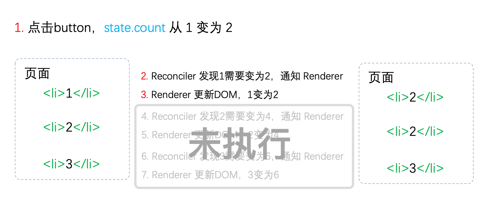

## 前言

在上一节中我们了解了`React`的理念，简单概括就是**快速响应**。

`React`从 v15 升级到 v16 后重构了整个架构。本节我们聊聊 v15，看看他为什么不能满足**快速响应**的理念，以至于被重构；重构后的 React16 是如何支持异步更新的。

## React15 架构

React15 架构可以分为两层：

- Reconciler（协调器）—— 负责找出变化的组件
- Renderer（渲染器）—— 负责将变化的组件渲染到页面上

### Reconciler（协调器）

我们知道，在`React`中可以通过`this.setState`、`this.forceUpdate`、`ReactDOM.render`等 API 触发更新。

每当有更新发生时，**Reconciler**会做如下工作：

- 调用函数组件、或 class 组件的`render`方法，将返回的 JSX 转化为虚拟 DOM
- 将虚拟 DOM 和上次更新时的虚拟 DOM 对比
- 通过对比找出本次更新中变化的虚拟 DOM
- 通知**Renderer**将变化的虚拟 DOM 渲染到页面上

> 你可以在[这里](https://zh-hans.reactjs.org/docs/codebase-overview.html#reconcilers)看到`React`官方对**Reconciler**的解释

### Renderer（渲染器）

由于`React`支持跨平台，所以不同平台有不同的**Renderer**。我们前端最熟悉的是负责在浏览器环境渲染的**Renderer** —— [ReactDOM](https://www.npmjs.com/package/react-dom)。

除此之外，还有：

- [ReactNative](https://www.npmjs.com/package/react-native)渲染器，渲染 App 原生组件
- [ReactTest](https://www.npmjs.com/package/react-test-renderer)渲染器，渲染出纯 Js 对象用于测试
- [ReactArt](https://www.npmjs.com/package/react-art)渲染器，渲染到 Canvas, SVG 或 VML (IE8)

在每次更新发生时，**Renderer**接到**Reconciler**通知，将变化的组件渲染在当前宿主环境。

> 你可以在[这里](https://zh-hans.reactjs.org/docs/codebase-overview.html#renderers)看到`React`官方对**Renderer**的解释

### 缺点

在**Reconciler**中，`mount`的组件会调用[mountComponent](https://github.com/facebook/react/blob/15-stable/src/renderers/dom/shared/ReactDOMComponent.js#L498)，`update`的组件会调用[updateComponent](https://github.com/facebook/react/blob/15-stable/src/renderers/dom/shared/ReactDOMComponent.js#L877)。这两个方法都会递归更新子组件。

#### 递归更新的缺点

由于递归执行，所以更新一旦开始，中途就无法中断。当层级很深时，递归更新时间超过了 16ms，用户交互就会卡顿。

在上一节中，我们已经提出了解决办法——用**可中断的异步更新**代替**同步的更新**。那么 React15 的架构支持异步更新么？让我们看一个例子：

> 初始化时`state.count = 1`，每次点击按钮`state.count++`
>
> 列表中 3 个元素的值分别为 1，2，3 乘以`state.count`的结果

我用红色标注了更新的步骤。


我们可以看到，**Reconciler**和**Renderer**是交替工作的，当第一个`li`在页面上已经变化后，第二个`li`再进入**Reconciler**。

由于整个过程都是同步的，所以在用户看来所有 DOM 是同时更新的。

接下来，让我们模拟一下，如果中途中断更新会怎么样？

:::danger 注意
以下是我们模拟中断的情况，实际上`React15`并不会中断进行中的更新
:::



当第一个`li`完成更新时中断更新，即步骤 3 完成后中断更新，此时后面的步骤都还未执行。

用户本来期望`123`变为`246`。实际却看见更新不完全的 DOM！（即`223`）

基于这个原因，`React`决定重写整个架构。接下来看看重构后的React16是如何支持异步更新的。

## React16架构

React16架构可以分为三层：

- Scheduler（调度器）—— 调度任务的优先级，高优任务优先进入**Reconciler**
- Reconciler（协调器）—— 负责找出变化的组件
- Renderer（渲染器）—— 负责将变化的组件渲染到页面上

可以看到，相较于React15，React16中新增了**Scheduler（调度器）**，让我们来了解下他。

### Scheduler（调度器）

既然我们以浏览器是否有剩余时间作为任务中断的标准，那么我们需要一种机制，当浏览器有剩余时间时通知我们。

其实部分浏览器已经实现了这个API，这就是[requestIdleCallback](https://developer.mozilla.org/zh-CN/docs/Web/API/Window/requestIdleCallback)。但是由于以下因素，`React`放弃使用：

- 浏览器兼容性
- 触发频率不稳定，受很多因素影响。比如当我们的浏览器切换tab后，之前tab注册的`requestIdleCallback`触发的频率会变得很低

基于以上原因，`React`实现了功能更完备的`requestIdleCallback`polyfill，这就是**Scheduler**。除了在空闲时触发回调的功能外，**Scheduler**还提供了多种调度优先级供任务设置。

> [Scheduler](https://github.com/facebook/react/blob/1fb18e22ae66fdb1dc127347e169e73948778e5a/packages/scheduler/README.md)是独立于`React`的库

### Reconciler（协调器）

我们知道，在React15中**Reconciler**是递归处理虚拟DOM的。让我们看看[React16的Reconciler](https://github.com/facebook/react/blob/1fb18e22ae66fdb1dc127347e169e73948778e5a/packages/react-reconciler/src/ReactFiberWorkLoop.new.js#L1673)。

我们可以看见，更新工作从递归变成了可以中断的循环过程。每次循环都会调用`shouldYield`判断当前是否有剩余时间。
```js
/** @noinline */
function workLoopConcurrent() {
  // Perform work until Scheduler asks us to yield
  while (workInProgress !== null && !shouldYield()) {
    workInProgress = performUnitOfWork(workInProgress);
  }
}
```

那么React16是如何解决中断更新时DOM渲染不完全的问题呢？

在React16中，**Reconciler**与**Renderer**不再是交替工作。当**Scheduler**将任务交给**Reconciler**后，**Reconciler**会为变化的虚拟DOM打上代表增/删/更新的标记，类似这样：

```js
export const Placement = /*             */ 0b0000000000010;
export const Update = /*                */ 0b0000000000100;
export const PlacementAndUpdate = /*    */ 0b0000000000110;
export const Deletion = /*              */ 0b0000000001000;
```

> 全部的标记见[这里](https://github.com/facebook/react/blob/1fb18e22ae66fdb1dc127347e169e73948778e5a/packages/react-reconciler/src/ReactSideEffectTags.js)

整个**Scheduler**与**Reconciler**的工作都在内存中进行。只有当所有组件都完成**Reconciler**的工作，才会统一交给**Renderer**。

> 你可以在[这里](https://zh-hans.reactjs.org/docs/codebase-overview.html#fiber-reconciler)看到`React`官方对React16新**Reconciler**的解释

### Renderer（渲染器）

**Renderer**根据**Reconciler**为虚拟DOM打的标记，同步执行对应的DOM操作。

所以，对于我们在上一节使用过的Demo

> `state.count = 1`，每次点击按钮`state.count++`
>
> 列表中3个元素的值分别为1，2，3乘以`state.count`的结果 

在React16架构中整个更新流程为：


其中红框中的步骤随时可能由于以下原因被中断：

- 有其他更高优任务需要先更新
- 当前帧没有剩余时间

由于红框中的工作都在内存中进行，不会更新页面上的DOM，所以即使反复中断，用户也不会看见更新不完全的DOM（即v15演示的情况）。

> 实际上，由于**Scheduler**和**Reconciler**都是平台无关的，所以`React`为他们单独发了一个包[react-Reconciler](https://www.npmjs.com/package/react-reconciler)。你可以用这个包自己实现一个`ReactDOM`。
 
## 总结

我们知道了`React16`采用新的`Reconciler`。

`Reconciler`内部采用了`Fiber`的架构。

`Fiber`是什么？它和`Reconciler`或者说和`React`之间是什么关系？我们会在接下来的文章解答。

